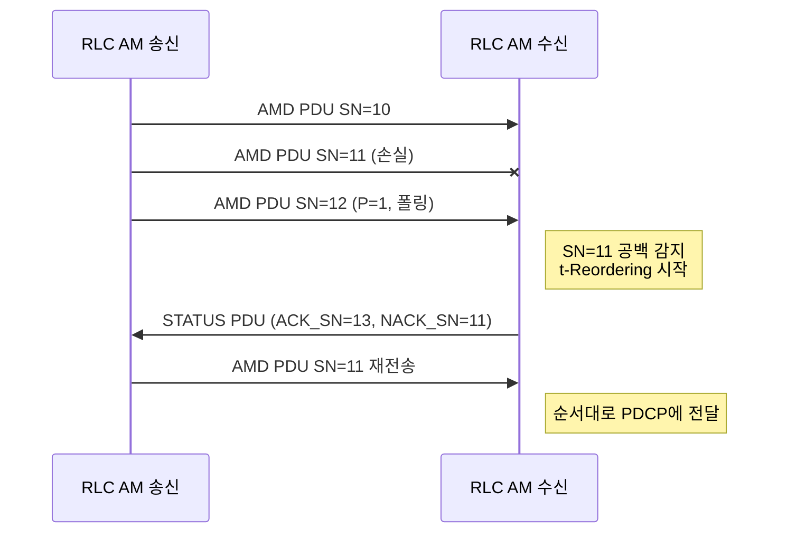

# RLC

!!! spec "스펙 · 릴리즈"
    TS 36.322 (E-UTRA RLC) — §4.2 모드, §5.1 데이터 전송, §5.2 ARQ, §5.3 SDU 폐기, §6 PDU 형식, §7 타이머·상수

    Rel-8~ (Rel-13 AM 16비트 SN 확장)

!!! basic "한눈에 보기"
    **RLC(Radio Link Control)**는 PDCP가 내려준 패킷을 MAC이 원하는 크기로 **자르거나 이어 붙이고**, 필요하면 **재전송(ARQ)**합니다.

    세 가지 모드가 있습니다.

    | 모드 | 설명 | 예 |
    |---|---|---|
    | **TM** (Transparent) | 아무것도 안 하고 통과 | SRB0, 방송·페이징 |
    | **UM** (Unacknowledged) | 자르고 붙이고 순서 맞추기, **재전송 없음** | VoLTE 음성 (늦은 패킷은 쓸모 없음) |
    | **AM** (Acknowledged) | UM 기능 + **재전송** | SRB1/2, 일반 데이터 (TCP) |

    MAC의 HARQ가 빠르게 대부분의 오류를 고치고, RLC ARQ는 HARQ가 놓친 잔여 오류(예: NACK→ACK 오판)를 마지막으로 잡습니다.

## RLC 기능 { .l2 }

| 기능 | TM | UM | AM |
|---|---|---|---|
| 분할(segmentation) · 연결(concatenation) | — | ✔ | ✔ |
| 재분할(re-segmentation) | — | — | ✔ (재전송 PDU가 새 grant에 안 맞을 때) |
| 순서 정렬(reordering), 순차 전달 | — | ✔ | ✔ |
| 중복 검출 | — | ✔ | ✔ |
| ARQ 재전송 | — | — | ✔ |
| 시퀀스 번호(SN) | — | 5 / 10비트 | 10비트 (Rel-13: 16비트 옵션) |

## AM 동작 { .l2 }



- 송신 측은 주기적으로 **폴(P 비트)**을 세워 상태 보고를 요청합니다.
- 수신 측은 **STATUS PDU**로 "어디까지 받았고(ACK_SN), 무엇이 빠졌는지(NACK_SN)" 알려 줍니다.
- 재전송 횟수가 `maxRetxThreshold`에 도달하면 RRC에 알리고, RRC는 **무선 링크 실패(RLF)**를 선언합니다.

## PDU 헤더 (AM, 10비트 SN) { .l2 }

```
 D/C | RF | P | FI(2) | E | SN(10)       ← 2바이트 고정 헤더
 [E | LI(11)] × n                        ← 여러 SDU를 연결했을 때 길이 지시
```

| 필드 | 의미 |
|---|---|
| D/C | 데이터(1) / 제어(0, STATUS) |
| RF | 재분할 플래그 (1이면 SO, LSF 필드 추가) |
| P | 폴링 |
| FI | 첫/마지막 바이트가 SDU의 시작/끝인지 (분할 표시) |
| E | 뒤에 LI 필드가 더 있는지 |
| LI | 각 SDU의 길이 |

??? expert "전문가 노트 — 타이머, 윈도, 성능"
    **주요 타이머·파라미터 (TS 36.331 `RLC-Config`)**

    | 이름 | 쪽 | 역할 | 대표값 |
    |---|---|---|---|
    | `t-PollRetransmit` | TX | 폴 후 상태 보고가 없으면 재폴 | 45 ms |
    | `pollPDU` / `pollByte` | TX | PDU 수 / 바이트 수마다 폴 | 4 / 25 kB, 또는 infinity |
    | `maxRetxThreshold` | TX | 최대 재전송 → RLF | 4 – 32 |
    | `t-Reordering` | RX | 공백 대기 시간 (HARQ 재전송 기다림) | 35 ms (AM), 50 ms (UM) |
    | `t-StatusProhibit` | RX | 상태 보고 최소 간격 | 0 – 50 ms |

    **윈도 크기.** AM 10비트 SN → 윈도 512, UM 10비트 → 512, UM 5비트 → 16.
    고속·고지연(예: 대용량 CA)에서는 SN 1024개가 부족해 송신이 멈출 수 있습니다(window stall). Rel-13에서 AM **16비트 SN**(윈도 32768)이 도입되었습니다.

    **t-Reordering 설정 요령.** HARQ 최대 재전송 시간보다 약간 길게 잡아야 합니다. 너무 짧으면 HARQ가 아직 복구 중인 PDU를 포기하고 NACK을 보내서 불필요한 RLC 재전송이 생기고, 너무 길면 TCP 지연이 늘어납니다.

    **NR RLC와의 차이.**
    - NR RLC는 **연결(concatenation)이 없고**, 순서 정렬도 하지 않습니다(out-of-order delivery → PDCP가 정렬).
    - 덕분에 grant를 받기 전에 RLC PDU를 미리 만들어 둘 수 있어(pre-processing) 처리 지연이 줄었습니다.
    - SN: UM 6/12비트, AM 12/18비트.

## 관련 페이지

- [PDCP](pdcp.md)
- [MAC](mac.md)
- [RRC 연결 관리](../procedures/rrc-connection.md) — RLF와 재수립
