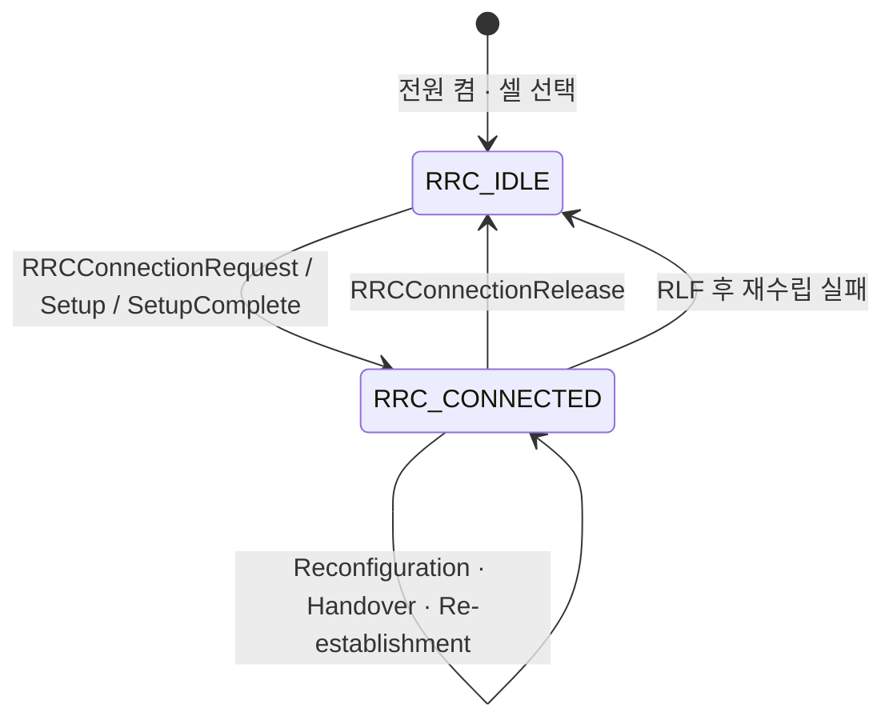

# RRC

!!! spec "스펙 · 릴리즈"
    TS 36.331 (E-UTRA RRC) — §4.2 상태, §5.2 시스템 정보, §5.3 연결 제어, §5.5 측정, §6 메시지 ASN.1, §7 타이머 · Idle 모드: TS 36.304

    Rel-8~ (Rel-13 Suspend/Resume, Rel-14 Light Connection, Rel-15 EN-DC 설정 컨테이너)

!!! basic "한눈에 보기"
    **RRC(Radio Resource Control)**는 단말과 기지국 사이의 **무선 연결을 관리하는 두뇌**입니다.

    - 단말은 **RRC_IDLE**(쉬는 중)과 **RRC_CONNECTED**(연결 중) 두 상태 중 하나에 있습니다.
    - RRC는 연결을 만들고(Connection Setup), 바꾸고(Reconfiguration), 끊습니다(Release).
    - 기지국은 RRC로 단말에게 "이 주파수를 측정해라", "이 셀로 핸드오버해라", "이런 설정으로 동작해라"를 지시합니다.
    - 셀이 방송하는 **시스템 정보(MIB, SIB)**도 RRC 메시지입니다.

## RRC 상태 { .l2 }

| 항목 | RRC_IDLE | RRC_CONNECTED |
|---|---|---|
| 단말 컨텍스트 | eNB에 없음 (MME에만) | eNB에 있음 |
| 이동성 | **단말이 셀 재선택** (TS 36.304) | **망이 핸드오버** 지시 |
| 위치 단위 | Tracking Area (MME가 앎) | 셀 (eNB가 앎) |
| 하향 수신 | 페이징 기회만 (DRX) | PDCCH 모니터링 (C-DRX 가능) |
| 데이터 송수신 | 불가 | 가능 |
| 단말 ID | S-TMSI | C-RNTI |

## 주요 메시지 { .l2 }

| 메시지 | 방향 | SRB | 용도 |
|---|---|---|---|
| MasterInformationBlock | ↓ | BCCH/BCH | 대역폭, PHICH 설정, SFN |
| SystemInformationBlockType1 | ↓ | BCCH/DL-SCH | 셀 접근 정보, PLMN, TAC, 셀 ID, SI 스케줄링 |
| SystemInformation (SIB2~) | ↓ | BCCH/DL-SCH | 공통 무선 설정, 재선택 파라미터 등 |
| Paging | ↓ | PCCH | 착신 알림, SI 변경, ETWS/CMAS |
| **RRCConnectionRequest** | ↑ | SRB0 | 연결 요청 (UE ID + 설정 원인) |
| **RRCConnectionSetup** | ↓ | SRB0 | SRB1 설정 |
| **RRCConnectionSetupComplete** | ↑ | SRB1 | PLMN 선택, 등록 MME, **NAS 메시지** 전달 |
| SecurityModeCommand / Complete | ↓ / ↑ | SRB1 | AS 보안 활성화 |
| UECapabilityEnquiry / Information | ↓ / ↑ | SRB1 | 단말 능력 (밴드, 카테고리, CA 조합…) |
| **RRCConnectionReconfiguration** | ↓ | SRB1 | 베어러·측정·핸드오버(mobilityControlInfo)·SCell 설정 |
| RRCConnectionReconfigurationComplete | ↑ | SRB1 | 설정 완료 |
| MeasurementReport | ↑ | SRB1 | 측정 결과 |
| RRCConnectionReestablishmentRequest | ↑ | SRB0 | RLF/핸드오버 실패 후 복구 |
| RRCConnectionRelease | ↓ | SRB1 | 연결 해제 (리디렉션, idle 우선순위) |
| DLInformationTransfer / ULInformationTransfer | ↓ / ↑ | SRB2 (또는 1) | NAS 메시지 운반 |

## 시스템 정보 블록 { .l2 }

| SIB | 내용 |
|---|---|
| MIB | `dl-Bandwidth`, `phich-Config`, SFN 상위 8비트 |
| SIB1 | PLMN 목록, TAC, Cell ID, `cellBarred`, `q-RxLevMin`, TDD 설정, **SI 스케줄링 정보** |
| SIB2 | RACH·PRACH·PUCCH·PUSCH·SRS 공통 설정, UL 대역/주파수, 타이머(T300 등), 접근 금지(ac-Barring) |
| SIB3 | 셀 재선택 공통 (서빙 셀 우선순위, `q-Hyst`, 측정 시작 임계값) |
| SIB4 / SIB5 | 동일 주파수 / 다른 주파수 이웃 셀 재선택 |
| SIB6 / SIB7 / SIB8 | UTRA / GERAN / CDMA2000 재선택 |
| SIB10 / 11 / 12 | ETWS 1차 / 2차, CMAS 재난 경보 |
| SIB13 | MBMS (MBSFN 영역) |
| SIB24 (Rel-15) | NR 재선택 정보 |

SIB1은 서브프레임 5에서 80 ms 주기로 (20 ms마다 반복), 나머지 SIB는 SI 메시지로 묶여 SIB1이 정한 SI 창에 실립니다.

??? expert "전문가 노트 — 타이머, RLF, 재수립"
    **주요 타이머 (TS 36.331 §7.3)**

    | 타이머 | 시작 | 정지 | 만료 시 |
    |---|---|---|---|
    | T300 | RRCConnectionRequest 송신 | Setup/Reject 수신 | 연결 실패 → NAS에 알림 |
    | T301 | Re-establishmentRequest 송신 | Re-establishment/Reject 수신 | Idle로 |
    | **T304** | 핸드오버 명령 수신 | 타깃에서 RA 성공 | 핸드오버 실패 → 재수립 |
    | **T310** | 물리계층 out-of-sync N310회 연속 | in-sync N311회 연속 | **RLF** 선언 |
    | T311 | 재수립 시작 (RLF 후) | 적합한 셀 선택 | Idle로 |
    | T320 | Idle 우선순위 수신 (Release) | — | 전용 우선순위 폐기 |

    **RLF 판단.** PHY는 PDCCH 가상 BLER로 동기 상태를 판정합니다(Qout ≈ BLER 10%, Qin ≈ BLER 2%, TS 36.133). out-of-sync가 N310번 → T310 시작 → 만료 시 RLF. 그 밖에 RA 문제, RLC 최대 재전송도 RLF 원인입니다.
    RLF 후 단말은 T311 동안 셀을 찾아 **RRCConnectionReestablishmentRequest**(reestablishmentCause: reconfigurationFailure / handoverFailure / otherFailure)를 보냅니다. 타깃 eNB가 단말 컨텍스트를 가지고 있어야(이전에 핸드오버 준비) 성공합니다.

    **RLF 보고 (Rel-9 MRO).** 단말은 RLF 정보를 저장했다가 다음 연결 때 `rlf-InfoAvailable`을 알리고, `UEInformationRequest/Response`로 넘깁니다. 망은 이걸로 너무 늦은/이른 핸드오버, 잘못된 셀로의 핸드오버를 찾아 파라미터를 고칩니다.

    **Suspend/Resume (Rel-13 CIoT).** Release에 `rrc-Suspend`를 넣어 AS 컨텍스트를 eNB와 단말이 보관하고, 다음 연결 때 **RRCConnectionResumeRequest**(resumeIdentity)로 보안·베어러 재설정 없이 빠르게 복귀합니다. NR의 **RRC_INACTIVE**로 발전했습니다.

    **ASN.1 확장 표기.** LTE RRC는 릴리즈마다 `-v920`, `-r10`, `-v1250` 같은 접미사가 붙은 nonCriticalExtension으로 확장됩니다. 로그를 볼 때 `RRCConnectionReconfiguration-v1250-IEs` 같은 중첩 구조를 따라가야 Rel-12 필드를 찾을 수 있습니다.

## 관련 페이지

- [RRC 연결 관리](../procedures/rrc-connection.md)
- [셀 탐색과 시스템 정보](../procedures/cell-search.md)
- [측정 이벤트](../measurement/events.md)
- [NAS](nas.md)
