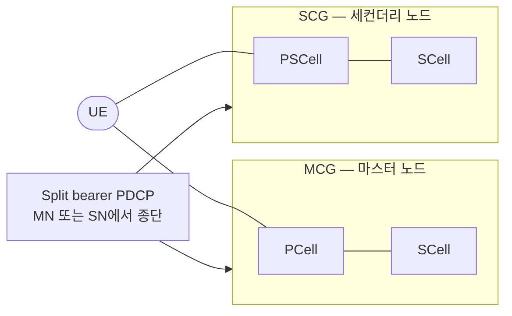

# CA와 DC (EN-DC · NR-DC)

!!! spec "스펙 · 릴리즈"
    NR CA: TS 38.300 §5.4.1, §10.4 · MR-DC 전반: TS 37.340 · SCell 활성/휴면: TS 38.321 §5.9, TS 38.213 §10.3 (dormancy) · RF 조합: TS 38.101-1/-2 §5.2A, TS 38.101-3 (EN-DC·NR-DC 조합)
    Rel-15 CA 최대 16 CC, EN-DC·NR-DC → Rel-16 SCell 휴면·비동기 NR-DC → Rel-17 **SCG 비활성화**, CPAC, SCell→PCell 교차 스케줄링 → Rel-18 **다중 셀 스케줄링 DCI**

!!! basic "한눈에 보기"
    더 넓은 대역을 쓰는 방법은 두 가지입니다.

    - **CA (Carrier Aggregation)**: **한 기지국**의 여러 캐리어를 묶음. 스케줄러가 하나라서 캐리어 간 협력이 긴밀합니다.
    - **DC (Dual Connectivity)**: **두 기지국**(마스터 MN, 세컨더리 SN)에 동시에 연결. 기지국 사이 연결(백홀)이 느려도 됩니다.

    5G NSA의 **EN-DC**는 LTE(마스터) + NR(세컨더리)의 DC입니다. SA에서는 FR1 + FR2를 묶는 **NR-DC**나, 한 기지국 안에서 FR1 + FR2 CA를 씁니다.

## CA vs DC { .l2 }

| 항목 | CA | DC |
|---|---|---|
| 기지국 | 1개 (같은 MAC) | 2개 (MAC 각각) |
| 셀 그룹 | 하나 (PCell + SCell들) | **MCG** (PCell + SCell) + **SCG** (**PSCell** + SCell) |
| 백홀 요구 | 이상적 (같은 장비) | 비이상적 허용 (수 ms) |
| 스케줄링 | 통합 가능, 교차 캐리어 | 셀 그룹별 독립 |
| PUCCH | PCell (+ PUCCH SCell, 최대 2 그룹) | MCG: PCell, SCG: PSCell |
| 데이터 분배 | MAC에서 | PDCP에서 (split bearer) |
| NR 최대 | **16 CC** (DL·UL) | MCG + SCG 합산 |

## MR-DC 유형 { .l2 }

| 이름 | MN | SN | 핵심망 | 배치 옵션 |
|---|---|---|---|---|
| **EN-DC** | LTE eNB | NR en-gNB | EPC | 3 / 3a / 3x |
| NGEN-DC | LTE ng-eNB | NR gNB | 5GC | 7 / 7a / 7x |
| NE-DC | NR gNB | LTE ng-eNB | 5GC | 4 / 4a |
| **NR-DC** | NR gNB | NR gNB | 5GC | 2 (+ DC) |

## SCell 상태 { .l2 }

| 상태 | PDCCH 감시 | CSI 보고 | 전환 |
|---|---|---|---|
| 비활성 | ✕ | ✕ | MAC CE 활성화 |
| 활성 | ✔ | ✔ | — |
| **휴면 (Rel-16)** | ✕ (휴면 BWP) | ✔ (CSI만) | DCI로 빠르게 비휴면 전환 → 빠른 복귀 |

??? expert "전문가 노트 — 단말 능력, SCG 비활성화, 다중 셀 DCI"
    **밴드 조합 능력.** 단말은 `UE-NR-Capability` / `UE-MRDC-Capability`에 밴드 조합(`BandCombinationList`)과 조합별 `featureSetCombination`(셀별 MIMO 레이어·대역폭·SCS)을 보고합니다. 조합 수가 매우 커서 망은 `UECapabilityEnquiry`의 필터(밴드 목록, 최대 CC 수)로 필요한 부분만 요청합니다.

    **EN-DC 상향 제약.** LTE와 NR 상향을 동시에 보내면 혼변조(IMD)와 전력 한계가 생겨, 단일 상향(TDM 패턴)이나 동적 전력 공유를 씁니다. → [전력 제어](../phy/power-control.md)

    **SCG 비활성화 (Rel-17).** 데이터가 없을 때 SCG를 해제하지 않고 **비활성** 상태로 두었다가 빠르게 재활성합니다. 단말은 PSCell PDCCH를 감시하지 않고 RRM·RLM만 최소로 합니다. EN-DC 단말 전력 소모를 크게 줄입니다.

    **SCell → PCell 교차 스케줄링 (Rel-17).** DSS로 LTE와 공유하는 PCell은 PDCCH 용량이 부족합니다. 그래서 NR 전용 SCell(예: n78)의 PDCCH로 PCell PDSCH/PUSCH를 스케줄합니다(sSCell).

    **다중 셀 스케줄링 (Rel-18).** DCI 0_3 / 1_3 하나로 **여러 셀의 PUSCH/PDSCH**를 동시에 스케줄해 제어 오버헤드를 줄입니다(같은 대역 다수 CC, 저대역 다수 CC 운용).

    **비동기 NR-DC.** MN·SN의 프레임 타이밍이 맞지 않아도 됩니다(Rel-16 확장). 단말은 SFN·슬롯 오프셋을 별도로 추적합니다.

## 관련 페이지

- [NSA와 SA](../architecture/nsa-sa.md)
- [PDCP](../protocol/pdcp.md) — split bearer, 복제
- [처리량 계산](../measurement/throughput.md)
- [LTE 캐리어 집성](../../lte/advanced/carrier-aggregation.md)
