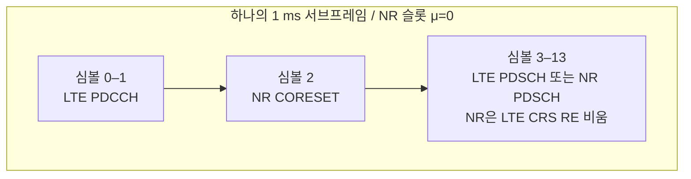

# DSS (Dynamic Spectrum Sharing)

!!! spec "스펙 · 릴리즈"
    LTE CRS 레이트 매칭: TS 38.214 §5.1.4.2, TS 38.331 `lte-CRS-ToMatchAround`, `RateMatchPatternLTE-CRS` · UL 7.5 kHz 이동: TS 38.101-1 §5.4.2 · 교차 캐리어 스케줄링 향상: TS 38.213 (Rel-17 SCell→PCell)
    Rel-15 기본 DSS → Rel-16 다중 CRS 패턴 (LTE CA·다중 셀) → Rel-17 **SCell이 PCell 스케줄링**, 겹치는 CRS 레이트 매칭 향상 → Rel-18 NR PDCCH가 LTE CRS RE와 겹치는 것 허용

!!! basic "한눈에 보기"
    새 주파수를 받기 전에 5G를 넓게 깔고 싶을 때, **이미 LTE가 쓰고 있는 주파수에 NR을 같이 얹는** 방법이 DSS입니다.

    - 같은 캐리어(예: 1.8 GHz 20 MHz)에서 **LTE와 NR이 매 ms 동적으로 자원을 나눠** 씁니다.
    - LTE 단말은 아무것도 바뀌지 않은 것처럼 동작하고, NR 단말은 **LTE의 CRS·제어 영역을 피해서** 데이터를 받습니다.
    - 저대역 FDD에 빠르게 5G 커버리지(특히 SA 앵커)를 만드는 데 많이 쓰였습니다.

    대가는 **오버헤드**입니다. LTE의 항상 켜진 CRS와 NR의 SSB·제어 채널이 겹쳐, 같은 대역을 LTE나 NR 하나만 쓸 때보다 효율이 떨어집니다.

## 공존 방식 { .l2 }

| 요소 | NR 측 처리 |
|---|---|
| **LTE CRS** | `lte-CRS-ToMatchAround`(LTE 대역폭, CRS 포트 수, v_shift, MBSFN 서브프레임)로 **레이트 매칭** — NR PDSCH가 CRS RE를 비움 |
| LTE PDCCH 영역 (심볼 0–1/2) | NR PDCCH·PDSCH를 그 뒤 심볼에 배치 (NR CORESET을 심볼 2 등에) |
| NR SSB | LTE PSS/SSS·PBCH와 겹치지 않는 위치, 또는 **LTE MBSFN 서브프레임** 안에 배치 |
| NR 부반송파 격자 | 15 kHz SCS로 LTE 격자와 정렬 |
| 상향 | 같은 15 kHz, **7.5 kHz 이동**(`frequencyShift7p5khz`)으로 LTE SC-FDMA 격자와 정렬 |
| 자원 분배 | 서브프레임마다 LTE·NR 스케줄러가 조정 (X2/내부 인터페이스, 제조사 구현) |

## 오버헤드 비교 (대략) { .l2 }

| 구성 | 데이터에 못 쓰는 자원 |
|---|---|
| LTE만 (2포트 CRS, CFI 2) | 약 25% |
| NR만 | 약 10–15% |
| **DSS** (LTE CRS + LTE 제어 + NR 제어/SSB) | 약 **30% 이상** (NR 단말 관점) |

??? expert "전문가 노트 — MBSFN 방식, PDCCH 용량, 진화"
    **MBSFN 서브프레임 방식.** LTE 셀이 일부 서브프레임을 MBSFN으로 선언하면 그 서브프레임은 앞 1–2 심볼 이후 CRS가 없습니다. NR SSB와 PDCCH를 이 서브프레임에 두면 CRS 충돌이 줄어듭니다. 대신 LTE 단말(TM9/10 제외)은 그 서브프레임을 쓸 수 없습니다.

    **NR PCell의 PDCCH 부족.** DSS 셀이 NR PCell(SA 앵커)이면 NR PDCCH가 쓸 수 있는 심볼이 LTE 제어 영역 때문에 좁아집니다. Rel-17은 다른 NR SCell(예: n78)이 **PCell의 PDSCH/PUSCH를 스케줄**하게 해서 해결했고(sSCell), Rel-18은 NR PDCCH가 LTE CRS RE와 겹치는 위치도 쓸 수 있도록 했습니다(겹치는 RE는 레이트 매칭/펑처링 규칙 적용).

    **다중 CRS 패턴 (Rel-16).** LTE가 같은 대역에서 CA나 여러 셀로 운용되면 CRS 패턴이 여러 개라서, NR이 여러 LTE 셀 CRS를 동시에 피하도록 패턴 목록을 지원합니다.

    **장기 전략.** DSS는 과도기 기술입니다. LTE 트래픽이 줄면 대역을 NR 전용으로 재배치(refarming)하는 것이 효율적입니다. LTE-M/NB-IoT는 NR 캐리어 안에 자원 예약(Rel-16)으로 계속 공존시킬 수 있습니다.

## 관련 페이지

- [리소스 그리드와 Point A](../phy/resource-grid.md)
- [LTE 참조신호](../../lte/phy/reference-signals.md) — CRS
- [CA와 DC](ca-dc.md)
- [FR1·FR2와 밴드](../spectrum/bands.md)
