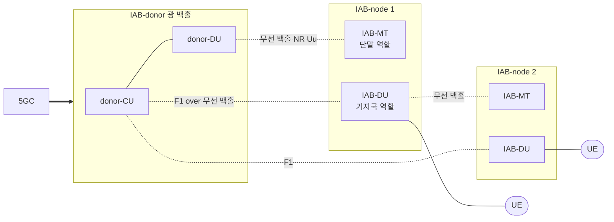

# IAB (Integrated Access and Backhaul)

!!! spec "스펙 · 릴리즈"
    구조: TS 38.300 §4.7, TS 38.401 §4 · BAP: TS 38.340 · F1 확장: TS 38.473 · 물리계층 자원: TS 38.213 §14 · 연구: TR 38.874
    Rel-16 IAB → Rel-17 eIAB (동시 송수신, 도너 간 이동) → Rel-18 **이동 IAB** (차량 탑재) · 관련: Rel-18 NCR

!!! basic "한눈에 보기"
    mmWave 기지국은 셀이 작아서 **아주 많이** 깔아야 합니다. 그런데 모든 기지국에 광케이블을 연결하기는 어렵고 비쌉니다.

    **IAB**는 기지국끼리 **무선(NR)으로 백홀**을 연결합니다. 광케이블은 일부 "도너" 기지국에만 있고, 나머지 IAB 노드는 무선으로 도너에 이어진 채 자기 셀을 서비스합니다. 여러 단계(멀티홉)로 이어 갈 수도 있습니다.

## 구조 { .l2 }

| 요소 | 역할 |
|---|---|
| **IAB-donor** | 광 백홀 연결점. donor-CU가 모든 IAB-DU를 **F1**로 제어 |
| **IAB-MT** | 상위 노드 쪽으로는 **단말처럼** 접속 (RRC, RACH, 측정) |
| **IAB-DU** | 하위 노드·단말 쪽으로는 **기지국(DU)처럼** 동작 |
| **BAP** | 백홀 적응 프로토콜 — 홉별 라우팅(BAP 주소·경로 ID), 베어러 매핑, 흐름 제어 |

## 자원 다중화 { .l2 }

IAB 노드는 대부분 **반이중**이라 같은 시간에 부모 링크와 자식 링크를 동시에 쓸 수 없습니다.

| 자원 유형 (IAB-DU 관점) | 의미 |
|---|---|
| Hard | DU가 항상 사용 가능 |
| Soft | 부모가 허용할 때만 사용 (**DCI 2_5**로 가용 지시) |
| Not Available | DU 사용 불가 (MT가 부모와 통신) |

시간 분할(TDM)이 기본이고, Rel-17에서 주파수·공간 분할 **동시 송수신**(MT Tx + DU Tx 등)을 지원해 효율을 높였습니다.

??? expert "전문가 노트 — 멀티홉, 이동성, NCR"
    **홉별 RLC.** 각 홉에 RLC가 있어 ARQ가 홉 단위로 동작합니다. 종단 간 손실은 PDCP가 donor-CU와 단말 사이에서 처리합니다. 홉이 늘수록 지연이 늘어나므로 실무는 2–3홉 이내가 일반적입니다.

    **토폴로지 적응.** 부모 링크가 끊기면 IAB-MT가 다른 부모로 이동합니다(RLF 복구, 조건부 핸드오버). Rel-17은 **도너 간 이동**(inter-donor migration, 다른 donor-CU로 이동)을 지원합니다.

    **타이밍.** IAB-DU 하향 송신 타이밍을 맞추기 위해 부모가 MAC CE로 \(T_{delta}\)를 알려 주고(Case 1 타이밍), Rel-17에서 다른 타이밍 모드도 추가되었습니다.

    **이동 IAB (Rel-18).** 버스·기차에 IAB 노드를 싣고 탑승객에게 셀을 제공합니다. 노드가 이동하며 도너를 바꿔도 탑승객 단말은 핸드오버하지 않도록(그룹 이동성) 설계합니다.

    **NCR (Network-Controlled Repeater, Rel-18).** IAB보다 단순한 **증폭·전달 중계기**지만, 기지국이 제어 링크로 빔 방향·ON/OFF·TDD 타이밍을 지시합니다. 저비용 커버리지 보강용입니다.

## 관련 페이지

- [CU/DU 분리와 O-RAN](../architecture/cu-du-oran.md)
- [NG-RAN 개요](../architecture/ng-ran.md)
- [빔 관리 개요](../beam/overview.md)
