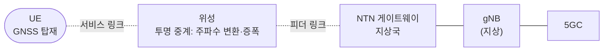

# NTN (비지상 네트워크, 위성)

!!! spec "스펙 · 릴리즈"
    개요: TS 38.300 §16.14 · 연구: TR 38.811 (채널·배치), TR 38.821 (해결책) · 물리계층 타이밍: TS 38.211 §4.3.1, TS 38.213 §4.2 (K_offset, TA) · SIB19: TS 38.331 · RF: TS 38.101-5, 38.108
    Rel-17 **NR NTN·IoT NTN** (투명 페이로드, FR1 L/S 밴드) → Rel-18 Ka 대역(FR2 이상 10 GHz), 커버리지 향상, 위치 검증, NTN–TN 이동성 → Rel-19 **재생형 페이로드**(위성 탑재 gNB), RedCap over NTN, IoT 저장 후 전달

!!! basic "한눈에 보기"
    **NTN**은 위성(또는 고고도 비행체)을 통해 5G를 제공하는 기술입니다. 바다, 사막, 산간처럼 기지국을 세우기 어려운 곳이나, 재난으로 지상망이 끊긴 곳에서 **일반 단말로 직접** 연결하는 것이 목표입니다.

    위성 통신이 어려운 이유는 세 가지입니다.

    1. **먼 거리**: 정지궤도(GEO)는 3만 6천 km → 왕복 지연이 **0.5초** 이상
    2. **빠른 이동**: 저궤도(LEO) 위성은 초속 7.5 km → 도플러가 수십 kHz
    3. **넓은 셀**: 빔 하나가 수백 km → 셀 안 단말 간 지연 차이가 큼

    NR NTN은 단말이 **GNSS로 자기 위치**를 알고, 위성이 방송하는 **궤도 정보(SIB19)**로 지연과 도플러를 **미리 보정**해서 해결합니다.

## 위성 궤도와 지연 { .l2 }

| 유형 | 고도 | 위성 속도 | 최대 왕복 지연 (UE–gNB, 투명 방식) | 최대 도플러 (2 GHz) |
|---|---|---|---|---|
| **LEO** | 600 km | 약 7.56 km/s | 약 26 ms | 약 ±48 kHz |
| LEO | 1200 km | 약 7.2 km/s | 약 41 ms | 약 ±46 kHz |
| MEO | 7000–25000 km | | 약 95–300 ms | |
| **GEO** | 35786 km | 지구와 정지 | 약 **541 ms** | 거의 0 (위성 이동 없음) |
| HAPS | 20 km 내외 | 느림 | 수 ms | 작음 |

## 구조 { .l2 }

- **투명(transparent) 페이로드** (Rel-17): 위성은 중계만, gNB는 지상
- **재생형(regenerative) 페이로드** (Rel-19): 위성에 gNB(또는 gNB-DU) 탑재 → 지연 감소, 위성 간 링크

## 바뀐 절차 { .l2 }

| 문제 | 해결 |
|---|---|
| 긴 왕복 지연 → 상향 타이밍 | 단말이 GNSS 위치 + 위성 궤도로 **TA를 스스로 계산**(사전 보정) + 공통 TA(망이 피더 링크 지연 방송) |
| 스케줄링 타이밍 | K1, K2, RAR 창 등에 **K_offset** 추가 |
| 큰 도플러 | 단말이 하향 주파수 오차를 추정하고 상향 주파수를 **사전 보정** |
| HARQ RTT가 너무 김 | **HARQ 프로세스 32개**, 프로세스별 **HARQ 피드백 비활성화** |
| RLC/PDCP 타이머 | 범위 확장 |
| 셀 이동 (LEO) | **지구 고정 셀**(위성 빔이 같은 지역을 계속 비춤) 또는 지구 이동 셀 |
| TA 영역 | 지구 위에 고정 (셀은 움직여도 TA는 고정) |
| 이동성 | 시간·위치 기반 조건부 핸드오버 (이벤트 **D1**: 거리, **T1**: 시간) |

## 밴드 (Rel-17) { .l2 }

| 밴드 | 상향 / 하향 | 위성 대역 |
|---|---|---|
| **n255** | 1626.5–1660.5 / 1525–1559 MHz | L-band |
| **n256** | 1980–2010 / 2170–2200 MHz | S-band |
| Rel-18 Ka | 27.5–30 / 17.7–20.2 GHz 등 | Ka-band (VSAT·고정 단말) |

??? expert "전문가 노트 — SIB19, 측정, IoT NTN"
    **SIB19 내용.** 서빙 위성의 **궤도력(ephemeris)**: 위치·속도 벡터(PVT) 또는 궤도 요소, 유효 시각(epoch), 유효 기간, 공통 TA 파라미터(피더 링크 지연과 변화율), K_offset, 셀 기준 위치, 이웃 위성 정보. 단말은 이 정보가 유효한 동안만 상향 송신할 수 있습니다.

    **TA 계산.** \(T_{TA} = (N_{TA} + N_{TA,UE\text{-}specific} + N_{TA,common} + N_{TA,offset}) \times T_c\). UE-specific 부분은 단말–위성 거리(서비스 링크)로, common 부분은 위성–게이트웨이(피더 링크)로 계산합니다.

    **측정과 SMTC.** 위성 이동으로 이웃 셀 SSB 도착 시간이 계속 바뀌므로, 위성별 SMTC 오프셋과 측정 갭 조정이 필요합니다. 셀 재선택에도 위치·시간 기반 조건이 쓰입니다.

    **IoT NTN (Rel-17).** NB-IoT와 eMTC를 위성으로 서비스합니다. GNSS 측정과 송신을 동시에 못 하는 저가 단말을 위해 GNSS 재측정 구간을 두고, Rel-19에서는 위성이 항상 게이트웨이와 연결되지 않는 경우를 위한 **저장 후 전달(Store & Forward)**을 다룹니다.

    **Direct-to-Device 서비스.** 상용 스마트폰을 위성과 직접 연결하는 서비스(문자·음성·저속 데이터)가 3GPP NTN 규격과 독자 방식으로 함께 확산되고 있습니다. 6G에서는 지상·비지상 통합 설계가 기본 전제입니다. → [6G 후보 기술](../../sixg/key-technologies.md)

## 관련 페이지

- [스케줄링과 HARQ](../procedures/scheduling-harq.md)
- [MAC](../protocol/mac.md) — HARQ 비활성화
- [측정 이벤트와 갭](../measurement/events-gaps.md) — D1, T1
- [3GPP 6G 일정](../../sixg/3gpp-6g-timeline.md)
