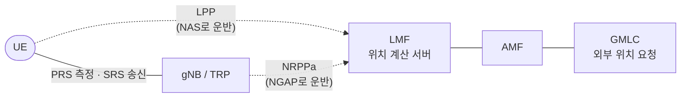

# 포지셔닝 (측위)

!!! spec "스펙 · 릴리즈"
    구조·절차: TS 38.305 (NG-RAN 측위) · 프로토콜: TS 37.355 (LPP), TS 38.455 (NRPPa) · PRS: TS 38.211 §7.4.1.7 · 측정: TS 38.215 (RSTD, UE Rx–Tx, PRS-RSRP) · 요구사항: TS 22.261 §7.3, TS 22.104
    Rel-16 NR 측위 → Rel-17 정확도·지연 향상 (IIoT, INACTIVE 측위, 무결성) → Rel-18 **반송파 위상 측위**·사이드링크 측위·RedCap 측위 → Rel-19 AI/ML 측위

!!! basic "한눈에 보기"
    GPS가 잘 안 되는 실내·도심·공장에서도 위치를 알기 위해, NR은 **기지국 신호 자체로 위치를 계산**하는 방법을 정의했습니다.

    기본 원리는 세 가지입니다.

    - **도착 시간 차이**: 여러 기지국 신호가 도착하는 시간 차로 위치 계산 (GPS와 비슷한 원리)
    - **왕복 시간**: 단말–기지국 사이 왕복 시간으로 거리 계산
    - **각도**: 빔 방향(도래각·출발각)으로 방향 계산

    NR은 대역이 넓고(정밀한 시간 측정) 빔이 있어(각도 측정) LTE보다 훨씬 정확합니다. 목표는 상용 서비스에서 수 m, 산업용에서 **수십 cm** 수준입니다.

## 측위 방식 { .l2 }

| 방식 | 측정 | 측정 주체 | 신호 |
|---|---|---|---|
| **DL-TDOA** | RSTD (기준 셀 대비 도착 시간 차) | 단말 | **PRS** |
| **UL-TDOA** | RTOA (상대 도착 시간) | gNB / TRP | **SRS** (측위용) |
| **Multi-RTT** | UE Rx–Tx 시간 + gNB Rx–Tx 시간 → 왕복 시간 | 단말 + gNB | PRS + SRS |
| **DL-AoD** | 빔별 PRS-RSRP → 출발각 추정 | 단말 | PRS |
| **UL-AoA** | 도래각 (안테나 배열) | gNB | SRS |
| E-CID | 셀 ID + RSRP, TA, AoA | 단말 / gNB | SSB, CSI-RS |
| (보조) A-GNSS, 센서, Wi-Fi, 블루투스 | | 단말 | |

## 구조 { .l2 }

| 측위 모드 | 위치 계산 |
|---|---|
| UE-assisted | 단말이 측정값 보고 → LMF가 계산 |
| UE-based | LMF가 보조 정보(TRP 좌표 등) 제공 → 단말이 계산 |
| NG-RAN node assisted | gNB가 측정 (UL 방식) |

## PRS (Positioning Reference Signal) { .l2 }

| 항목 | 값 |
|---|---|
| comb | 2, 4, 6, 12 (주파수 엇갈림 패턴으로 RE 전체 커버) |
| 심볼 | 2, 4, 6, 12 |
| 주기 | 4 – 10240 슬롯 |
| 빔 | TRP당 PRS 자원 집합 최대 2, 집합당 자원 최대 64 (빔별) |
| 대역 | FR1 최대 100 MHz, FR2 최대 400 MHz (Rel-18: 대역 집성) |
| 뮤팅 | 이웃 TRP 간섭 회피 비트맵 |
| 측정 창 | PRS 처리 창 (Rel-17 측정 갭 없이 측정) |

??? expert "전문가 노트 — 정확도 목표와 최신 기술"
    **정확도 요구 (대표).**

    | 릴리즈 | 시나리오 | 수평 정확도 (90%) | 지연 |
    |---|---|---|---|
    | Rel-16 | 상용 실내 / 실외 | < 3 m / < 10 m | < 1 s |
    | Rel-17 | 상용 | < 1 m | < 100 ms |
    | Rel-17 | IIoT | **< 0.2 m** | < 10 ms (일부 100 ms) |

    **오차 원인.** 기지국 간 시각 동기 오차(1 ns ≈ 30 cm), 다중경로·비가시선(NLOS), 송수신기 그룹 지연(TEG). Rel-17은 **TEG 보고**, NLOS·LOS 지시, 다중 경로 보고를 추가했습니다.

    **INACTIVE 측위 (Rel-17).** RRC 연결 없이 INACTIVE 상태에서 SRS 송신 및 LPP 보고(SDT 활용)로 IoT 측위 전력을 줄입니다. **on-demand PRS**로 필요할 때만 PRS를 켭니다.

    **반송파 위상 측위 (Rel-18 CPP).** 신호의 반송파 위상(파장 수 cm)을 측정해 cm 단위 정확도를 노립니다(RTK GNSS와 비슷한 원리, 정수 모호성 해결 필요). **사이드링크 측위**(SL-PRS)로 차량 간 상대 위치, **대역 집성 측위**로 해상도 향상, **LPHAP**(저전력 고정밀)도 포함됩니다.

    **AI/ML 측위 (Rel-18 연구 → Rel-19 규격).** 채널 임펄스 응답 같은 측정값을 모델에 넣어 직접 위치를 추정(direct)하거나 NLOS 판정·측정 보정(assisted)에 씁니다. 공장처럼 다중경로가 심한 곳에서 효과가 큽니다.

## 관련 페이지

- [SRS](../phy/srs.md)
- [빔 관리 개요](../beam/overview.md)
- [Sidelink와 NR V2X](sidelink.md)
- [무선 인터페이스 AI/ML](../../advanced5g/ai-ml.md)
