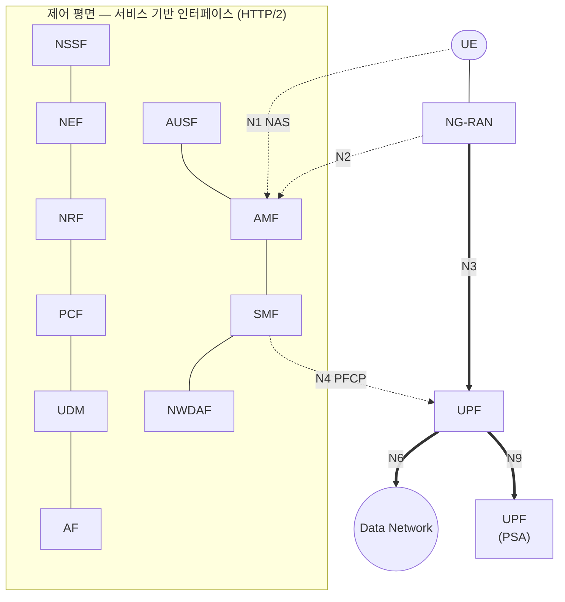
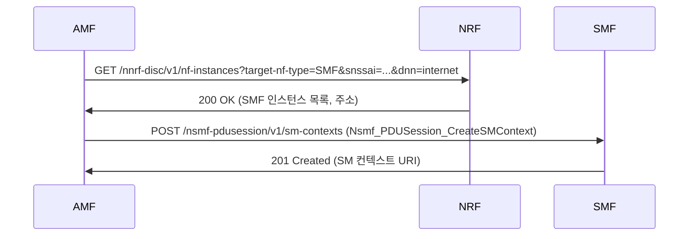

# 5GC와 SBA

!!! spec "스펙 · 릴리즈"
    5G 시스템 구조: TS 23.501 §4 (참조점·서비스 기반 표현), §6 (NF 기능) · 절차: TS 23.502 · 서비스 프레임워크: TS 29.500, 29.501 · NF별 API: TS 29.5xx (예: 29.518 Namf, 29.502 Nsmf) · 보안: TS 33.501
    Rel-15~ (Rel-16 SCP·NWDAF 확장, Rel-17 NSACF·Edge, Rel-18 AI/ML 지원)

!!! basic "한눈에 보기"
    **5GC(5G Core)**는 LTE 핵심망(EPC)과 설계 방식이 다릅니다.

    - EPC는 MME, S-GW 같은 **장비(노드)** 단위였습니다.
    - 5GC는 기능을 잘게 나눈 **NF(Network Function)** 소프트웨어들이 **웹 서비스처럼(HTTP/2 API)** 서로 호출합니다. 이를 **SBA(Service-Based Architecture)**라고 합니다.

    덕분에 클라우드 위에서 필요한 기능만 늘리고 줄일 수 있고, 새 기능을 쉽게 붙일 수 있습니다.
    또 **제어(SMF)와 데이터 처리(UPF)를 완전히 분리**해서, UPF를 사용자 가까이(엣지)에 배치할 수 있습니다.

## 서비스 기반 구조 { .l2 }

## 주요 NF { .l2 }

| NF | 이름 | 역할 | EPC 대응 |
|---|---|---|---|
| **AMF** | Access and Mobility Management Function | 등록, 연결·이동성 관리, NAS 종단·보안, 도달성 | MME (이동성 부분) |
| **SMF** | Session Management Function | PDU 세션 관리, UE IP 할당, UPF 선택·제어 | MME (세션) + S/P-GW-C |
| **UPF** | User Plane Function | 패킷 라우팅·포워딩, QoS 집행, 과금 데이터, 이동성 앵커 | S/P-GW-U |
| **AUSF** | Authentication Server Function | 5G-AKA / EAP-AKA' 인증 | HSS (일부) |
| **UDM** | Unified Data Management | 가입자 데이터, 인증 자격 생성, SUCI 복호화(SIDF) | HSS |
| UDR | Unified Data Repository | 데이터 저장소 | — |
| **PCF** | Policy Control Function | 정책 결정 (QoS, 과금, URSP) | PCRF |
| **NRF** | NF Repository Function | NF 등록·**탐색** (서비스 디렉터리) | — (DNS 대체) |
| **NSSF** | Network Slice Selection Function | 슬라이스 선택, AMF 집합 결정 | — |
| NEF | Network Exposure Function | 외부(AF)에 망 기능 노출 | SCEF |
| NWDAF | Network Data Analytics Function | 망 분석, 예측 (부하, 이동성) | — |
| SCP | Service Communication Proxy (Rel-16) | NF 간 메시지 라우팅 (서비스 메시) | — |
| SEPP | Security Edge Protection Proxy | 로밍 시 사업자 간 보안 경계 | (Diameter Edge Agent) |
| N3IWF / TNGF | 비3GPP 접속 게이트웨이 | Wi-Fi 접속 | ePDG |
| NSACF | NS Admission Control Function (Rel-17) | 슬라이스별 단말·세션 수 제한 | — |

## 참조점 { .l2 }

| 참조점 | 연결 | 프로토콜 |
|---|---|---|
| N1 | UE – AMF | NAS (24.501) |
| N2 | NG-RAN – AMF | NGAP |
| N3 | NG-RAN – UPF | GTP-U |
| N4 | SMF – UPF | **PFCP** (29.244) |
| N6 | UPF – DN | IP / 이더넷 |
| N9 | UPF – UPF | GTP-U |
| N11 | AMF – SMF | Nsmf / Namf (SBI) |
| N8 / N10 / N13 | AMF·SMF·AUSF – UDM | Nudm (SBI) |
| N7 / N15 | SMF·AMF – PCF | Npcf (SBI) |

## SBI 호출 예 { .l2 }

??? expert "전문가 노트 — SBA 구현과 진화"
    **서비스 프레임워크.** 각 NF 서비스는 OpenAPI 3.0(YAML)으로 정의되고 HTTP/2 + JSON으로 동작합니다. 요청–응답과 **구독–통지(subscribe/notify)** 두 패턴이 있으며, 통지는 소비자가 등록한 콜백 URI로 POST합니다. NF 간 보안은 TLS + OAuth 2.0(NRF가 토큰 발급)입니다.

    **간접 통신 모델 (Rel-16).** 모델 A/B(직접), 모델 C/D(SCP 경유)가 있고, 모델 D는 SCP가 탐색까지 대신합니다. 대규모 클라우드 배치에서 서비스 메시(Envoy 등)와 비슷한 역할입니다.

    **UPF 체인과 엣지.** PDU 세션은 UPF 여러 개를 거칠 수 있습니다. **ULCL(Uplink Classifier)**이나 **Branching Point**로 특정 트래픽만 로컬 UPF(MEC)로 보내고 나머지는 중앙 PSA(PDU Session Anchor)로 보냅니다. Rel-17에서 엣지 컴퓨팅 지원(TS 23.548, EASDF)이 정리되었습니다.

    **PFCP (N4).** SMF는 UPF에 **PDR**(패킷 탐지 규칙), **FAR**(포워딩), **QER**(QoS 집행), **URR**(사용량 보고), BAR(버퍼링)을 설치합니다. EPC CUPS의 Sx와 같은 프로토콜입니다.

    **EPC 연동.** SA와 LTE 공존 시 **N26**(AMF–MME) 인터페이스로 이동 중 컨텍스트를 넘깁니다. 통합 노드 SMF+PGW-C, UPF+PGW-U, UDM+HSS, PCF+PCRF가 EPS–5GS 간 IP 주소 유지와 VoNR↔VoLTE(EPS fallback)를 가능하게 합니다.

    **NWDAF와 AI.** Rel-16부터 NF·OAM 데이터를 모아 부하 예측, 단말 이동성 분석, QoS 지속성 예측 등을 제공합니다. Rel-17에서 분석·모델 학습 기능 분리(AnLF/MTLF), Rel-18에서 연합 학습 등 AI/ML 지원이 확장되었습니다.

## 관련 페이지

- [NG-RAN 개요](ng-ran.md)
- [QoS 플로우](qos-flow.md)
- [네트워크 슬라이싱](network-slicing.md)
- [등록 (Registration)](../procedures/registration.md)
- [PDU 세션](../procedures/pdu-session.md)
