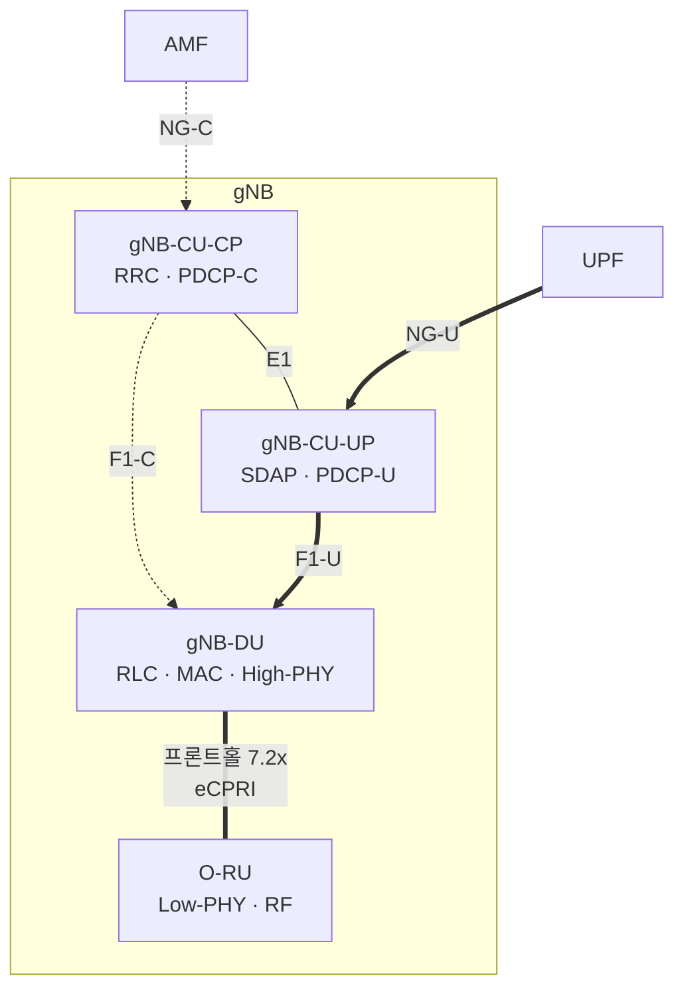
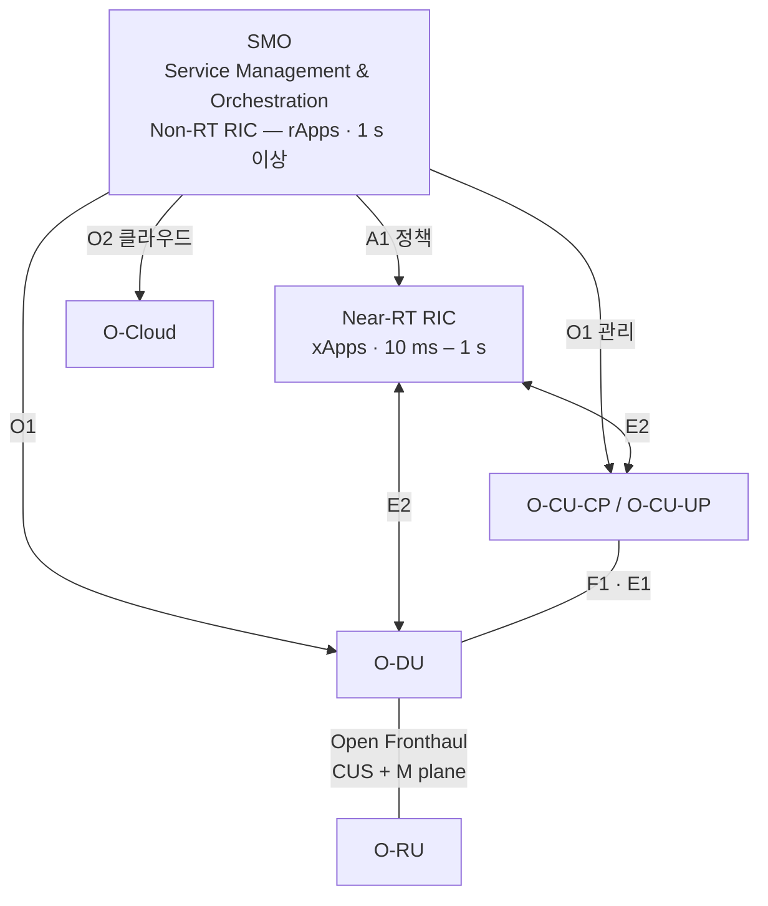

# CU/DU 분리와 O-RAN

!!! spec "스펙 · 릴리즈"
    기능 분할 연구: TR 38.801 §11 · NG-RAN 구조: TS 38.401 · F1: TS 38.470–38.475 · E1: TS 38.460–38.463 · O-RAN Alliance: WG4 (Fronthaul 7.2x), WG2/WG3 (Non-RT/Near-RT RIC), WG1 (구조)
    Rel-15 F1 (CU/DU), E1 (CU-CP/CU-UP) → Rel-16 IAB (F1 확장) → Rel-17/18 F1 기반 기능 확장

!!! basic "한눈에 보기"
    LTE 기지국은 보통 하나의 장비였습니다. 5G 기지국(gNB)은 기능을 **세 덩어리로 나눠** 서로 다른 장소에 둘 수 있습니다.

    | 장치 | 맡는 일 | 배치 위치 |
    |---|---|---|
    | **CU** (Central Unit) | RRC, PDCP, SDAP — 느려도 되는 상위 기능 | 지역 데이터센터 (클라우드) |
    | **DU** (Distributed Unit) | RLC, MAC, PHY 상위 — 빠른 처리 (스케줄링) | 국사, 기지국 근처 |
    | **RU** (Radio Unit) | PHY 하위, RF, 안테나 | 철탑, 건물 옥상 |

    CU 하나가 여러 DU를 관리할 수 있어 자원을 모아 쓰고(풀링), 핸드오버 일부를 CU 안에서 처리할 수 있습니다.
    **O-RAN**은 이 인터페이스들을 **개방**해서 서로 다른 제조사의 장비를 섞어 쓰고, **RIC**라는 지능형 컨트롤러로 망을 최적화하려는 업계 표준입니다.

## 기능 분할 옵션 (TR 38.801) { .l2 }

| 분할 | 위치 | 전송 요구 | 쓰임 |
|---|---|---|---|
| 옵션 2 | PDCP / RLC 사이 | 사용자 데이터 수준 대역폭, 지연 수 ms | **3GPP F1** (CU–DU) |
| 옵션 6 | MAC / PHY 사이 | 중간 | (Small Cell Forum FAPI) |
| 옵션 7.2x | High PHY / Low PHY 사이 (주파수 영역 IQ) | 수 Gbps–수십 Gbps, 지연 수백 µs | **O-RAN 프론트홀** (DU–RU) |
| 옵션 8 | PHY / RF 사이 (시간 영역 IQ) | 매우 큼 (안테나 수 × 샘플링률) | 전통적 CPRI |

## gNB 내부 인터페이스 { .l2 }

| 인터페이스 | 프로토콜 | 내용 |
|---|---|---|
| F1-C | F1AP / SCTP | UE 컨텍스트, RRC 메시지 전달(RRC는 CU에서 생성, DU가 무선으로 송신), 시스템 정보, 페이징 |
| F1-U | GTP-U (NR-U 확장 헤더) | 사용자 데이터 + **흐름 제어**(DL Data Delivery Status) |
| E1 | E1AP | CU-CP가 CU-UP의 베어러 컨텍스트 설정 |

## O-RAN 구조 { .l2 }

| 요소 | 역할 |
|---|---|
| **Non-RT RIC** (SMO 안) | 장기 최적화, AI 모델 학습, 정책 생성 (rApp) |
| **Near-RT RIC** | 준실시간 제어: 트래픽 조정, 부하 분산, 간섭 관리, 슬라이스 보장 (xApp) |
| E2 | RIC ↔ CU/DU. 서비스 모델(E2SM-KPM 측정, E2SM-RC 제어 등) |
| A1 | Non-RT → Near-RT 정책·ML 모델 지시 |
| Open Fronthaul | 7.2x 분할의 제어·사용자·동기·관리 평면(C/U/S/M-plane) 규격 |

??? expert "전문가 노트 — 분할 설계와 실무 쟁점"
    **CU-DU 간 RRC 처리.** RRC 메시지는 CU가 만들고 F1AP `DL RRC Message Transfer`에 담아 DU로 보냅니다. 하지만 **셀 그룹 설정(CellGroupConfig: RLC/MAC/PHY 설정)은 DU가 만들어** CU에 넘깁니다(`DU to CU RRC Information`). 그래서 F1 UE Context Setup/Modification 절차에서 CU와 DU가 설정을 주고받습니다.

    **Intra-CU 핸드오버.** 같은 CU 아래 DU 간 이동은 PDCP 앵커가 바뀌지 않으므로 보안 키 변경 없이(또는 간소화) 처리할 수 있습니다. Rel-18 **LTM**(L1/L2 Triggered Mobility)은 이 구조를 이용해 MAC CE로 셀을 바꾸는 저지연 이동성입니다.

    **7.2x Category A / B.** Cat A는 프리코딩을 O-DU에서 하고(RU 단순, 프론트홀 대역 큼), Cat B는 프리코딩을 O-RU에서 합니다(Massive MIMO에서 프론트홀 대역 절감, RU 복잡). 압축(Block Floating Point, μ-law)으로 대역을 줄입니다.

    **동기 요구.** TDD와 CA, 측위를 위해 기지국 간 ±1.5 µs(TDD) 시간 오차 이내가 필요합니다. 프론트홀은 PTP(IEEE 1588v2)와 SyncE로 시각을 분배하고 O-RAN S-plane이 구성(LLS-C1–C4)을 정의합니다.

    **vRAN / Cloud RAN.** CU와 DU를 범용 서버 위 소프트웨어(가상화)로 구현합니다. DU의 LDPC 디코딩·채널 추정 같은 L1 연산은 실시간성이 높아 가속기(FPGA, eASIC, GPU, 인라인/룩어사이드 방식)를 함께 씁니다.

    **멀티벤더 현실.** 인터페이스 규격이 열려 있어도 상호운용 시험(IOT)과 성능 튜닝 부담이 큽니다. RIC의 효과는 xApp 품질과 E2로 노출되는 데이터·제어 범위에 달려 있습니다.

## 관련 페이지

- [NG-RAN 개요](ng-ran.md)
- [IAB](../advanced/iab.md) — F1 기반 무선 백홀
- [NR 프로토콜 스택](../protocol/overview.md)
- [핸드오버 (CHO·DAPS·LTM)](../procedures/handover.md)
