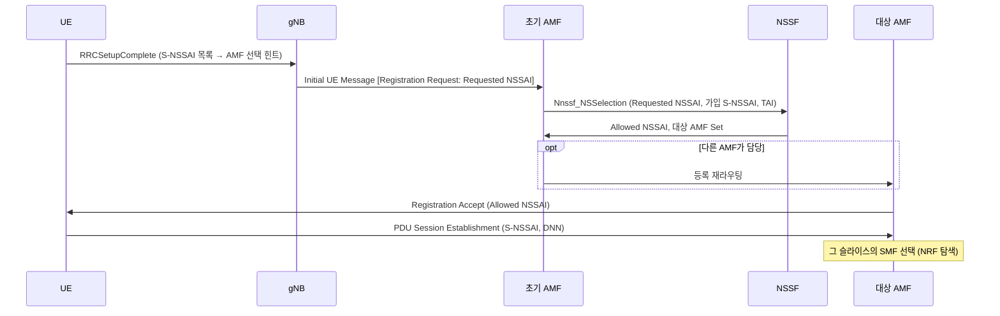

# 네트워크 슬라이싱

!!! spec "스펙 · 릴리즈"
    슬라이싱 구조: TS 23.501 §5.15 · S-NSSAI 형식: TS 23.003 §28.4 · NSSAA: TS 23.502 §4.2.9 · NSAC: TS 23.501 §5.15.11 · RAN 지원: TS 38.300 §16.3 · 관리: TS 28.530/28.541
    Rel-15 기본 → Rel-16 NSSAA → Rel-17 NSAC·RAN 슬라이스 기반 재선택/RACH → Rel-18 슬라이스 기반 이동성 향상

!!! basic "한눈에 보기"
    하나의 물리 망을 **여러 개의 가상 망(슬라이스)**으로 나눠, 용도마다 다른 특성으로 운용하는 기술입니다.

    - 스마트폰 인터넷용 슬라이스: 빠르면 됨
    - 공장 로봇용 슬라이스: 느려도 되지만 **절대 끊기면 안 되고 지연이 짧아야** 함
    - 경찰·소방용 슬라이스: 혼잡해도 **우선 보장**

    같은 기지국과 핵심망 장비를 쓰지만, 슬라이스마다 다른 핵심망 기능(SMF, UPF)과 다른 무선 자원 정책을 쓸 수 있습니다. 5G SA부터 본격적으로 쓸 수 있습니다.

## 슬라이스 식별자 { .l2 }

\[
\text{S-NSSAI} = \text{SST (8비트)} + \text{SD (24비트, 선택)}
\]

| SST | 의미 | 릴리즈 |
|---|---|---|
| 1 | eMBB | Rel-15 |
| 2 | URLLC | Rel-15 |
| 3 | MIoT (대규모 IoT) | Rel-15 |
| 4 | V2X | Rel-16 |
| 5 | HMTC (고성능 MTC) | Rel-17 |
| 6 | HDLLC (고속·저지연) | Rel-18 |
| 128–255 | 사업자 정의 | |

**SD(Slice Differentiator)**는 같은 SST 안에서 슬라이스를 구분합니다(예: 고객사별 URLLC 슬라이스).

| NSSAI 종류 | 의미 |
|---|---|
| Configured NSSAI | 단말에 미리 설정된 목록 |
| **Requested NSSAI** | 단말이 등록 시 요청 (최대 8개 S-NSSAI) |
| **Allowed NSSAI** | 망이 이 TA에서 허용한 목록 |
| Rejected NSSAI | 거부된 목록 (원인 포함) |

## 슬라이스 선택 흐름 { .l2 }

단말 안에서 어떤 앱 트래픽을 어떤 슬라이스로 보낼지는 PCF가 내려 주는 **URSP**(UE Route Selection Policy)가 정합니다. 예: "앱 X → S-NSSAI {SST 2, SD 0x000001}, DNN factory".

## 무선 구간의 슬라이싱 { .l2 }

| 기능 | 내용 |
|---|---|
| 슬라이스 인지 승인 제어 | gNB가 PDU 세션 자원 요청의 S-NSSAI를 보고 승인 결정 |
| 자원 분리·보장 | 슬라이스별 최소/최대 PRB 비율 등 — **표준이 아닌 구현** (O-RAN RRM 정책으로 지시 가능) |
| 슬라이스 기반 셀 재선택 (Rel-17) | SIB16 / 전용 시그널링으로 슬라이스 그룹별 주파수 우선순위 |
| 슬라이스별 RACH (Rel-17) | 슬라이스 그룹 전용 RACH 자원·파라미터 → 혼잡 시 우선 접속 |

??? expert "전문가 노트 — NSSAA, NSAC, 실무 쟁점"
    **NSSAA (Rel-16).** 슬라이스 단위 추가 인증입니다. 가입자 인증(5G-AKA)과 별도로, 기업 AAA 서버가 EAP로 "이 단말이 우리 슬라이스를 써도 되는가"를 판단합니다(AMF ↔ NSSAAF ↔ AAA-S).

    **NSAC (Rel-17).** 슬라이스별 최대 등록 단말 수·최대 PDU 세션 수를 NSACF가 관리합니다(SLA 기반 판매 모델).

    **슬라이스와 이동성.** Allowed NSSAI는 **TA 단위**입니다. 단말이 해당 슬라이스를 지원하지 않는 TA로 가면 그 슬라이스의 PDU 세션은 해제되거나 다른 슬라이스로 대체될 수 있습니다. Rel-17/18에서 슬라이스 대체(slice replacement), 지원 셀로의 우선 재선택이 보강되었습니다.

    **슬라이스 격리 수준.** 핵심망 NF 공유/전용, UPF 전용, 전송망(TN) 슬라이싱(FlexE, SR-TE), RAN 자원 분할 정도에 따라 격리 수준이 달라집니다. GSMA는 고객 요구를 **GST**(Generic Slice Template, NG.116) 속성으로 표현합니다.

    **관리 계층.** 3GPP 관리 규격(TS 28.530 계열)은 Network Slice → Network Slice Subnet(RAN/CN/TN) 구조로 생성·변경·모니터링을 정의합니다.

## 관련 페이지

- [5GC와 SBA](5gc-sba.md)
- [등록 (Registration)](../procedures/registration.md)
- [PDU 세션](../procedures/pdu-session.md)
- [QoS 플로우](qos-flow.md)
