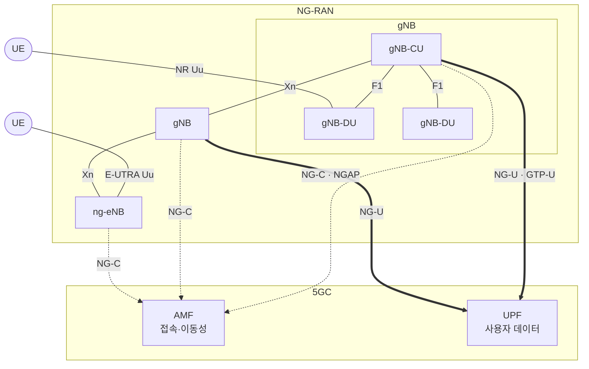

# NG-RAN 개요

!!! spec "스펙 · 릴리즈"
    NG-RAN 구조: TS 38.300 §4, TS 38.401 · NG: TS 38.410/38.413 (NGAP) · Xn: TS 38.420/38.423 (XnAP) · F1: TS 38.470/38.473 · E1: TS 38.460/38.463 · 식별자: TS 38.300 §8, TS 23.003
    Rel-15~ (Rel-16 IAB, Rel-17 NTN, Rel-18 NCR·이동 IAB)

!!! basic "한눈에 보기"
    5G의 무선 접속망을 **NG-RAN**이라고 부릅니다. NG-RAN에는 두 종류의 기지국이 있습니다.

    - **gNB**: NR 무선으로 단말과 통신하는 기지국
    - **ng-eNB**: LTE 무선을 쓰지만 **5G 핵심망(5GC)**에 연결되는 기지국

    기지국은 **NG** 인터페이스로 5GC에, **Xn** 인터페이스로 서로 연결됩니다. LTE의 S1, X2에 대응합니다.
    gNB는 내부를 **CU**(중앙 장치)와 **DU**(분산 장치)로 나눌 수 있다는 점이 LTE와 크게 다릅니다.

## 전체 구조 { .l2 }

## gNB의 기능 (TS 38.300 §4.2) { .l2 }

| 기능 | 내용 |
|---|---|
| 무선 자원 관리 | 무선 베어러 제어, 승인 제어, 연결 이동성, **동적 스케줄링** |
| 빔 관리 | SSB/CSI-RS 빔 운용, 빔 측정·보고 처리 |
| IP·이더넷 헤더 압축, 암호화, 무결성 | PDCP (NR은 **DRB 무결성 보호**도 지원) |
| AMF 선택 | 단말이 준 정보로 AMF 결정 (NAS는 보지 않음) |
| 사용자 데이터 라우팅 | QoS 플로우 → DRB 매핑 (SDAP) |
| 이중 연결 | MN / SN 역할 |
| 기타 | 페이징 전송, SI 방송, RAN 페이징(INACTIVE), 측정 설정, 네트워크 슬라이싱 지원 |

## 인터페이스 { .l2 }

| 인터페이스 | 연결 | 제어 | 사용자 | LTE 대응 |
|---|---|---|---|---|
| **NG-C (N2)** | gNB – AMF | NGAP / SCTP | — | S1-MME |
| **NG-U (N3)** | gNB – UPF | — | GTP-U / UDP | S1-U |
| **Xn-C / Xn-U** | gNB – gNB, gNB – ng-eNB | XnAP / SCTP | GTP-U | X2 |
| **F1-C / F1-U** | gNB-CU – gNB-DU | F1AP / SCTP | GTP-U | (없음) |
| **E1** | gNB-CU-CP – gNB-CU-UP | E1AP | — | (없음) |
| X2 | en-gNB – eNB (EN-DC) | X2AP | GTP-U | X2 |

## 주요 식별자 { .l2 }

| 식별자 | 구성 | 길이 | 용도 |
|---|---|---|---|
| **PCI** | 3 × N_ID(1) + N_ID(2) | 0–1007 | 물리 셀 ID |
| **NCI** (NR Cell Identity) | gNB ID (22–32비트) + 셀 ID | 36비트 | 전역 셀 ID의 일부 |
| NCGI | PLMN + NCI | | 전역 셀 ID |
| **TAC** | | **24비트** (LTE 16비트) | Tracking Area |
| **5G-GUTI** | GUAMI + 5G-TMSI | | 임시 단말 ID (NAS) |
| GUAMI | PLMN + AMF Region ID(8) + AMF Set ID(10) + AMF Pointer(6) | | AMF 식별 |
| **5G-S-TMSI** | AMF Set ID + AMF Pointer + 5G-TMSI(32) | 48비트 | 페이징, RRC 연결 |
| **SUPI / SUCI** | IMSI 등 / 암호화된 SUPI | | 영구 ID / 무선 전송용 |
| C-RNTI, TC-RNTI | | 16비트 | 셀 내 단말 ID |
| **I-RNTI** | full 40비트 / short 24비트 | | RRC_INACTIVE 단말 ID |
| RNA | 셀 목록 또는 RAN Area Code 목록 | | INACTIVE 단말의 RAN 위치 단위 |

??? expert "전문가 노트 — 배치 형태와 실무 포인트"
    **gNB ID 길이 선택.** NCI 36비트 중 gNB ID를 22–32비트로 사업자가 정합니다. gNB ID를 길게 잡으면 gNB 수는 많아지지만 gNB당 셀 수(나머지 비트)가 줄어듭니다. 예: 24비트 gNB ID → gNB당 최대 4096셀.

    **en-gNB와 gNB.** EN-DC의 NR 기지국(en-gNB)은 5GC에 연결되지 않고 X2로 eNB, S1-U로 S-GW에 연결됩니다. 같은 장비가 소프트웨어로 SA gNB 역할도 겸하는 경우가 많습니다.

    **NG Setup / Xn Setup.** gNB 기동 시 NG Setup으로 지원 TA·PLMN·S-NSSAI 목록을 AMF에 알리고, Xn Setup으로 이웃 gNB와 서빙 셀 정보(NR-ARFCN, PCI, SSB 정보, TAC)를 교환합니다. ANR이 Xn 자동 구성까지 연결합니다.

    **Rel-16 이후 노드 확장.**
    - **IAB** (Rel-16): 무선 백홀 중계 노드. IAB-node 내부에 DU와 MT(단말 기능)가 있고 IAB-donor-CU가 F1으로 제어 → [IAB](../advanced/iab.md)
    - **NTN** (Rel-17): 위성에 gNB 또는 투명 중계기 → [NTN](../advanced/ntn.md)
    - **NCR** (Rel-18 Network-Controlled Repeater): 기지국이 빔·ON/OFF를 제어하는 지능형 중계기
    - **Mobile IAB** (Rel-18): 버스·기차 등 이동체 위의 IAB 노드

## 관련 페이지

- [5GC와 SBA](5gc-sba.md)
- [CU/DU 분리와 O-RAN](cu-du-oran.md)
- [NSA와 SA](nsa-sa.md)
- [LTE E-UTRAN과 EPC](../../lte/architecture/overview.md)
