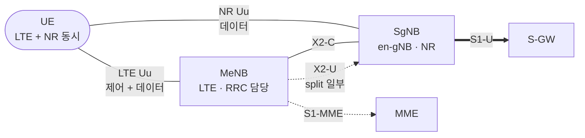
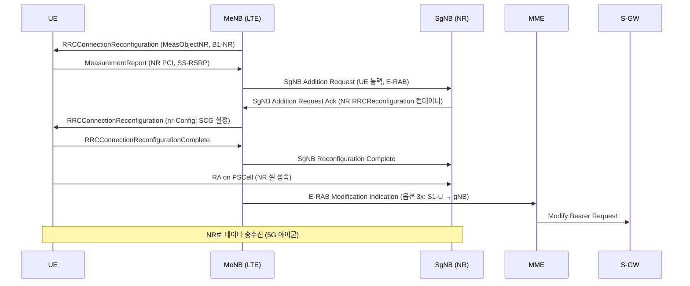

# NSA와 SA

!!! spec "스펙 · 릴리즈"
    Multi-RAT DC: TS 37.340 (EN-DC, NGEN-DC, NE-DC, NR-DC) · 배치 옵션 연구: TR 38.801 · EN-DC RRC: TS 36.331 + 38.331 (`nr-SecondaryCellGroupConfig`) · X2AP EN-DC: TS 36.423 · 5GS–EPS 연동: TS 23.501 §5.17
    Rel-15 early drop(2017-12): Option 3 → main(2018-06): Option 2 → late drop(2019-03): Option 4, 7, NR-DC

!!! basic "한눈에 보기"
    5G 상용화 초기에는 5G 핵심망도, 5G 커버리지도 부족했습니다. 그래서 두 가지 방식이 생겼습니다.

    - **NSA (Non-Standalone)**: **LTE에 5G를 덧붙이는** 방식. 단말은 LTE로 접속·제어하고, 데이터만 5G로 추가로 받습니다. 핵심망은 LTE용 EPC를 그대로 씁니다. → 빠르게 상용화 (2019년 한국·미국 초기 5G)
    - **SA (Standalone)**: **5G만으로** 동작. 5G 기지국 + 5G 핵심망(5GC). 슬라이싱, 초저지연 같은 5G 고유 기능은 SA에서만 제대로 됩니다.

    스마트폰의 "5G" 표시가 NSA인지 SA인지에 따라 실제로 쓰는 기술이 꽤 다릅니다.

## 배치 옵션 { .l2 }

| 옵션 | 핵심망 | 마스터 (제어) | 세컨더리 | 3GPP 이름 | 비고 |
|---|---|---|---|---|---|
| 1 | EPC | LTE | — | (LTE) | 기존 4G |
| **2** | **5GC** | **NR** | — | **SA** (NR-DC 가능) | 목표 구조 |
| **3 / 3a / 3x** | EPC | LTE eNB | NR en-gNB | **EN-DC** | 가장 널리 쓰인 NSA |
| 4 / 4a | 5GC | NR gNB | LTE ng-eNB | NE-DC | 드묾 |
| 5 | 5GC | LTE ng-eNB | — | (eLTE) | |
| 7 / 7a / 7x | 5GC | LTE ng-eNB | NR gNB | NGEN-DC | |

옵션 3 변형은 사용자 데이터 경로 차이입니다.

| | 3 | 3a | **3x** |
|---|---|---|---|
| S1-U 종단 | eNB | eNB + en-gNB (베어러별) | **en-gNB** |
| 분기 (split) | eNB PDCP에서 | 없음 (베어러 단위) | **en-gNB PDCP에서** (LTE로도 일부 전송) |
| 장점 | — | 단순 | LTE eNB 처리 부담 적음, NR 고속 처리 |

## EN-DC 구조 (옵션 3x) { .l2 }

## SgNB 추가 절차 { .l2 }

## NSA vs SA 비교 { .l2 }

| 항목 | NSA (EN-DC) | SA |
|---|---|---|
| 핵심망 | EPC | **5GC** |
| 초기 접속·이동성 제어 | LTE | NR |
| 음성 | VoLTE | **VoNR** 또는 EPS Fallback |
| 상향 커버리지 | LTE 상향 활용 가능 | NR 상향만 (FDD 저대역, SUL로 보완) |
| 지연 | LTE 제어 경유 → 상대적으로 김 | 짧음 |
| 슬라이싱, URLLC, RedCap, INACTIVE | 제한적 / 불가 | **가능** |
| 단말 전력 | LTE + NR 두 개 송수신 | NR만 → 일반적으로 유리 |
| NR 셀 SIB | 방송 안 해도 됨 (전용 RRC로 전달) | SSB, SIB1 필수 |

??? expert "전문가 노트 — 베어러 유형, 5G 표시, 진화"
    **MR-DC 베어러 유형 (TS 37.340).**
    - MN-terminated / SN-terminated × MCG / SCG / split 베어러 조합
    - EN-DC에서도 **NR PDCP**를 쓰는 베어러가 있어서, LTE 단말 측 PDCP가 NR PDCP(38.323)로 바뀌기도 합니다(MCG 베어러도 NR PDCP 가능)
    - **SRB3**: SN이 단말에 직접 RRC 메시지(SN RRC)를 보내는 SRB. SCG 측정 설정 등을 MN을 거치지 않고 처리

    **SCG 실패.** NR 쪽 무선 링크 실패(SCG RLF)는 MN 연결을 끊지 않습니다. 단말이 `SCGFailureInformationNR`을 MN에 보내고 MN이 SN을 해제/변경합니다. Rel-16 **fast MCG recovery**는 반대로 MCG 실패를 SCG 경유로 복구합니다.

    **5G 아이콘.** LTE SIB2의 `upperLayerIndication-r15`와 단말 정책(NR 셀 측정 여부, EN-DC 연결 여부)에 따라 표시됩니다. 실제 NR로 데이터를 받지 않아도 "5G"가 표시될 수 있는 이유입니다(GSMA가 권고한 Config A–D 방식 중 사업자 선택).

    **NR-DC (Rel-15 late drop).** 5GC 기반으로 NR 캐리어 두 그룹(예: FR1 MCG + FR2 SCG)을 이중 연결합니다. FR1 앵커 + mmWave 용량 구조의 SA 버전입니다.

    **NSA → SA 전환 중 고려사항.** 상향 커버리지(3.5 GHz TDD 상향 한계 → FDD NR 또는 SUL, LTE-NR CA 없는 구조), VoNR 성숙도, 5GC·N26 연동, 단말의 SA 지원 밴드 조합. Rel-16 이후 기능(URLLC, NR-U 단독, RedCap)은 대부분 SA 전제입니다.

## 관련 페이지

- [CA와 DC (EN-DC·NR-DC)](../advanced/ca-dc.md)
- [LTE 캐리어 집성](../../lte/advanced/carrier-aggregation.md) — LTE DC
- [LTE 측정 이벤트](../../lte/measurement/events.md) — B1-NR
- [5GC와 SBA](5gc-sba.md)
