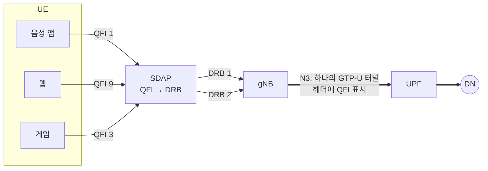

# QoS 플로우

!!! spec "스펙 · 릴리즈"
    5G QoS 모델: TS 23.501 §5.7 (5QI 표: Table 5.7.4-1) · SDAP: TS 37.324 · 정책: TS 23.503 · NG-RAN QoS: TS 38.300 §12
    Rel-15~ (Rel-16 TSN·Delay-critical 5QI 확장, Rel-17 PDU Set 준비, Rel-18 XR용 PDU Set QoS)

!!! basic "한눈에 보기"
    LTE는 품질이 다른 서비스마다 **베어러**라는 통로를 따로 만들었습니다. 5G에서는 하나의 **PDU 세션**(통로) 안에서 패킷마다 **QoS 플로우** 꼬리표(QFI)를 붙여 구분합니다.

    - 통로를 새로 만들지 않고 꼬리표만 바꾸면 되므로 더 유연하고 빠릅니다.
    - 기지국은 QoS 플로우들을 무선 구간의 **DRB**로 묶어서 보냅니다. 이 매핑을 **SDAP** 계층이 합니다.
    - 품질 등급 번호는 **5QI**입니다(LTE의 QCI에 해당).

## LTE 베어러와 비교 { .l2 }

| 항목 | LTE (EPS) | 5G (5GS) |
|---|---|---|
| QoS 단위 | EPS 베어러 | **QoS 플로우** (QFI, 6비트) |
| 핵심망 터널 | 베어러마다 GTP-U 터널 | **PDU 세션마다 하나** (패킷에 QFI 표시) |
| 무선 매핑 | 베어러 = DRB (1:1) | QoS 플로우 → DRB (N:1, gNB가 결정) |
| 등급 | QCI | **5QI** |
| 패킷 분류 | TFT | **QoS 규칙**(UE), **PDR**(UPF) |
| 기본 통로 | 기본 베어러 | **기본 QoS 규칙** (match-all) |

## QoS 파라미터 { .l2 }

| 파라미터 | 적용 | 의미 |
|---|---|---|
| **5QI** | 플로우 | 자원 유형, 우선순위, 지연 예산(PDB), 오류율(PER), 평균 창, MDBV |
| **ARP** | 플로우 | 생성·선점 우선순위 |
| **GFBR / MFBR** | GBR 플로우 | 보장 / 최대 비트레이트 |
| **Session-AMBR** | PDU 세션 | non-GBR 플로우 합 최대 (UPF·UE 집행) |
| **UE-AMBR** | 단말 | 모든 세션 non-GBR 합 최대 (gNB 집행) |
| RQA / RQI | 플로우 | **Reflective QoS** — 단말이 하향 패킷을 보고 상향 QoS 규칙을 자동 생성 |

## 표준 5QI (주요 값) { .l2 }

| 5QI | 자원 유형 | 우선순위 | PDB | PER | 서비스 예 |
|---|---|---|---|---|---|
| 1 | GBR | 20 | 100 ms | 10⁻² | 음성 (VoNR) |
| 2 | GBR | 40 | 150 ms | 10⁻³ | 영상통화 |
| 3 | GBR | 30 | 50 ms | 10⁻³ | 실시간 게임, V2X |
| 4 | GBR | 50 | 300 ms | 10⁻⁶ | 버퍼링 스트리밍 |
| 65 | GBR | 7 | 75 ms | 10⁻² | MC-PTT 음성 |
| 5 | Non-GBR | 10 | 100 ms | 10⁻⁶ | **IMS 시그널링** |
| 6 | Non-GBR | 60 | 300 ms | 10⁻⁶ | 영상(버퍼링), TCP |
| 7 | Non-GBR | 70 | 100 ms | 10⁻³ | 라이브 음성·영상, 대화형 게임 |
| 8 / 9 | Non-GBR | 80 / 90 | 300 ms | 10⁻⁶ | TCP 서비스, **기본** |
| 79 | Non-GBR | 65 | 50 ms | 10⁻² | V2X 메시지 |
| 80 | Non-GBR | 68 | 10 ms | 10⁻⁶ | 저지연 eMBB, AR |
| 82 | **Delay-critical GBR** | 19 | 10 ms | 10⁻⁴ | 이산 자동화 (MDBV 255 B) |
| 83 | Delay-critical GBR | 22 | 10 ms | 10⁻⁴ | 이산 자동화 (MDBV 1354 B) |
| 84 | Delay-critical GBR | 24 | 30 ms | 10⁻⁵ | 지능형 교통 |
| 85 | Delay-critical GBR | 21 | 5 ms | 10⁻⁵ | 전력망 원격 제어 |

LTE QCI와 달리 우선순위 숫자 체계가 넓어졌습니다(QCI 1의 우선순위 2 ↔ 5QI 1의 우선순위 20). 숫자가 작을수록 높은 우선순위인 점은 같습니다.

??? expert "전문가 노트 — SDAP, Reflective QoS, Delay-critical"
    **SDAP 헤더.** DL 헤더: RDI(Reflective QoS to DRB mapping Indication), RQI, QFI(6비트). UL 헤더: D/C, R, QFI. 헤더는 DRB별로 켜고 끌 수 있습니다(`sdap-HeaderDL/UL`). 기본 DRB(`defaultDRB`)는 매핑 규칙이 없는 플로우를 받습니다.

    **Reflective QoS 동작.** UPF가 하향 패킷 N3 헤더에 RQI를 표시 → gNB가 SDAP 헤더 RQI=1 → 단말 NAS가 그 패킷의 5-tuple을 뒤집어 상향 QoS 규칙(유효 타이머 RQ timer)을 만듭니다. 플로우마다 망이 명시적 규칙을 내려보내지 않아도 되어 시그널링이 줄어듭니다. 무선 구간에서는 RDI로 DRB 매핑도 반사할 수 있습니다.

    **Delay-critical GBR.** 지연 예산을 넘긴 패킷은 손실로 계산됩니다. **MDBV(최대 데이터 버스트 크기)**가 함께 정의되어, 그 크기 이하 버스트를 PDB 안에 보내는 것이 보장 목표입니다. PDB는 UE–UPF(PSA) 구간 전체이며, 핵심망 구간 지연(CN PDB, 예: 1 ms 또는 5 ms 이상)을 빼고 무선 구간 예산을 계산합니다.

    **QoS 통지 제어.** GBR 플로우에 Notification Control이 켜져 있으면 gNB가 GFBR을 더 이상 보장할 수 없을 때 SMF에 알리고, 응용은 대체 QoS 프로파일(Rel-16 Alternative QoS)로 전환할 수 있습니다.

    **XR과 PDU Set (Rel-18).** 영상 프레임처럼 "여러 패킷이 모두 와야 의미 있는" 단위를 **PDU Set**으로 정의하고, PDU Set 지연 예산·오류율, 중요도에 따른 폐기를 QoS에 포함했습니다. → [XR과 저지연 서비스](../../advanced5g/xr.md)

## 관련 페이지

- [PDU 세션](../procedures/pdu-session.md)
- [NR 프로토콜 개요와 SDAP](../protocol/overview.md)
- [LTE 베어러와 QoS](../../lte/architecture/bearer-qos.md)
- [URLLC](../advanced/urllc.md)
