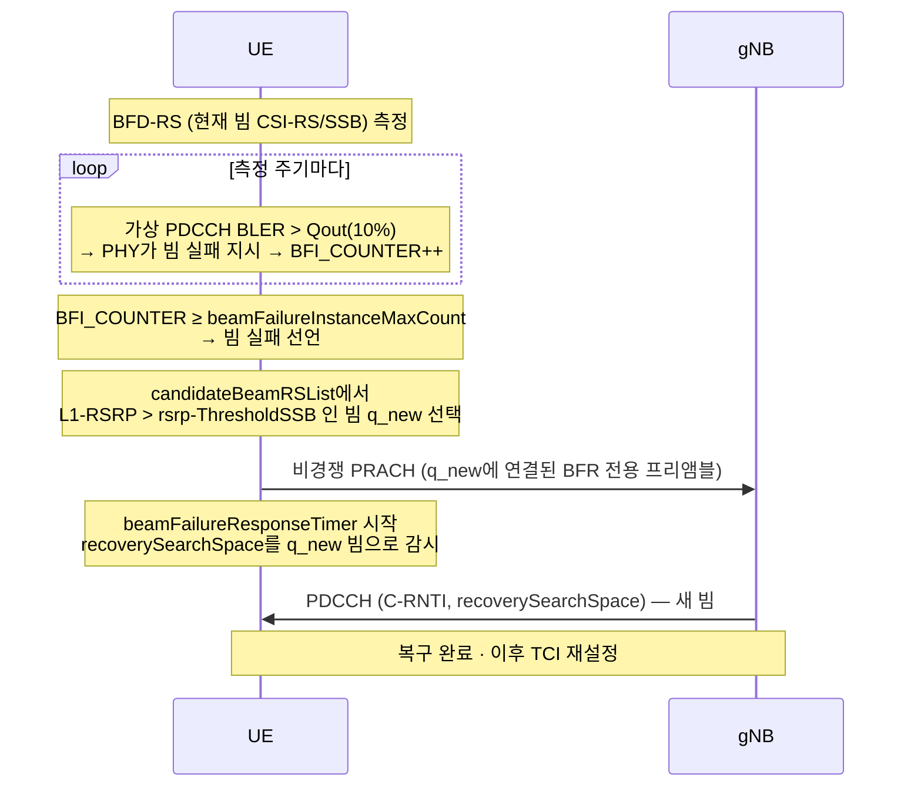
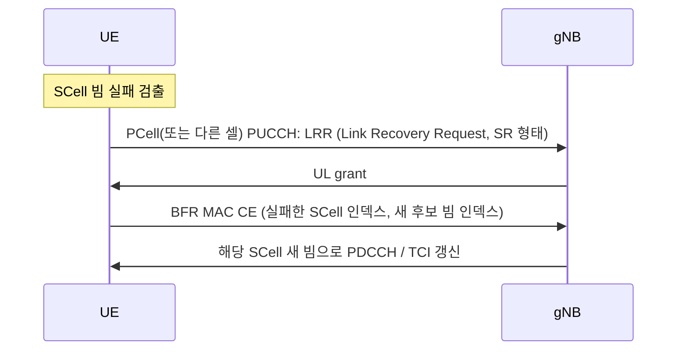

# 빔 실패 복구 (BFR)

!!! spec "스펙 · 릴리즈"
    물리계층: TS 38.213 §6 (링크 복구 절차) · MAC: TS 38.321 §5.17 (빔 실패 검출·복구), §6.1.3.23 (BFR MAC CE) · 요구사항: TS 38.133 §8.5 · RRC `RadioLinkMonitoringConfig`, `BeamFailureRecoveryConfig`
    Rel-15 PCell/PSCell BFR (RA 기반) → Rel-16 **SCell BFR** (MAC CE) → Rel-17 TRP별 BFR → Rel-18 통합 TCI 연동

!!! basic "한눈에 보기"
    좁은 빔으로 통신하다 보면 사람이 지나가거나 단말이 돌아가서 빔이 갑자기 막힐 수 있습니다. 이걸 무선 링크 실패(RLF)로 처리하면 연결을 다시 맺느라 **수백 ms ~ 수 초**가 걸립니다.

    **BFR (Beam Failure Recovery)**은 "빔만 바꾸면 되는" 상황을 MAC·PHY 수준에서 **수십 ms 안에** 복구합니다.

    1. **감지**: 지금 빔의 기준신호 품질이 계속 나쁨
    2. **새 빔 찾기**: 후보 빔(SSB/CSI-RS) 중 충분히 좋은 것 선택
    3. **요청**: 새 빔에 연결된 전용 RACH 자원으로 "이 빔으로 바꿔 주세요" 전송
    4. **응답**: 기지국이 새 빔으로 PDCCH를 보내면 복구 완료

## 절차 { .l2 }

후보 빔이 없거나 응답이 없으면 **경쟁 기반 RA**로 재시도하고, 그래도 실패하면 RLF → RRC 재수립으로 넘어갑니다.

## 주요 파라미터 { .l2 }

| 파라미터 | 의미 |
|---|---|
| `failureDetectionResources` | 감시할 BFD-RS (없으면 활성 CORESET들의 TCI가 가리키는 RS, 최대 2개) |
| `beamFailureInstanceMaxCount` | 실패 선언까지 필요한 지시 수 (1–10) |
| `beamFailureDetectionTimer` | 지시가 없으면 카운터 리셋 (BFD-RS 주기 단위) |
| `candidateBeamRSList` | 후보 빔 RS와 연결된 RACH 자원 (최대 16개) |
| `rsrp-ThresholdSSB` | 후보로 인정할 최소 L1-RSRP |
| `recoverySearchSpaceId` | 응답 PDCCH 감시 SS |
| `beamFailureRecoveryTimer` | 비경쟁 BFR 자원 사용 제한 시간 |

## SCell BFR (Rel-16) { .l2 }

FR2 SCell은 RACH 자원이 없는 경우가 많아서, 다른 방식을 씁니다.

??? expert "전문가 노트 — RLM과의 관계, 타이밍"
    **RLM vs BFD.** 둘 다 가상 PDCCH BLER(Qout 10%, Qin 2%)로 판정하지만, RLM은 셀 수준(RLF로 이어짐), BFD는 빔 수준입니다. 감시 RS가 같을 수도 있습니다. BFR 진행 중에도 RLM의 T310은 따로 동작하므로, BFR이 빨리 끝나면 RLF를 피할 수 있습니다.

    **응답 시점.** 단말은 BFR 프리앰블 송신 후 4 슬롯부터 `recoverySearchSpace`를 감시합니다. 응답 PDCCH를 받은 뒤 28 심볼 이후부터 PUCCH 공간 관계를 q_new로 바꾸고, 새 TCI가 설정될 때까지 PDCCH/PDSCH도 q_new와 QCL이라고 가정합니다.

    **TRP별 BFR (Rel-17).** Multi-TRP에서 한 TRP 빔만 실패한 경우 그 TRP의 BFD-RS 집합만 판정하고, BFR MAC CE에 TRP 인덱스를 포함해 나머지 TRP 연결은 유지합니다.

    **실무 튜닝.** BFD-RS 주기·카운터를 너무 민감하게 잡으면 일시적 차단에도 BFR이 자주 일어나 RACH 부하가 늘고, 너무 둔하면 RLF로 넘어갑니다. 손·몸 차단(수백 ms 지속)이 흔한 FR2에서는 후보 빔 목록을 넉넉하게 설정하는 것이 유리합니다.

## 관련 페이지

- [빔 관리 개요](overview.md)
- [TCI와 QCL](tci-qcl.md)
- [랜덤 액세스 (4-step·2-step)](../procedures/random-access.md)
- [RRC 상태와 INACTIVE](../procedures/rrc-states.md)
