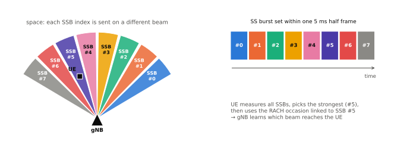
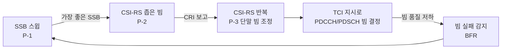

# 빔 관리 개요

!!! spec "스펙 · 릴리즈"
    빔 관리 개요: TS 38.300 §9.2.8 (빔 실패), TR 38.802 §6.1.6 (P-1/P-2/P-3 연구) · 빔 보고: TS 38.214 §5.2.1.4 (L1-RSRP/SINR), TS 38.215 §5.1.1 · 빔 지시: TS 38.214 §5.1.5 (TCI) · 빔 실패 복구: TS 38.213 §6, TS 38.321 §5.17
    Rel-15 기본 → Rel-16 L1-SINR·SCell BFR → Rel-17 통합 TCI·multi-TRP 빔 → Rel-18 AI/ML 빔 예측 연구 → Rel-19 AI/ML 빔 관리 규격화

!!! basic "한눈에 보기"
    mmWave(FR2)는 전파 손실이 커서 **좁고 강한 빔**으로만 통신할 수 있습니다. 빔이 좁으면 단말이 조금만 움직이거나 손으로 가려도 빔이 어긋납니다. 그래서 NR은 빔을 다루는 절차를 처음부터 넣었습니다.

    1. **빔 찾기**: 기지국이 여러 방향으로 SSB를 보내고(스윕), 단말이 가장 좋은 것을 고름
    2. **빔 다듬기**: 고른 방향 근처에서 더 좁은 CSI-RS 빔으로 정밀 조정
    3. **빔 알려주기**: "다음 데이터는 이 빔으로 보낸다"를 단말에게 지시(TCI)
    4. **빔 잃었을 때 복구**: 빔이 끊기면 단말이 새 빔을 찾아 빠르게 알림(BFR)

    FR1에서도 Massive MIMO 기지국은 같은 절차로 빔을 운용합니다.

## 세 단계 빔 관리 (P-1 / P-2 / P-3) { .l2 }

<figure markdown>

<figcaption>P-1: 기지국은 SSB를 빔마다 다른 방향으로 보내고 단말은 가장 강한 SSB를 고릅니다.</figcaption>
</figure>

| 단계 | 기지국 빔 | 단말 빔 | 사용 신호 | 단말 보고 |
|---|---|---|---|---|
| **P-1** | 넓은 빔 스윕 | 수신 빔 스윕 | SSB (또는 CSI-RS) | 접속 시 RACH 자원, 연결 후 SSB 인덱스 + L1-RSRP |
| **P-2** | 고른 방향 근처 **좁은 빔 스윕** | 고정 | CSI-RS 자원 집합 (`repetition` off) | **CRI + L1-RSRP** |
| **P-3** | **고정** (같은 빔 반복) | 수신 빔 스윕 | CSI-RS 자원 집합 (`repetition` **on**) | 보고 없음 (단말 내부 학습) |

## 빔 보고 { .l2 }

| 항목 | 값 |
|---|---|
| 보고 내용 | 자원 인덱스(SSBRI 또는 CRI) + L1-RSRP (Rel-16: L1-SINR) |
| 보고 빔 수 | 1 – 4 (`nrofReportedRS`) |
| 첫 빔 L1-RSRP | 7비트, −140 ~ −44 dBm, 1 dB 단위 |
| 나머지 빔 | 첫 빔 대비 **차분 4비트, 2 dB 단위** |
| 그룹 보고 | `groupBasedBeamReporting`: 동시에 받을 수 있는 2개 빔 보고 (다중 패널 단말) |
| 보고 채널 | 주기 PUCCH, 반지속 PUCCH/PUSCH, 비주기 PUSCH |

## 빔 대응성 (Beam Correspondence) { .l2 }

단말이 **하향 수신에 좋은 빔으로 상향 송신도 좋다**고 가정할 수 있는 능력입니다(TS 38.101-2 요구사항). 대응성이 있으면 하향 빔 측정만으로 상향 빔을 정할 수 있고, 없으면 SRS 빔 스윕(`usage = beamManagement`)이 필요합니다.

??? expert "전문가 노트 — 빔 관리 실무와 진화"
    **아날로그 빔의 제약.** FR2 단말은 패널당 한 시점에 한 방향만 받을 수 있습니다. 그래서 같은 심볼에 서로 다른 QCL-D(수신 빔)를 요구하는 신호가 겹치면 단말은 우선순위 규칙(CORESET 우선 등)에 따라 하나를 고릅니다. 기지국 스케줄러가 이 제약을 지켜야 합니다.

    **측정 주기와 오버헤드.** SSB 64개 × 20 ms 주기는 FR2 120 kHz에서 하프 프레임의 상당 부분을 차지합니다. 실제 망은 SSB 수를 줄이고(예: 8–16개), CSI-RS로 세밀화하는 계층형 설계를 씁니다.

    **빔 지시 지연.** Rel-15에서 PDSCH 빔 변경은 RRC(최대 128 TCI) → MAC CE(8개 활성) → DCI(3비트) 경로라서, 새 빔을 쓰려면 MAC CE 처리 시간(약 3 ms + HARQ)이 필요했습니다. Rel-17 **통합 TCI**는 DCI만으로 DL/UL 공통 빔을 바꿔 지연을 줄였습니다. → [TCI와 QCL](tci-qcl.md)

    **L1/L3 이동성.** 빔 변경은 L1(같은 셀), 셀 변경은 L3 핸드오버였습니다. Rel-17 inter-cell beam management(다른 PCI의 SSB를 TCI로 사용), Rel-18 **LTM**으로 셀 변경까지 L1/L2로 처리하는 방향으로 발전했습니다.

    **AI/ML 빔 관리 (Rel-18 연구 → Rel-19 규격).** 일부 빔만 측정해 나머지 빔의 품질을 **공간 예측**(BM-Case 1)하거나, 과거 측정으로 미래 빔을 **시간 예측**(BM-Case 2)합니다. 측정·보고 오버헤드와 지연을 크게 줄일 수 있습니다. → [무선 인터페이스 AI/ML](../../advanced5g/ai-ml.md)

## 관련 페이지

- [TCI와 QCL](tci-qcl.md)
- [빔 실패 복구](bfr.md)
- [SSB 구조](../phy/ssb.md)
- [CSI-RS와 CSI 보고](../phy/csi-rs.md)
- [빔포밍 기초](../../basics/beamforming.md)
