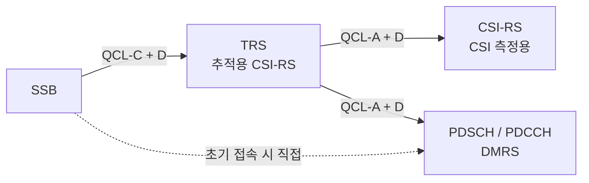

# TCI와 QCL

!!! spec "스펙 · 릴리즈"
    QCL·TCI 정의: TS 38.214 §5.1.5 · PDCCH TCI: TS 38.213 §10.1 · MAC CE (TCI 활성화/지시): TS 38.321 §6.1.3.14–15 · 통합 TCI: TS 38.214 §5.1.5 (Rel-17), TS 38.331 `TCI-State`, `TCI-UL-State`
    Rel-15 (QCL Type A–D) → Rel-16 (multi-TRP 2-TCI) → Rel-17 (**통합 TCI**: joint / separate DL·UL) → Rel-18 (multi-TRP 통합 TCI)

!!! basic "한눈에 보기"
    단말이 데이터를 잘 받으려면 "이 데이터가 **어떤 빔으로, 어떤 채널 특성으로** 올지" 미리 알아야 합니다.

    - **QCL (Quasi Co-Location)**: "신호 A와 신호 B는 같은 곳에서 같은 빔으로 오니까, A로 측정한 채널 특성을 B에도 써도 된다"는 관계입니다.
    - **TCI 상태 (Transmission Configuration Indicator)**: "이 PDCCH/PDSCH는 **이 기준신호**(SSB 또는 CSI-RS)와 QCL이다"라는 꼬리표입니다.

    기지국이 TCI를 바꾼다는 것은 곧 **빔을 바꾼다**는 뜻입니다. 단말은 TCI가 가리키는 기준신호를 받을 때 쓴 수신 빔으로 데이터를 받습니다.

## QCL 유형 { .l2 }

| 유형 | 공유하는 특성 | 쓰임 |
|---|---|---|
| **Type A** | 도플러 이동, 도플러 확산, 평균 지연, 지연 확산 | 채널 추정 (TRS → DMRS) |
| **Type B** | 도플러 이동, 도플러 확산 | FR1 일부 |
| **Type C** | 도플러 이동, 평균 지연 | SSB → TRS (시간·주파수 동기) |
| **Type D** | **공간 수신 파라미터 (수신 빔)** | **FR2 빔** |

TCI 상태 하나에는 QCL 정보가 최대 2개 들어갑니다: (Type A/B/C 중 하나) + (선택적으로 Type D).

## 전형적인 QCL 연결 사슬 { .l2 }

단말은 SSB로 대략적인 시간·주파수·빔을 잡고, TRS로 정밀 추적을 한 뒤, 그 결과를 DMRS 채널 추정에 그대로 씁니다.

## Rel-15 빔 지시 구조 { .l2 }

| 대상 | 설정 (RRC) | 활성화 (MAC CE) | 지시 (DCI) |
|---|---|---|---|
| **PDCCH** | CORESET마다 TCI 후보 목록 | CORESET별 **TCI 1개 지시** MAC CE | — |
| **PDSCH** | BWP당 최대 **128** TCI 상태 | 최대 **8**개 활성화 | DCI 1_1의 **TCI 필드 3비트** (`tci-PresentInDCI`) |
| PUCCH | `PUCCH-SpatialRelationInfo` | MAC CE로 선택 | — |
| PUSCH | SRS 자원의 spatial relation | — | SRI |

**스케줄링 오프셋 규칙**: PDCCH와 PDSCH 간격이 `timeDurationForQCL`(단말 능력, 수신 빔 전환 시간)보다 짧으면, 단말은 DCI의 TCI를 적용할 시간이 없으므로 **기본 TCI**(가장 최근 슬롯에서 가장 낮은 ID의 CORESET의 TCI)로 받습니다.

## 통합 TCI (Rel-17) { .l2 }

| 항목 | Rel-15 | Rel-17 통합 TCI |
|---|---|---|
| DL·UL 빔 | 채널별 따로 (TCI, spatial relation, SRI) | **공통 빔 하나**(joint) 또는 DL용·UL용 한 쌍(separate) |
| 적용 대상 | 채널마다 지시 | PDCCH·PDSCH·PUCCH·PUSCH·일부 CSI-RS/SRS에 **한 번에 적용** |
| 지시 | MAC CE + DCI(PDSCH만) | MAC CE로 후보 활성 → **DCI 1_1/1_2로 지시** (데이터 없이도 가능, ACK로 확인) |
| 효과 | 빔 변경 지연·오버헤드 큼 | 지연·시그널링 감소, 고속 이동 대응 |

??? expert "전문가 노트 — 세부 규칙과 multi-TRP"
    **TCI 필드 해석.** DCI의 TCI 3비트는 MAC CE가 활성화한 TCI 목록의 순서 인덱스입니다(TCI 상태 ID 자체가 아님). Multi-TRP(Rel-16)에서는 한 코드포인트가 **TCI 상태 2개**를 가리킬 수 있어 두 TRP 동시 전송을 지시합니다.

    **기본 빔과 CORESET#0.** 초기 접속 직후에는 TCI가 설정되지 않아 PDCCH/PDSCH가 **RA에 쓴 SSB와 QCL**이라고 가정합니다. CORESET#0은 Type0-PDCCH 감시 시점의 SSB와 QCL입니다.

    **Type D 충돌 규칙.** 같은 심볼에 Type D가 다른 CORESET들이 겹치면 단말은 CSS가 있는 CORESET 중 ID가 가장 낮은 셀·CORESET을 우선해 그 빔만 감시하고, 같은 빔을 공유하는 다른 CORESET만 함께 감시합니다.

    **inter-cell 빔 관리 (Rel-17).** TCI 상태의 기준 RS로 **이웃 셀(다른 PCI)의 SSB**를 지정할 수 있어, 핸드오버 없이 다른 셀 TRP에서 데이터를 받는 multi-TRP 운용이 가능해졌습니다(L1/L2 이동성의 전 단계).

    **UL 빔과 전력.** 통합 TCI에서 UL TCI 상태는 경로 손실 기준 RS와 P0/α/폐루프 인덱스까지 연결되어, 빔이 바뀌면 전력 제어 파라미터도 함께 바뀝니다.

## 관련 페이지

- [빔 관리 개요](overview.md)
- [빔 실패 복구](bfr.md)
- [CORESET과 Search Space](../phy/coreset-searchspace.md)
- [LTE CoMP와 eICIC](../../lte/advanced/comp-eicic.md) — QCL Type B의 기원(TM10)
