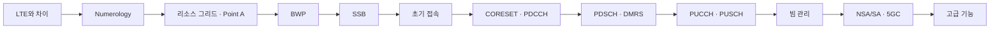

# NR (5G)

!!! spec "핵심 규격"
    전체 개요 TS 38.300 · 물리계층 38.211/212/213/214/215 · L2 38.321/322/323, 37.324 (SDAP) · RRC 38.331 · NAS 24.501 · 5GC 23.501/23.502 · RF 38.101-1/-2/-3, 38.104

    Rel-15 (2018–2019, 첫 NR) → Rel-16 (URLLC, NR-U, IAB, V2X) → Rel-17 (RedCap, NTN, 71 GHz) → Rel-18 이후 5G-Advanced

!!! basic "NR이란"
    **NR(New Radio)**은 3GPP의 5세대 무선 접속 기술입니다. LTE를 개선한 수준이 아니라 **처음부터 새로 설계**했고, 목표가 세 갈래로 넓어졌습니다.

    | 서비스 유형 | 목표 | 예 |
    |---|---|---|
    | **eMBB** (enhanced Mobile Broadband) | 초고속 — 최대 20 Gbps | 고화질 영상, AR/VR, FWA |
    | **URLLC** (Ultra-Reliable Low-Latency) | 초저지연·고신뢰 — 1 ms, 99.999% | 공장 자동화, 원격 제어 |
    | **mMTC** (massive Machine-Type) | 초연결 — 10⁶ 기기/km² | 센서망 (NR에서는 LTE-M/NB-IoT·RedCap이 담당) |

    이를 위해 NR은 **유연성**을 핵심 원칙으로 삼았습니다. 부반송파 간격, 슬롯 길이, TDD 패턴, 대역폭 일부(BWP), 빔을 상황에 맞게 바꿀 수 있습니다.

## LTE에서 무엇이 달라졌나 { .l2 }

| 항목 | LTE | NR |
|---|---|---|
| 주파수 | 6 GHz 이하 | **FR1** (410 MHz – 7.125 GHz) + **FR2** (24.25 – 71 GHz) |
| 캐리어 대역폭 | 최대 20 MHz | 최대 **100 MHz (FR1), 400 MHz (FR2)** |
| 부반송파 간격 | 15 kHz 고정 | 15 · 30 · 60 · 120 · 480 · 960 kHz (**numerology**) |
| 스케줄링 단위 | 1 ms 서브프레임 | 슬롯 (1 ms ~ 15.6 µs), **미니슬롯** (2, 4, 7 심볼) |
| 상시 참조신호 | CRS (항상 송신) | **없음** — SSB만 주기적 (lean carrier, 에너지 절감) |
| 빔 | 선택 기능 | **기본 설계** — SSB 빔 스윕, 빔 관리 |
| 채널 코딩 | Turbo / TBCC | **LDPC** (데이터) / **Polar** (제어) |
| 제어 채널 위치 | 서브프레임 앞부분 대역 전체 | **CORESET** (설정 가능한 시간·주파수 영역) |
| HARQ 타이밍 | 고정 (FDD n+4) | **유연** (DCI의 K1, K2) |
| 핵심망 | EPC (노드 기반) | **5GC** (서비스 기반 SBA, 슬라이싱) |
| RRC 상태 | IDLE, CONNECTED | IDLE, **INACTIVE**, CONNECTED |
| QoS | EPS 베어러 | **QoS 플로우** (SDAP) |

## 이 섹션의 구성

| 영역 | 페이지 |
|---|---|
| **아키텍처** | [NG-RAN](architecture/ng-ran.md) · [5GC와 SBA](architecture/5gc-sba.md) · [NSA와 SA](architecture/nsa-sa.md) · [CU/DU와 O-RAN](architecture/cu-du-oran.md) · [QoS 플로우](architecture/qos-flow.md) · [슬라이싱](architecture/network-slicing.md) |
| **프로토콜 스택** | [개요와 SDAP](protocol/overview.md) · [MAC](protocol/mac.md) · [RLC](protocol/rlc.md) · [PDCP](protocol/pdcp.md) · [RRC](protocol/rrc.md) · [NAS](protocol/nas.md) |
| **물리계층** | [Numerology](phy/numerology.md) → [리소스 그리드](phy/resource-grid.md) → [BWP](phy/bwp.md) → [슬롯 포맷](phy/slot-format.md) → [SSB](phy/ssb.md) → [CORESET](phy/coreset-searchspace.md) → 채널·신호별 페이지 |
| **빔 관리** | [개요](beam/overview.md) · [TCI와 QCL](beam/tci-qcl.md) · [빔 실패 복구](beam/bfr.md) |
| **절차** | [초기 접속](procedures/initial-access.md) · [랜덤 액세스](procedures/random-access.md) · [등록](procedures/registration.md) · [PDU 세션](procedures/pdu-session.md) · [RRC 상태](procedures/rrc-states.md) · [핸드오버](procedures/handover.md) · [Paging](procedures/paging.md) · [스케줄링·HARQ](procedures/scheduling-harq.md) |
| **주파수** | [FR1·FR2와 밴드](spectrum/bands.md) · [NR-ARFCN과 GSCN](spectrum/arfcn-gscn.md) |
| **고급 기능** | [CA/DC](advanced/ca-dc.md) · [URLLC](advanced/urllc.md) · [NR-U](advanced/nr-u.md) · [IAB](advanced/iab.md) · [Sidelink](advanced/sidelink.md) · [측위](advanced/positioning.md) · [RedCap](advanced/redcap.md) · [NTN](advanced/ntn.md) · [전력 절약](advanced/power-saving.md) · [DSS](advanced/dss.md) |
| **측정** | [SS-RSRP](measurement/ss-rsrp.md) · [이벤트와 갭](measurement/events-gaps.md) · [처리량](measurement/throughput.md) |

## 핵심 수치 { .l2 }

| 항목 | 값 |
|---|---|
| 최대 캐리어 대역폭 | FR1 100 MHz (SCS 30/60 kHz), FR2-1 400 MHz (120 kHz), FR2-2 2 GHz (960 kHz) |
| 최대 RB / 캐리어 | 275 (3300 부반송파) |
| 최대 CA | 16 CC (Rel-15) |
| 하향 MIMO | 최대 8 레이어 (단일 단말) |
| 상향 MIMO | 최대 4 레이어 |
| 변조 | DL 256QAM (Rel-17 FR1 1024QAM), UL 256QAM, π/2-BPSK |
| PCI | 1008 |
| SSB 빔 수 | 최대 4 / 8 (FR1), 64 (FR2) |
| HARQ 프로세스 | 최대 16 (Rel-17 NTN 32) |
| 목표 지연 (사용자 평면, IMT-2020) | eMBB 4 ms, URLLC 1 ms |

## NR 학습 순서 추천

