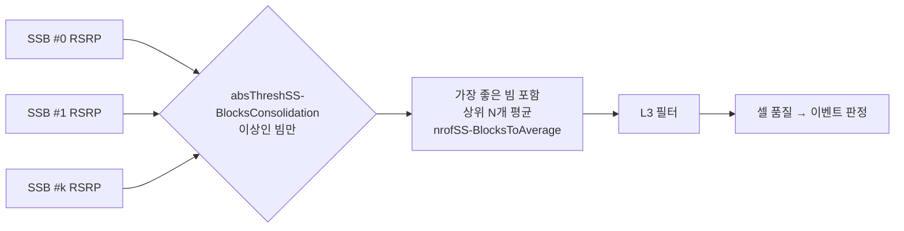

# SS-RSRP · RSRQ · SINR

!!! spec "스펙 · 릴리즈"
    측정량 정의: TS 38.215 §5.1 (SS-RSRP, SS-RSRQ, SS-SINR, CSI-RSRP, CSI-RSRQ, CSI-SINR, L1-RSRP) · 보고 매핑: TS 38.133 §10.1 · 셀 품질 도출: TS 38.331 §5.5.3.3 · SMTC: TS 38.331 `SSB-MTC`
    Rel-15~ (Rel-16 L1-SINR·CLI 측정, Rel-17 NTN SMTC 확장)

!!! basic "한눈에 보기"
    LTE 단말이 CRS로 셀 신호를 쟀다면, NR 단말은 주로 **SSB**로 잽니다. 이름 앞에 "SS-"가 붙는 이유입니다.

    - **SS-RSRP**: SSB의 SSS(와 PBCH DMRS) RE 평균 전력 — 신호 세기
    - **SS-RSRQ**: 신호 세기 ÷ 전체 수신 전력 — 부하·간섭 포함 품질
    - **SS-SINR**: 신호 ÷ (간섭 + 잡음)

    NR 셀은 **빔이 여러 개**라서, 단말은 빔(SSB 인덱스)별로 측정한 뒤 그것을 합쳐 **셀 품질**을 계산합니다.

## 측정량 정의 (TS 38.215) { .l2 }

| 측정량 | 정의 | 보고 범위 / 단위 |
|---|---|---|
| **SS-RSRP** | SSS 운반 RE 전력의 선형 평균 (PBCH DMRS 추가 가능), 측정 시간은 SMTC 창 | −156 ~ −31 dBm, 1 dB |
| **SS-RSRQ** | \(N \times\) SS-RSRP / NR 반송파 RSSI (SMTC 안 지정 심볼, N RB) | −43 ~ 20 dB, 0.5 dB |
| **SS-SINR** | SSS RE 전력 / 같은 RE의 간섭+잡음 | −23 ~ 40 dB, 0.5 dB |
| CSI-RSRP / RSRQ / SINR | 이동성용 CSI-RS 기반 | 같은 범위 |
| **L1-RSRP** | 빔 관리용, L3 필터 없음 | −140 ~ −44 dBm (빔 보고) |

## 빔 측정에서 셀 품질로 { .l2 }

- 임계값을 넘는 빔이 없으면 **가장 좋은 빔 하나**가 셀 품질
- N = 1이면 최고 빔만 사용 (셀 경계에서 빔 하나에 민감)
- 측정 보고에는 셀 품질과 함께 **빔별 결과**(SSB 인덱스 + 값)를 최대 `maxNrofRS-IndexesToReport`개까지 넣을 수 있음

## SMTC (SSB Measurement Timing Configuration) { .l2 }

NR SSB는 5–160 ms 주기로만 오기 때문에, 단말에게 **언제 측정 창을 열지** 알려 줍니다.

| 파라미터 | 값 |
|---|---|
| 주기 + 오프셋 | 5, 10, 20, 40, 80, 160 ms |
| 창 길이 | 1, 2, 3, 4, 5 ms |
| SMTC2 | 특정 셀 목록용 짧은 주기 (연결 상태 동일 주파수) |
| SMTC3 (Rel-16) | IAB 노드 간 측정 |
| NTN (Rel-17) | 위성별 SMTC 오프셋 |

??? expert "전문가 노트 — RSSI 측정, 정확도, L1/L3"
    **RSRQ의 RSSI.** NR 반송파 RSSI는 `ss-RSSI-Measurement`(측정할 심볼 비트맵, 끝 심볼 패턴)로 지정된 심볼에서 잽니다. 지정이 없으면 SMTC 창 안의 SSB 심볼 0–1 등 정해진 규칙을 따릅니다. 부하가 실린 심볼을 고르면 LTE RSRQ처럼 부하 지표 성격이 강해집니다.

    **L1 vs L3.** L1-RSRP는 빔 관리(수 ms 반응)에, L3 필터 셀 품질은 이동성(수백 ms 평균)에 씁니다. L3 필터 계수 `filterCoefficientRSRP`(기본 fc4)는 LTE와 같은 식입니다.

    **측정 정확도 (TS 38.133).** 동일 주파수 SS-RSRP 절대 정확도는 FR1 정상 조건 ±4.5 dB 수준(조건별 상이), FR2는 단말 안테나·빔 특성 때문에 더 넓은 허용 범위를 둡니다.

    **CLI 측정 (Rel-16).** SRS-RSRP(다른 단말의 SRS 세기), CLI-RSSI로 단말 간 교차 링크 간섭을 측정해 동적 TDD 운용을 돕습니다.

## LTE ↔ NR 비교

| 항목 | LTE | NR |
|---|---|---|
| 기준 신호 | CRS (항상) | SSB (SMTC 창 안), CSI-RS |
| RSRP 하한 | −140 dBm (Rel-13 −156) | −156 dBm |
| 빔 | 없음 | 빔별 측정 → 셀 품질 도출 |
| SINR 정의 | Rel-13 RS-SINR | Rel-15 SS-SINR |

## 관련 페이지

- [측정 이벤트와 갭](events-gaps.md)
- [SSB 구조](../phy/ssb.md)
- [LTE RSRP·RSRQ·SINR](../../lte/measurement/rsrp-rsrq.md)
