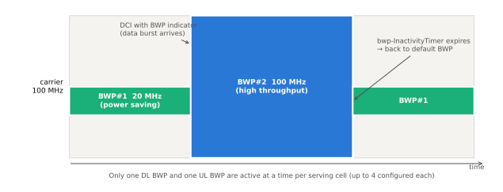

# BWP (Bandwidth Part)

!!! spec "스펙 · 릴리즈"
    TS 38.211 §4.4.5 · TS 38.213 §12 (BWP 동작) · TS 38.321 §5.15 (BWP 전환, 비활성 타이머) · TS 38.331 `BWP-Downlink`, `BWP-Uplink` · 전환 지연: TS 38.133 §8.6
    Rel-15~ (Rel-16 dormant BWP, Rel-17 RedCap 전용 초기 BWP, Rel-18 RedCap NCD-SSB)

!!! basic "한눈에 보기"
    NR 캐리어는 최대 100 MHz(FR1), 400 MHz(FR2)로 넓습니다. 하지만 모든 단말이 항상 넓은 대역을 쓸 필요는 없습니다.

    **BWP**는 캐리어 안의 **일부 대역**을 잘라 단말에게 "지금은 이 부분만 써라"라고 정해 주는 개념입니다.

    - 데이터가 적을 때는 **좁은 BWP** → 단말 RF·처리 전력 절약
    - 데이터가 많을 때는 **넓은 BWP**로 전환 → 고속 전송
    - 단말이 지원하는 대역폭이 캐리어보다 좁아도 접속 가능 (예: RedCap 20 MHz 단말)
    - BWP마다 **다른 numerology**를 쓸 수 있음

## BWP 전환 { .l2 }

<figure markdown>

<figcaption>평소에는 좁은 BWP#1로 대기하다가, 데이터가 오면 DCI의 BWP 지시자로 넓은 BWP#2로 전환합니다. 활동이 없으면 bwp-InactivityTimer 만료로 기본 BWP로 돌아옵니다.</figcaption>
</figure>

| BWP 종류 | 의미 |
|---|---|
| **Initial BWP** | 초기 접속용. DL은 CORESET#0 대역(또는 SIB1 `initialDownlinkBWP`), UL은 SIB1 `initialUplinkBWP` |
| **Dedicated BWP** | RRC로 설정, 서빙 셀당 DL·UL 각각 **최대 4개** |
| **Active BWP** | 한 시점에 실제로 쓰는 BWP (DL 1개, UL 1개) |
| **Default BWP** | 타이머 만료 시 돌아갈 BWP (`defaultDownlinkBWP-Id`, 없으면 initial) |
| **First active BWP** | RRC 설정 직후 활성화될 BWP |
| Dormant BWP (Rel-16) | SCell을 해제하지 않고 PDCCH 감시만 끈 상태 (빠른 복귀) |

### 전환 방법

| 방법 | 동작 |
|---|---|
| **DCI** | DCI 1_1 / 0_1의 BWP indicator 필드 (0–2비트) |
| **타이머** | `bwp-InactivityTimer` 만료 → default BWP |
| **RRC** | `firstActiveDownlinkBWP-Id` 등으로 재설정 |
| **RA** | 활성 UL BWP에 PRACH 자원이 없으면 initial BWP로 전환 후 RA |

TDD(unpaired)에서는 DL BWP와 UL BWP가 같은 ID로 **쌍으로** 함께 전환됩니다(중심 주파수 동일).

## BWP 하나에 들어가는 설정 { .l2 }

| 공통 (`BWP-DownlinkCommon`) | 단말별 (`BWP-DownlinkDedicated`) |
|---|---|
| `locationAndBandwidth` (RIV, 기준 275 RB) | PDCCH 설정 (CORESET 최대 3개, Search Space 최대 10개) |
| `subcarrierSpacing`, `cyclicPrefix` | PDSCH 설정 (TDRA 표, DMRS, TCI 상태 등) |
| 공통 PDCCH (CORESET#0, SS#0, 페이징 SS, RA SS) | SPS 설정, 무선 링크 감시 RS |
| 공통 PDSCH (TDRA 표) | |

UL BWP도 마찬가지로 RACH 공통 설정, PUCCH/PUSCH/SRS 설정을 가집니다.

??? expert "전문가 노트 — 전환 지연과 설계 포인트"
    **전환 지연 (TS 38.133 Table 8.6.2-1).** DCI 기반 전환 시 단말은 다음 슬롯 수 동안 송수신하지 않아도 됩니다.

    | μ | Type 1 지연 | Type 2 지연 |
    |---|---|---|
    | 0 | 1 슬롯 | 3 슬롯 |
    | 1 | 2 | 5 |
    | 2 | 3 | 9 |
    | 3 | 6 | 17 |

    Type 1/2는 단말 능력(RF 재조정 필요 여부)입니다. 또한 BWP 지시 DCI가 스케줄한 PDSCH/PUSCH는 \(K_0\)/\(K_2\)가 이 지연 이상이어야 합니다.

    **중심 주파수 변화.** BWP가 바뀌면서 중심 주파수가 바뀌면 단말 RF가 재조정되어 지연이 늘어납니다. 전력 절약용 좁은 BWP를 넓은 BWP와 같은 중심으로 두면 Type 1 전환이 가능해 지연이 짧아집니다.

    **DCI 크기 문제.** BWP마다 RB 수가 달라 자원 할당 필드 길이가 다릅니다. BWP 전환 DCI는 **현재 BWP 기준 크기**로 오므로, 대상 BWP 필드를 잘라내거나(truncation) 0으로 채워(zero-padding) 해석합니다.

    **SSB와 BWP.** 연결 상태 단말의 활성 BWP가 SSB를 포함하지 않아도 됩니다. 이때 RLM·BFD·측정은 CSI-RS로 하거나 측정 갭이 필요할 수 있습니다. Rel-17 RedCap은 SSB가 없는 BWP에서 **NCD-SSB**(non-cell-defining SSB, Rel-17 RedCap/Rel-18 확장)를 쓸 수 있게 했습니다.

    **기지국 측면.** BWP는 단말 관점 개념입니다. 기지국 스케줄러는 서로 다른 BWP 단말들이 같은 PRB를 겹쳐 쓰지 않도록 캐리어 전체 관점에서 관리해야 합니다.

## 관련 페이지

- [리소스 그리드와 Point A](resource-grid.md)
- [CORESET과 Search Space](coreset-searchspace.md)
- [UE 전력 절약](../advanced/power-saving.md)
- [RedCap](../advanced/redcap.md)
