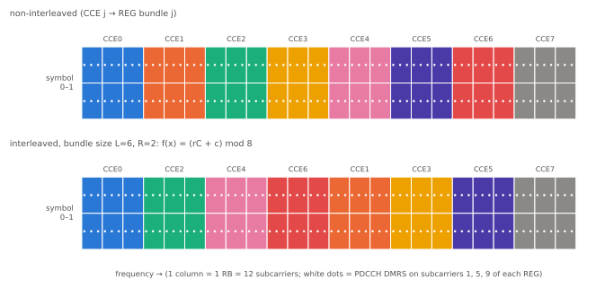

# CORESET과 Search Space

!!! spec "스펙 · 릴리즈"
    TS 38.211 §7.3.2 (PDCCH, CCE-REG 매핑, 인터리버) · TS 38.213 §10.1 (탐색 공간, 블라인드 디코딩 한계 Table 10.1-2/-3), §13 (CORESET#0·Type0-PDCCH, Table 13-1~13-15) · TS 38.331 `ControlResourceSet`, `SearchSpace`
    Rel-15~ (Rel-16 CORESET 최대 5개·multi-TRP, Rel-17 FR2-2 다중 슬롯 모니터링, Rel-18 RedCap 등)

!!! basic "한눈에 보기"
    LTE의 PDCCH는 서브프레임 앞 1–3 심볼 **대역 전체**에 퍼져 있었습니다. NR에서는 PDCCH가 들어갈 영역을 **따로 정의**합니다.

    - **CORESET (Control Resource Set)**: PDCCH가 들어갈 **"어디(주파수 RB, 심볼 수)"**
    - **Search Space**: 그 CORESET을 **"언제(어느 슬롯·심볼), 무엇을(어떤 DCI 포맷, 집성 레벨, 후보 수)"** 볼지

    넓은 캐리어 전체를 볼 필요 없이 좁은 영역만 보면 되므로 단말 전력이 줄고, BWP·빔마다 다른 CORESET을 쓸 수 있습니다.

## CORESET 구성 { .l2 }

| 파라미터 | 값 | 의미 |
|---|---|---|
| `frequencyDomainResources` | 45비트 비트맵 | **6 RB 묶음** 단위로 사용 여부 |
| `duration` | 1, 2, 3 심볼 | 시간 길이 |
| `cce-REG-MappingType` | interleaved / nonInterleaved | CCE를 REG 번들에 매핑하는 방식 |
| `reg-BundleSize` \(L\) | 2, 3, 6 (인터리브) / 6 (비인터리브) | REG 번들 크기 |
| `interleaverSize` \(R\) | 2, 3, 6 | 블록 인터리버 행 수 |
| `shiftIndex` | 0–274 | 인터리버 순환 이동 (기본: PCI) |
| `precoderGranularity` | sameAsREG-bundle / allContiguousRBs | DMRS 프리코딩이 같은 범위 |
| `tci-StatesPDCCH-ToAddList` | | 이 CORESET의 빔 후보 (MAC CE로 하나 활성화) |
| `pdcch-DMRS-ScramblingID` | 0–65535 | DMRS 스크램블 ID |

**단위**: REG = 1 RB × 1 심볼(12 RE, 그중 DMRS 3개) · **CCE = 6 REG** · REG 번호는 CORESET 안에서 **시간 우선** 순서.

<figure markdown>

<figcaption>24 RB × 2 심볼 CORESET (48 REG = 8 CCE). 위: 비인터리브 — CCE가 연속 RB에 놓입니다(빔포밍·부분 대역 간섭 회피에 유리). 아래: 인터리브 — CCE가 대역에 분산됩니다(주파수 다이버시티).</figcaption>
</figure>

## Search Space 구성 { .l2 }

| 파라미터 | 의미 |
|---|---|
| `controlResourceSetId` | 연결된 CORESET |
| `monitoringSlotPeriodicityAndOffset` | 감시 주기(1–2560 슬롯)와 오프셋 |
| `duration` | 주기마다 연속 감시 슬롯 수 |
| `monitoringSymbolsWithinSlot` | 14비트: 슬롯 안 어느 심볼에서 CORESET이 시작하는지 |
| `nrofCandidates` | AL 1, 2, 4, 8, 16별 후보 수 (0–8) |
| `searchSpaceType` | common (DCI 0_0/1_0, 2_x) / ue-Specific (0_0/1_0 또는 0_1/1_1 …) |

### 공통 탐색 공간 종류

| 유형 | 용도 | RNTI |
|---|---|---|
| **Type0** | SIB1 | SI-RNTI |
| Type0A | 기타 SI | SI-RNTI |
| **Type1** | RAR, Msg4 (RA 과정) | RA-RNTI, MsgB-RNTI, TC-RNTI |
| **Type2** | 페이징 | P-RNTI |
| Type3 | 그룹 공통 DCI (2_0, 2_1, 2_2, 2_3 …) 및 C-RNTI | 각종 |

BWP당 CORESET 최대 3개(Rel-16 최대 5개), Search Space 최대 10개입니다.

## CORESET#0 { .l2 }

단말이 아무 설정 없이 SIB1을 받기 위한 CORESET입니다. MIB의 `pdcch-ConfigSIB1`의 상위 4비트(**controlResourceSetZero**)가 TS 38.213 표 13-1~13-10 중 한 행을 가리킵니다.

| 표 결정 요소 | 표에서 얻는 값 |
|---|---|
| SSB SCS, PDCCH SCS, 최소 채널 대역폭 | **SSB–CORESET 다중화 패턴** (1: TDM, 2·3: FDM) |
| | CORESET#0 **RB 수** (24 / 48 / 96) |
| | **심볼 수** (1, 2, 3) |
| | SSB 대비 **RB 오프셋** |

하위 4비트(**searchSpaceZero**)는 표 13-11~13-15에서 Type0-PDCCH 감시 시점(슬롯 오프셋 O, SSB당 슬롯 수, 첫 심볼)을 정합니다. CORESET#0의 대역이 곧 **초기 DL BWP**가 됩니다(SIB1이 다르게 정하기 전까지).

??? expert "전문가 노트 — 블라인드 디코딩 한계와 해시"
    **슬롯당 최대 블라인드 디코딩 / non-overlapped CCE (서빙 셀당, TS 38.213 Table 10.1-2, -3)**

    | μ | 최대 PDCCH 후보 | 최대 CCE (채널 추정) |
    |---|---|---|
    | 0 | 44 | 56 |
    | 1 | 36 | 56 |
    | 2 | 22 | 48 |
    | 3 | 20 | 32 |

    설정이 한계를 넘으면(overbooking) **PCell의 USS는 ID가 큰 것부터** 감시를 포기합니다. CSS는 반드시 지켜야 합니다.

    **DCI 크기 예산 "3+1".** 셀당 DCI 크기는 최대 4종류, 그중 C-RNTI용은 최대 3종류입니다. 크기 맞추기(size alignment) 절차로 0_0/1_0을 맞추고, 그래도 넘으면 폴백 DCI 크기를 조정합니다.

    **UE-specific 해시.** LTE와 비슷하지만 CORESET \(p\)별 상수를 씁니다.

    \[
    Y_{p,n_s} = (A_p \cdot Y_{p,n_s-1}) \bmod D, \ \ A_p = 39827 / 39829 / 39839 \ (p \bmod 3 = 0/1/2), \ D = 65537
    \]

    CCE 인덱스 = \(L\{(Y + \lfloor m N_{CCE}/(L M) \rfloor + n_{CI}) \bmod \lfloor N_{CCE}/L \rfloor\} + i\). CSS는 \(Y = 0\).

    **인터리버 수식.** 번들 수 \(N = N_{REG}^{CORESET}/L\), \(C = N/R\), \(x = cR + r\) 일 때 \(f(x) = (rC + c + n_{shift}) \bmod N\). 위 그림 아래쪽이 \(R=2, L=6, n_{shift}=0\) 예입니다.

    **DMRS.** 각 REG의 부반송파 1, 5, 9(오프셋 고정)에 QPSK DMRS가 있습니다. `allContiguousRBs`이면 단말은 CORESET의 연속 RB 전체에 같은 프리코딩을 가정해 넓게 채널 추정할 수 있습니다(광대역 DMRS).

    **Multi-TRP (Rel-16).** `CORESETPoolIndex` 0/1로 TRP별 CORESET을 구분해 두 TRP가 각각 PDSCH를 스케줄하거나(multi-DCI), PDCCH 반복(Rel-17, 두 SS 연결)으로 신뢰성을 높입니다.

## 관련 페이지

- [PDCCH와 DCI](pdcch-dci.md)
- [SSB 구조](ssb.md)
- [BWP](bwp.md)
- [초기 접속](../procedures/initial-access.md)
- [LTE PDCCH와 DCI](../../lte/phy/pdcch-dci.md)
