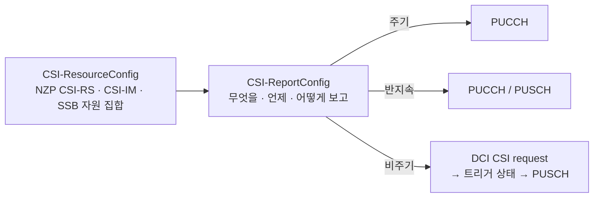

# CSI-RS와 CSI 보고

!!! spec "스펙 · 릴리즈"
    CSI-RS 구조: TS 38.211 §7.4.1.5 (Table 7.4.1.5.3-1, row 1–18) · CSI 프레임워크·보고: TS 38.214 §5.2 (CQI 표 §5.2.2.1, 코드북 §5.2.2.2), §5.1.6.1 (TRS) · 측정: TS 38.215 · RRC `CSI-MeasConfig`, `CSI-ReportConfig`, `CSI-ResourceConfig`
    Rel-15 Type I/II → Rel-16 eType II·L1-SINR → Rel-17 FeType II (포트 선택)·multi-TRP CSI → Rel-18 Doppler CSI·CJT·AI/ML CSI 연구

!!! basic "한눈에 보기"
    **CSI-RS (Channel State Information RS)**는 NR에서 가장 **다재다능한 참조신호**입니다. 같은 신호 구조를 용도에 따라 다르게 씁니다.

    | 용도 | 하는 일 |
    |---|---|
    | **CSI 측정** | 단말이 채널을 재고 CQI·PMI·RI를 보고 → 기지국이 MCS·MIMO 결정 |
    | **빔 관리** | 좁은 빔 여러 개를 보내고 단말이 가장 좋은 빔을 보고 |
    | **TRS (추적)** | 단말이 시간·주파수 동기를 정밀하게 맞춤 (LTE CRS 역할 일부) |
    | **이동성 측정 (RRM)** | 이웃 셀·빔 품질 측정 |
    | **RLM / BFD** | 무선 링크·빔 실패 감시 |

    CQI 보고는 "이 정도 MCS면 **오류율 10% 이하**로 받을 수 있다"는 단말의 추천입니다(URLLC용 표는 10⁻⁵).

## CSI-RS 자원 구조 { .l2 }

| 항목 | 값 |
|---|---|
| 포트 수 | 1, 2, 4, 8, 12, 16, 24, 32 |
| 밀도 \(\rho\) | 0.5, 1, 3 (RB당 포트당 RE) — 3은 TRS 등 1포트 |
| CDM 유형 | noCDM, fd-CDM2, cdm4-FD2-TD2, cdm8-FD2-TD4 |
| 시간 동작 | **주기**(4–640 슬롯) / **반지속**(MAC CE 활성) / **비주기**(DCI 트리거) |
| 구성 패턴 | TS 38.211 Table 7.4.1.5.3-1의 row 1–18 |
| ZP CSI-RS | 데이터를 비우는 자리 (이웃 셀 보호) |
| CSI-IM | 간섭 측정 자원 (ZP 위치에서 간섭+잡음) |

## CSI 프레임워크 { .l2 }

| `reportQuantity` | 내용 | 용도 |
|---|---|---|
| cri-RI-PMI-CQI | 자원 선택 + 랭크 + 프리코딩 + 품질 | 일반 MIMO |
| cri-RI-i1-CQI | 광대역 빔 그룹만 | 부분 피드백 |
| cri-RI-CQI | PMI 없음 | TDD 상호성 |
| **cri-RSRP / ssb-Index-RSRP** | 빔 인덱스 + L1-RSRP | **빔 관리** |
| cri-SINR / ssb-Index-SINR (Rel-16) | L1-SINR | 간섭 인지 빔 선택 |
| none | 보고 없음 | TRS, 수신 빔 학습 |

## CQI 표 (64QAM, TS 38.214 Table 5.2.2.1-2) { .l2 }

| CQI | 변조 | 코딩률 × 1024 | 효율 | | CQI | 변조 | 코딩률 × 1024 | 효율 |
|---|---|---|---|---|---|---|---|---|
| 1 | QPSK | 78 | 0.1523 | | 9 | 16QAM | 616 | 2.4063 |
| 2 | QPSK | 120 | 0.2344 | | 10 | 64QAM | 466 | 2.7305 |
| 3 | QPSK | 193 | 0.3770 | | 11 | 64QAM | 567 | 3.3223 |
| 4 | QPSK | 308 | 0.6016 | | 12 | 64QAM | 666 | 3.9023 |
| 5 | QPSK | 449 | 0.8770 | | 13 | 64QAM | 772 | 4.5234 |
| 6 | QPSK | 602 | 1.1758 | | 14 | 64QAM | 873 | 5.1152 |
| 7 | 16QAM | 378 | 1.4766 | | 15 | 64QAM | 948 | 5.5547 |
| 8 | 16QAM | 490 | 1.9141 | | | | | |

LTE의 4비트 CQI 표와 같은 값입니다. 그 밖에 256QAM 표(Table 5.2.2.1-3), **저효율 표**(Table 5.2.2.1-4, URLLC 목표 BLER 10⁻⁵), 1024QAM 표(Rel-17)가 있습니다.

## 코드북 { .l2 }

| 코드북 | 방식 | 해상도 | 주 용도 |
|---|---|---|---|
| **Type I 단일 패널** | DFT 빔 하나 선택 + 편파 위상 (\(N_1, N_2, O_1, O_2\)) | 낮음 | SU-MIMO 기본 |
| Type I 다중 패널 | 패널 간 위상 추가 | 낮음 | 다중 패널 안테나 |
| **Type II** | **빔 L개(2–4)의 선형 결합**, 진폭·위상 양자화 | 높음 | MU-MIMO |
| eType II (Rel-16) | 주파수 영역 DFT 기저로 압축 → 오버헤드 감소 | 높음 | MU-MIMO |
| FeType II (Rel-17) | 포트 선택 (TDD 각도·지연 상호성 활용) | 높음 | TDD Massive MIMO |
| Rel-18 | 시간 영역(도플러) 압축, **CJT**(다중 TRP 동기 결합) | 높음 | 고속 이동, 분산 MIMO |

??? expert "전문가 노트 — TRS, CSI 타이밍, Type I 계산"
    **TRS (Tracking Reference Signal).** `trs-Info = true`인 NZP CSI-RS 자원 집합: 1포트, 밀도 3, 두 연속 슬롯에 각 2 심볼(예: 심볼 4·8)씩 총 4 심볼. 단말은 이것으로 미세 시간·주파수 오프셋, 지연 확산, 도플러 확산을 추정합니다. PDSCH DMRS는 TRS와 QCL Type A 관계로 이 통계를 빌려 씁니다. Rel-17에서는 Idle/Inactive 단말도 TRS를 쓸 수 있게 SIB17로 알립니다(빠른 동기, 전력 절약).

    **CSI 계산 시간.** 비주기 CSI는 트리거 DCI와 보고 PUSCH 사이에 \(Z\), CSI-RS와 보고 사이에 \(Z'\) 심볼 이상 필요합니다(TS 38.214 Table 5.4-1/2, 복잡도에 따라 Z1·Z2·Z3). 동시에 처리할 수 있는 CSI 계산 수는 **CPU(CSI Processing Unit)** 개수로 단말이 보고합니다.

    **Type I 단일 패널 예.** \(N_1 = 4, N_2 = 2\)(16포트, 이중 편파), 오버샘플링 \(O_1 = O_2 = 4\) → 빔 후보 \(N_1O_1 \times N_2O_2 = 16 \times 8\)개. 랭크 1 PMI = \(i_{1,1}, i_{1,2}\)(빔), \(i_2\)(편파 간 위상 4가지). 부대역마다 \(i_2\)만 바꿔 보고할 수 있습니다.

    **CQI 정의의 차이.** NR CQI는 CSI 기준 자원에서 "첫 2 심볼 PDCCH, PDSCH 12 심볼, DMRS·PTRS 오버헤드 가정 등"의 표준 가정을 두고 계산합니다(TS 38.214 §5.2.2.5). 실제 할당과 다르면 기지국이 보정합니다.

## 관련 페이지

- [빔 관리 개요](../beam/overview.md)
- [TCI와 QCL](../beam/tci-qcl.md)
- [MIMO 기초](../../basics/mimo.md)
- [TBS와 MCS](tbs-mcs.md)
- [LTE CQI·PMI·RI](../../lte/measurement/csi.md)
