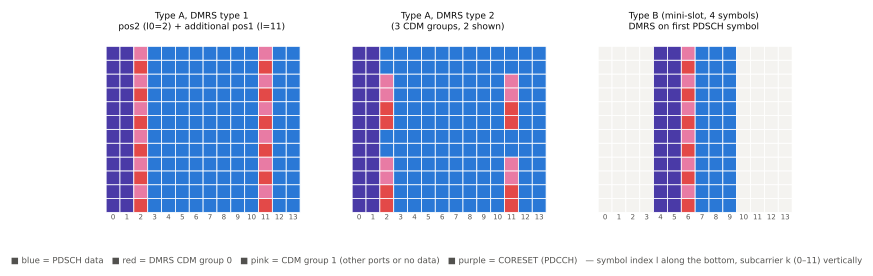

# DMRS · PTRS

!!! spec "스펙 · 릴리즈"
    DMRS: TS 38.211 §7.4.1.1 (PDSCH), §7.4.1.3 (PDCCH), §7.4.1.4 (PBCH), §6.4.1.1 (PUSCH), §6.4.1.3 (PUCCH) · PTRS: §7.4.1.2 (DL), §6.4.1.2 (UL) · 절차: TS 38.214 §5.1.6, §6.2.2–6.2.3 (PTRS 밀도 표)
    Rel-15~ (Rel-16 low-PAPR DMRS for π/2-BPSK, Rel-18 DMRS 포트 확장: 최대 24 직교 포트)

!!! basic "한눈에 보기"
    NR에는 LTE의 CRS처럼 "항상 켜진 공통 참조신호"가 없습니다. 대신 **필요한 곳에만** 참조신호를 보냅니다.

    - **DMRS (Demodulation RS)**: 데이터·제어 채널과 **같은 빔, 같은 자원 영역**으로 보내서, 수신기가 그 채널을 복조할 때 씁니다. 모든 NR 채널(PDSCH, PUSCH, PDCCH, PUCCH, PBCH)에 각자의 DMRS가 있습니다.
    - **PTRS (Phase Tracking RS)**: 높은 주파수(특히 mmWave)에서는 발진기 **위상 잡음** 때문에 심볼마다 위상이 조금씩 돕니다. PTRS는 이 회전을 추적하라고 시간 방향으로 촘촘히 넣는 신호입니다.

## 채널별 DMRS { .l2 }

| 채널 | 시간 위치 | 주파수 패턴 | 시퀀스 |
|---|---|---|---|
| PDSCH / PUSCH (CP-OFDM) | Type A: 심볼 2·3 / Type B: 첫 심볼, + 추가 위치 0–3개 | 설정 Type 1(comb 2) / Type 2(2×3 그룹) | Gold (QPSK) |
| PUSCH (DFT-s-OFDM) | 같음 | Type 1, 데이터와 같은 심볼에 섞지 않음 | **Low-PAPR ZC 계열** (π/2-BPSK용 Rel-16 시퀀스) |
| PDCCH | CORESET 모든 심볼 | REG의 부반송파 1, 5, 9 | Gold |
| PBCH | SSB 심볼 1–3 | 4번째 부반송파마다, 오프셋 PCI mod 4 | Gold (SSB 인덱스 포함) |
| PUCCH 1 / 3 / 4 | 포맷별 고정 심볼 | 전체 PRB | 기저 시퀀스 |
| PUCCH 2 | 모든 심볼 | 부반송파 1, 4, 7, 10 | Gold |

## PDSCH/PUSCH DMRS 설정 { .l2 }

{ .fig }

| 파라미터 | 값 | 의미 |
|---|---|---|
| `dmrs-Type` | type1 / type2 | 주파수 패턴, 최대 포트 수 (8 / 12) |
| `maxLength` | len1 / len2 | 단일·이중 심볼 DMRS (이중이면 TD-OCC로 포트 2배) |
| `dmrs-AdditionalPosition` | pos0 – pos3 | 추가 DMRS 심볼 수 (고속 이동 대응) |
| `scramblingID0/1` | 0–65535 | 시퀀스 초기화 ID (\(n_{SCID}\) 0/1) |
| DCI `antenna ports` | 표 인덱스 | 사용 포트, 데이터 없는 CDM 그룹 수 |

## PTRS { .l2 }

| 항목 | DL / UL (CP-OFDM) | UL (DFT-s-OFDM) |
|---|---|---|
| 목적 | 공통 위상 오차(CPE) 추정 | 같음 |
| 시간 밀도 \(L_{PTRS}\) | 1, 2, 4 심볼마다 (**MCS가 높을수록 촘촘**) | — |
| 주파수 밀도 \(K_{PTRS}\) | 2 또는 4 RB마다 1 부반송파 (**RB가 많을수록 성기게**) | DFT 이전 블록 삽입 (2·4 그룹 × 2·4 샘플) |
| 연결 포트 | DMRS 포트 하나와 연동 | |

### 밀도 결정 (TS 38.214 Table 5.1.6.3-1/-2)

| 스케줄 MCS | 시간 밀도 | | 스케줄 RB 수 | 주파수 밀도 |
|---|---|---|---|---|
| < ptrs-MCS1 | PTRS 없음 | | < N_RB0 | PTRS 없음 |
| ptrs-MCS1 – MCS2 | 4 심볼마다 | | N_RB0 – N_RB1 | 2 RB마다 |
| ptrs-MCS2 – MCS3 | 2 심볼마다 | | ≥ N_RB1 | 4 RB마다 |
| ptrs-MCS3 – MCS4 | 매 심볼 | | | |

??? expert "전문가 노트 — 시퀀스 초기화와 설계 이유"
    **PDSCH DMRS 시퀀스 초기화.**

    \[
    c_{init} = \left(2^{17}(N_{symb}^{slot} n_{s,f}^{\mu} + l + 1)(2N_{ID}^{n_{SCID}} + 1) + 2N_{ID}^{n_{SCID}} + n_{SCID}\right) \bmod 2^{31}
    \]

    (Rel-16에서 CDM 그룹 \(\lambda\) 항이 추가됨) \(N_{ID}\)를 셀 ID 대신 설정 값으로 바꿀 수 있어, 서로 다른 TRP나 MU-MIMO 단말이 준직교 시퀀스를 쓰도록 계획할 수 있습니다.

    **front-loaded DMRS.** 슬롯 앞쪽(심볼 2/3)에 DMRS를 두는 이유는 수신기가 **빨리 채널 추정을 시작**해 디코딩 지연을 줄이기 위해서입니다. LTE CRS처럼 슬롯 전체에 흩어져 있으면 마지막 심볼까지 기다려야 했습니다.

    **위상 잡음 모델.** FR2 발진기 위상 잡음은 부반송파 간 간섭(ICI)과 심볼마다 공통으로 도는 위상(CPE)을 만듭니다. PTRS는 CPE를 추정하고, 넓은 SCS는 ICI를 줄입니다. 3GPP는 PTRS 밀도 임계값을 단말 능력(선호 값 보고)과 망 설정으로 정합니다.

    **DMRS–PTRS 연동.** 다중 레이어에서 PTRS는 보통 한 포트(가장 SINR 좋은 레이어의 DMRS 포트)에만 실립니다. UL은 단말 발진기 공유 여부(full/partial coherent)에 따라 PTRS 포트 1–2개.

    **TRS와의 관계.** 정밀한 시간·주파수 추적(도플러, 지연 확산 추정)은 PTRS가 아니라 **TRS**(tracking 용 CSI-RS, `trs-Info`)가 담당합니다. → [CSI-RS와 CSI 보고](csi-rs.md)

## 관련 페이지

- [PDSCH](pdsch.md)
- [PUSCH](pusch.md)
- [LTE 참조신호](../../lte/phy/reference-signals.md)
