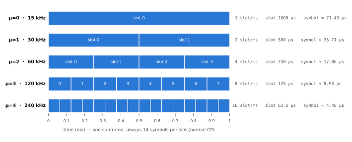

# Numerology와 프레임 구조

!!! spec "스펙 · 릴리즈"
    TS 38.211 §4.2 (numerology, Table 4.2-1), §4.3 (프레임·슬롯), §5.3 (OFDM 신호 생성, CP 길이) · 지원 SCS·대역폭: TS 38.101-1 §5.3, 38.101-2 §5.3
    Rel-15 (μ = 0–4) → Rel-17 FR2-2 (μ = 5, 6: 480 · 960 kHz, 52.6–71 GHz)

!!! basic "한눈에 보기"
    LTE는 부반송파 간격이 15 kHz 하나뿐이었습니다. NR은 **15 kHz × 2^μ** 중에서 고를 수 있고, 이 선택을 **numerology(μ)**라고 부릅니다.

    - 부반송파 간격을 **2배로 넓히면 심볼과 슬롯이 절반으로 짧아집니다**.
    - 슬롯 하나는 항상 **14 심볼**이지만, 슬롯의 길이가 1 ms(15 kHz)에서 0.125 ms(120 kHz)까지 달라집니다.
    - **낮은 주파수·넓은 셀** → 좁은 간격(15/30 kHz, CP가 길어 다중경로에 강함)
    - **높은 주파수(mmWave)·좁은 셀** → 넓은 간격(120 kHz 이상, 위상 잡음과 도플러에 강함, 지연 짧음)

    프레임(10 ms)과 서브프레임(1 ms) 길이는 LTE와 같아서 LTE와 시간 정렬이 쉽습니다.

## Numerology 표 (TS 38.211 Table 4.2-1) { .l2 }

| μ | SCS | CP | 슬롯/서브프레임 | 슬롯 길이 | 심볼 길이 (CP 포함) | Normal CP | 데이터 | SSB |
|---|---|---|---|---|---|---|---|---|
| 0 | 15 kHz | Normal | 1 | 1 ms | 71.4 µs | 4.69 µs | FR1 | FR1 |
| 1 | 30 kHz | Normal | 2 | 0.5 ms | 35.7 µs | 2.34 µs | FR1 | FR1 |
| 2 | 60 kHz | Normal, **Extended** | 4 | 0.25 ms | 17.9 µs | 1.17 µs | FR1, FR2-1 | — |
| 3 | 120 kHz | Normal | 8 | 125 µs | 8.93 µs | 0.59 µs | FR2-1, FR2-2 | FR2-1, FR2-2 |
| 4 | 240 kHz | Normal | 16 | 62.5 µs | 4.46 µs | 0.29 µs | — | FR2-1 |
| 5 | 480 kHz | Normal | 32 | 31.25 µs | 2.23 µs | 0.15 µs | FR2-2 | FR2-2 |
| 6 | 960 kHz | Normal | 64 | 15.6 µs | 1.12 µs | 0.07 µs | FR2-2 | FR2-2 |

Extended CP(슬롯당 12 심볼)는 μ = 2 에서만 지원합니다.

<figure markdown>

<figcaption>1 ms 서브프레임 안의 슬롯 수. μ가 1 늘 때마다 슬롯이 2배로 늘고 길이는 절반이 됩니다.</figcaption>
</figure>

## 최대 대역폭 { .l2 }

| SCS | FR1 최대 | FR2 최대 | 최대 RB |
|---|---|---|---|
| 15 kHz | 50 MHz | — | 270 |
| 30 kHz | 100 MHz | — | 273 |
| 60 kHz | 100 MHz | 200 MHz | 135 (FR1) / 264 (FR2) |
| 120 kHz | — | 400 MHz | 264 |
| 480 / 960 kHz | — | 최대 1.6 / 2 GHz (FR2-2) | — |

FFT 크기를 4096 정도로 유지하면서 대역폭을 넓히려면 SCS를 키워야 합니다. 그래서 대역폭과 SCS가 함께 움직입니다.

## numerology 선택의 트레이드오프 { .l2 }

| 넓은 SCS (μ 큼) | 좁은 SCS (μ 작음) |
|---|---|
| ✔ 위상 잡음·도플러에 강함 | ✔ CP가 길어 큰 지연 확산·큰 셀에 강함 |
| ✔ 슬롯이 짧아 **지연 감소** | ✔ 심볼당 오버헤드(CP 비율 같음) 대비 커버리지 유리 |
| ✔ 같은 FFT로 넓은 대역 | ✔ 같은 대역에서 RB 수 많음 → 세밀한 할당 |
| ✘ CP 짧음 → 작은 셀 | ✘ 도플러·위상 잡음에 약함 |

실제 상용: FR1 TDD(3.5 GHz) **30 kHz**, FR1 FDD(저대역) **15 kHz**(LTE와 DSS 시 필수), FR2 **120 kHz**.

## 슬롯과 미니슬롯 { .l2 }

| 단위 | 길이 | 용도 |
|---|---|---|
| 슬롯 | 14 심볼 | 기본 스케줄링 단위 (PDSCH/PUSCH 매핑 Type A) |
| 미니슬롯 | **2, 4, 7 심볼** (DL Type B), UL 1–14 심볼 | 저지연(URLLC), 비면허 대역 빠른 시작, 빔 스윕 |
| 슬롯 묶음 | 여러 슬롯 (aggregation, repetition) | 커버리지 향상 |

??? expert "전문가 노트 — 시간 단위와 CP 규칙"
    **기본 시간 단위.**

    \[
    T_c = \frac{1}{\Delta f_{max} \cdot N_f} = \frac{1}{480\,000 \times 4096}\ \text{s} \approx 0.509\ \text{ns}, \qquad \kappa = \frac{T_s}{T_c} = 64
    \]

    LTE의 \(T_s\) = 64 \(T_c\)이므로 두 시스템의 타이밍을 같은 단위로 표현할 수 있습니다.

    **심볼과 CP 길이 (TS 38.211 §5.3.1).**

    \[
    N_u^{\mu} = 2048\,\kappa \cdot 2^{-\mu}, \qquad
    N_{CP,l}^{\mu} = \begin{cases} 512\,\kappa \cdot 2^{-\mu} & \text{Extended CP} \\ 144\,\kappa \cdot 2^{-\mu} + 16\,\kappa & \text{Normal CP}, \ l = 0 \text{ 또는 } l = 7 \cdot 2^{\mu} \\ 144\,\kappa \cdot 2^{-\mu} & \text{Normal CP, 그 외} \end{cases}
    \]

    **0.5 ms마다** 첫 심볼의 CP에 \(16\kappa\)(= 16 \(T_s\) ≈ 0.52 µs)를 더해, 모든 numerology의 심볼 경계가 0.5 ms 단위로 맞춰집니다. 그래서 μ = 2(60 kHz)에서는 4슬롯 중 1번째·3번째 슬롯 첫 심볼만 길고, μ = 3에서는 4슬롯마다 한 번 깁니다.

    **혼합 numerology.** 같은 캐리어에서 BWP마다 다른 SCS를 쓸 수 있지만, 서로 다른 SCS 부반송파는 직교하지 않으므로 경계에 보호 대역이 필요합니다. 공통 RB 격자(Point A 기준)는 SCS별로 따로 정의되지만 서로 겹쳐지도록(nested) 설계되었습니다. → [리소스 그리드와 Point A](resource-grid.md)

    **FR2-2의 짧은 슬롯 (Rel-17).** 960 kHz 슬롯은 15.6 µs라서 매 슬롯 PDCCH를 보기 어렵습니다. 그래서 **다중 슬롯 PDCCH 모니터링**(4·8 슬롯 그룹 단위)과 **DCI 하나로 여러 PDSCH/PUSCH 스케줄링**(multi-PxSCH)을 도입했습니다.

    **처리 시간.** 단말 처리 능력 \(N_1\)(PDSCH 디코딩 → HARQ-ACK), \(N_2\)(UL grant → PUSCH 준비)는 심볼 수로 정의되어 μ에 따라 절대 시간이 달라집니다. 예: Capability 1, μ = 1에서 \(N_1\) = 10 심볼(약 0.36 ms), Capability 2(μ = 0, 1)에서는 4.5 심볼 수준. (TS 38.214 §5.3, §6.4)

## LTE ↔ NR 비교

| 항목 | LTE | NR |
|---|---|---|
| SCS | 15 kHz | 15 × 2^μ kHz (μ = 0–6) |
| 슬롯당 심볼 | 7 (슬롯 0.5 ms) | 14 (슬롯 1 ms / 2^μ) |
| 스케줄링 단위 | 1 ms | 슬롯 / 미니슬롯 |
| 기본 시간 단위 | \(T_s\) ≈ 32.55 ns | \(T_c\) ≈ 0.509 ns |

## 관련 페이지

- [리소스 그리드와 Point A](resource-grid.md)
- [슬롯 포맷과 TDD 패턴](slot-format.md)
- [SSB 구조](ssb.md)
- [LTE 프레임 구조](../../lte/phy/frame-structure.md)
