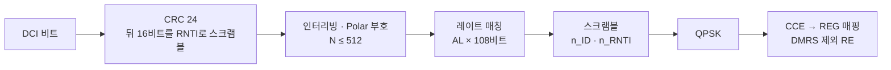

# PDCCH와 DCI

!!! spec "스펙 · 릴리즈"
    TS 38.211 §7.3.2 (PDCCH 변조·매핑), §7.4.1.3 (PDCCH DMRS) · TS 38.212 §7.3 (DCI 포맷, 부호화) · TS 38.213 §10 (UE 절차), §11 (그룹 공통 DCI)
    Rel-15 (0_0~2_3) → Rel-16 (0_2, 1_2, 2_4, 2_5, 2_6, 3_x) → Rel-17 (2_7, 4_x MBS) → Rel-18 (0_3, 1_3 다중 셀 스케줄링)

!!! basic "한눈에 보기"
    **PDCCH**는 기지국이 단말에게 보내는 **지시서(DCI)**를 나르는 채널입니다. LTE와 역할은 같지만 다음이 바뀌었습니다.

    - 위치: CORESET 안에서만 (→ [CORESET](coreset-searchspace.md))
    - 부호: TBCC 대신 **Polar 부호**, CRC 24비트
    - 복조: CRS 대신 **PDCCH 전용 DMRS** → PDCCH도 빔포밍 가능
    - 집성 레벨: 1, 2, 4, 8에 **16** 추가 (셀 가장자리, 고신뢰)
    - DCI 포맷이 용도별로 체계화: **0_x = 상향 grant, 1_x = 하향 할당, 2_x = 그룹 공통**

## DCI 포맷 { .l2 }

| 포맷 | 용도 | 릴리즈 |
|---|---|---|
| **0_0** | PUSCH 스케줄링 (폴백, 고정 필드) | 15 |
| **0_1** | PUSCH 스케줄링 (전체 기능: MIMO, CBG, BWP 전환 등) | 15 |
| 0_2 | PUSCH (필드 크기 설정 가능, URLLC용 소형) | 16 |
| 0_3 | 다중 셀 PUSCH 스케줄링 | 18 |
| **1_0** | PDSCH 스케줄링 (폴백) — SIB, RAR, 페이징, Msg4도 이 포맷 | 15 |
| **1_1** | PDSCH 스케줄링 (전체 기능) | 15 |
| 1_2 | PDSCH (소형, URLLC) | 16 |
| 1_3 | 다중 셀 PDSCH 스케줄링 | 18 |
| 2_0 | **슬롯 포맷 지시 (SFI)**, 가용 RB 집합 (NR-U) | 15 |
| 2_1 | **선점 지시** (URLLC가 eMBB 자원을 빼앗았음을 알림) | 15 |
| 2_2 | PUCCH/PUSCH TPC (그룹) | 15 |
| 2_3 | SRS TPC (그룹) | 15 |
| 2_4 | **UL 취소 지시** (URLLC UL 보호) | 16 |
| 2_5 | IAB soft 자원 가용 지시 | 16 |
| 2_6 | **전력 절약 신호** (C-DRX 웨이크업, WUS) | 16 |
| 2_7 | 페이징 조기 지시 (PEI) | 17 |
| 3_0 / 3_1 | NR / LTE 사이드링크 스케줄링 | 16 |
| 4_0 / 4_1 / 4_2 | MBS 방송·멀티캐스트 | 17 |

## 예: DCI 1_0 (C-RNTI, USS/CSS) { .l2 }

| 필드 | 비트 |
|---|---|
| DCI 포맷 식별자 | 1 |
| 주파수 자원 할당 (Type 1) | \(\lceil \log_2(N_{RB}(N_{RB}+1)/2) \rceil\) |
| 시간 자원 할당 (TDRA 표 인덱스) | 4 |
| VRB-to-PRB 매핑 | 1 |
| MCS | 5 |
| NDI | 1 |
| RV | 2 |
| HARQ 프로세스 번호 | 4 |
| DAI | 2 |
| PUCCH TPC | 2 |
| PUCCH 자원 지시자 (PRI) | 3 |
| PDSCH-to-HARQ 타이밍 (K1) | 3 |

예: BWP 51 RB → 주파수 할당 11비트 → 총 **39비트** (+ CRC 24).

## 처리 과정 { .l2 }

REG당 데이터 RE는 9개(12 − DMRS 3)이므로 CCE당 54 RE = **108비트**입니다. AL 16이면 1728비트까지 됩니다.

??? expert "전문가 노트 — 그룹 공통 DCI와 실무 이슈"
    **DCI 2_1 선점(preemption) 지시.** URLLC 트래픽이 이미 eMBB에 할당된 PDSCH 자원 일부를 빼앗아 쓰면, 그 후 INT-RNTI로 DCI 2_1을 보내 "이 시간·주파수 영역(14 비트맵 × 주파수 1/2 분할)은 너에게 보낸 게 아니다"라고 알립니다. eMBB 단말은 해당 소프트 비트를 버려 HARQ 결합 오염을 막습니다.

    **DCI 2_4 UL 취소.** 반대로 URLLC 단말의 UL을 위해 eMBB 단말의 예정된 PUSCH/SRS를 취소하게 합니다(CI-RNTI).

    **DCI 2_6 (WUS).** C-DRX onDuration 전에 PS-RNTI로 보내 "이번 onDuration에 깨어날지"를 알려 줍니다. 깨울 필요가 없으면 단말은 onDuration 동안 PDCCH 감시를 생략합니다.

    **Polar 세부.** DCI는 CRC 앞에 24개의 1을 덧붙인 상태로 CRC를 계산(초기화 효과)하고, 분산 CRC 인터리버로 리스트 디코딩 조기 종료를 지원합니다. 최소 페이로드 12비트(작으면 0 패딩).

    **False alarm.** CRC 24비트(실효 21비트 수준)로 LTE(16비트)보다 오검출 확률이 크게 낮습니다.

    **PDCCH 반복 (Rel-17).** 두 SS 집합의 PDCCH 후보를 연결해(같은 DCI를 두 TRP·두 빔으로) 보내 신뢰성을 높입니다. 단말은 소프트 결합하거나 둘 중 하나를 디코딩합니다.

## LTE ↔ NR 비교

| 항목 | LTE | NR |
|---|---|---|
| 포맷 이름 | 0, 1, 1A, 2, 2A … | 0_x (UL), 1_x (DL), 2_x (그룹) |
| 부호 / CRC | TBCC / 16 | Polar / 24 |
| AL | 1, 2, 4, 8 | 1, 2, 4, 8, 16 |
| HARQ 타이밍 | 고정 | DCI가 K1 지시 |
| UL HARQ 지시 | PHICH 또는 DCI 0 | **DCI만** (NDI 토글) |
| 빔 | CRS 기반 (빔포밍 불가) | DMRS 기반, CORESET별 TCI |

## 관련 페이지

- [CORESET과 Search Space](coreset-searchspace.md)
- [PDSCH](pdsch.md) · [PUSCH](pusch.md)
- [URLLC](../advanced/urllc.md)
- [LTE PDCCH와 DCI](../../lte/phy/pdcch-dci.md)
