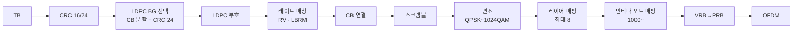

# PDSCH

!!! spec "스펙 · 릴리즈"
    TS 38.211 §7.3.1 (PDSCH 처리), §7.4.1.1 (PDSCH DMRS) · TS 38.212 §7.2 (DL-SCH, LDPC) · TS 38.214 §5.1 (수신 절차: §5.1.2 시간·주파수 할당, §5.1.3 MCS·TBS, §5.1.4 레이트 매칭, §5.1.6 DMRS·PTRS)
    Rel-15~ (Rel-16 multi-TRP·Type B 길이 확장, Rel-17 1024QAM·multi-PDSCH, Rel-18 DMRS 포트 확장 24개)

!!! basic "한눈에 보기"
    **PDSCH**는 NR 하향 **데이터 채널**입니다. LTE PDSCH와 비교하면 다음이 다릅니다.

    - **시간 위치가 자유롭습니다**: 슬롯 전체(Type A)뿐 아니라 2·4·7 심볼짜리 짧은 **미니슬롯**(Type B)도 가능
    - **PDCCH와 다른 슬롯**에 보낼 수 있습니다 (\(K_0\))
    - 복조는 항상 **DMRS**로 합니다 (CRS 없음)
    - 데이터 부호는 **LDPC**
    - 최대 **8 레이어**, 1024QAM(Rel-17, FR1)

## 시간 자원 할당 (TDRA) { .l2 }

DCI의 TDRA 필드(4비트)가 RRC 표(`pdsch-TimeDomainAllocationList`, 최대 16행)의 한 행을 고릅니다.

| 열 | 의미 |
|---|---|
| \(K_0\) | PDCCH 슬롯에서 PDSCH 슬롯까지 (0–32 슬롯) |
| SLIV → \(S\), \(L\) | 시작 심볼, 길이 |
| 매핑 유형 | Type A / Type B |

| 매핑 유형 | 시작 \(S\) | 길이 \(L\) (Normal CP) | DMRS 첫 위치 |
|---|---|---|---|
| **Type A** (슬롯 기반) | 0 – 3 | 3 – 14 | 슬롯 기준 심볼 2 또는 3 (`dmrs-TypeA-Position`) |
| **Type B** (미니슬롯) | 0 – 12 | 2, 4, 7 (Rel-16: 2 – 13) | PDSCH 첫 심볼 |

<figure markdown>

<figcaption>왼쪽: Type A, DMRS 설정 Type 1(comb), 추가 DMRS 1개. 가운데: DMRS 설정 Type 2(인접 2 부반송파 묶음, CDM 그룹 3개). 오른쪽: Type B 4심볼 미니슬롯 — DMRS가 PDSCH 첫 심볼에 옵니다.</figcaption>
</figure>

## 처리 과정 { .l2 }

| 항목 | 값 |
|---|---|
| 코드워드 | 1–4 레이어: 1개, 5–8 레이어: 2개 |
| DMRS 포트 | 1000–1007 (설정 Type 1), 1000–1011 (Type 2) |
| 프리코딩 | 기지국 구현 (투명). 단말은 DMRS로 실효 채널 추정 |
| PRB 번들링 | 2, 4 RB 또는 광대역 — 단말이 같은 프리코딩을 가정할 범위 |
| 슬롯 반복 | `pdsch-AggregationFactor` 2, 4, 8 (같은 TB, RV 순환) |

## PDSCH가 피해 가는 자원 (레이트 매칭) { .l2 }

| 자원 | 설정 |
|---|---|
| SSB | `ssb-PositionsInBurst` |
| CORESET (다른 단말의 PDCCH 포함) | `rateMatchPatternToAddModList` 또는 스케줄링한 PDCCH 자원 |
| ZP CSI-RS | `zp-CSI-RS-ResourceToAddModList` (주기 / 반지속 / 비주기) |
| NZP CSI-RS | 자기 측정용 CSI-RS |
| LTE CRS (DSS) | `lte-CRS-ToMatchAround` |
| 일반 패턴 | RB·심볼 비트맵, DCI의 rate matching indicator로 동적 적용 |

??? expert "전문가 노트 — DMRS 설계와 고급 기능"
    **DMRS 추가 위치 (Type A, 단일 심볼, 길이 14).** `dmrs-AdditionalPosition`: pos0 → {\(l_0\)}, pos1 → {\(l_0\), 11}, pos2 → {\(l_0\), 7, 11}, pos3 → {\(l_0\), 5, 8, 11} (\(l_0\) = 2 또는 3, pos3는 \(l_0\) = 2일 때만). 고속 이동일수록 추가 DMRS가 필요하지만 오버헤드가 늘어납니다.

    **DMRS 설정 Type 1 vs Type 2.**

    | | Type 1 | Type 2 |
    |---|---|---|
    | 주파수 패턴 | comb 2 (짝수/홀수 부반송파) | 인접 2개 묶음 × 3 그룹 |
    | CDM 그룹 | 2 | 3 |
    | 포트 (단일/이중 심볼) | 4 / 8 | 6 / 12 |
    | 밀도 | 높음 (채널 추정 강건) | 낮음 (MU-MIMO 포트 많음) |

    같은 CDM 그룹 안 포트는 FD-OCC(길이 2)와 TD-OCC(이중 심볼)로 구분합니다. DCI의 **antenna ports** 필드가 사용할 포트와 "데이터 없는 CDM 그룹 수"를 알려 주어, MU-MIMO 상대 단말의 DMRS 자리를 비워 두게 합니다(그림의 분홍색 RE).

    **DMRS 전력 부스팅.** 데이터 없는 CDM 그룹이 2개면 DMRS EPRE를 3 dB(3개면 4.77 dB) 높입니다(TS 38.214 Table 4.1-1).

    **Multi-TRP PDSCH (Rel-16).** 단일 DCI로 두 TRP가 서로 다른 레이어를 보내거나(SDM), 같은 TB를 FDM·TDM 방식으로 반복(scheme 2a/2b/3/4)해 신뢰성을 높입니다. DCI의 TCI 필드가 두 TCI 상태를 가리킵니다.

    **Multi-PDSCH 스케줄링 (Rel-17).** FR2-2의 짧은 슬롯과 NR-U에서 DCI 하나로 여러 슬롯의 서로 다른 TB를 스케줄합니다.

    **처리 시간 경계.** 단말은 PDSCH 마지막 심볼 이후 \(N_1\) 심볼 + 여유 뒤의 PUCCH에서만 HARQ-ACK를 보낼 수 있습니다. 기지국은 \(K_1\)을 이 조건에 맞게 골라야 합니다.

## LTE ↔ NR 비교

| 항목 | LTE | NR |
|---|---|---|
| 시작 위치 | CFI 다음 심볼 고정 | TDRA로 자유 (\(K_0\), \(S\), \(L\)) |
| 최소 길이 | 서브프레임 | 2 심볼 |
| 복조 | CRS 또는 DMRS (TM 의존) | 항상 DMRS |
| 부호 | Turbo | LDPC |
| 최대 레이어 | 8 (TM9) | 8 |
| 최고 변조 | 1024QAM (Rel-15) | 1024QAM (Rel-17, FR1) |

## 관련 페이지

- [DMRS·PTRS](dmrs-ptrs.md)
- [TBS와 MCS](tbs-mcs.md)
- [PDCCH와 DCI](pdcch-dci.md)
- [스케줄링과 HARQ](../procedures/scheduling-harq.md)
