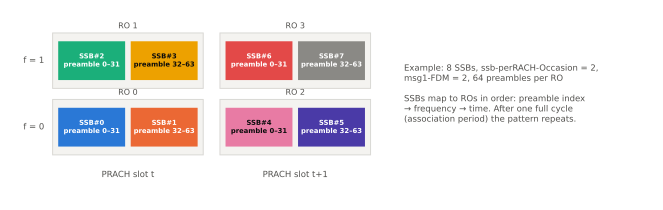

# PRACH

!!! spec "스펙 · 릴리즈"
    TS 38.211 §6.3.3 (PRACH: 시퀀스 §6.3.3.1, 포맷 Table 6.3.3.1-1/-2, 자원 Table 6.3.3.2-2~4) · TS 38.213 §8.1 (RACH occasion, SSB 연동) · TS 38.321 §5.1 · RRC `RACH-ConfigCommon`, `RACH-ConfigGeneric`
    Rel-15~ (Rel-16 2-step RA·NR-U 길이 571/1151, Rel-17 NTN·RedCap·커버리지 향상 Msg3 반복, Rel-18 RACH 반복)

!!! basic "한눈에 보기"
    PRACH는 단말이 처음 기지국에 신호를 보내는 채널입니다(LTE와 같은 역할). NR PRACH에는 두 가지 새로운 점이 있습니다.

    1. **짧은 프리앰블**: LTE식 긴 시퀀스(839) 외에 **짧은 시퀀스(139)**를 추가했습니다. 넓은 SCS(15–120 kHz)로 보내 mmWave와 작은 셀에 맞습니다.
    2. **빔과 연결**: 단말은 가장 강한 **SSB를 고르고, 그 SSB에 짝지어진 RACH 기회(RO)**에 프리앰블을 보냅니다. 기지국은 프리앰블이 온 RO만 보고도 단말이 어느 빔 방향에 있는지 압니다.

## 프리앰블 포맷 { .l2 }

### 긴 프리앰블 (\(L_{RA}\) = 839, FR1 전용)

| 포맷 | SCS | 시퀀스 반복 | CP | 대략 길이 | 셀 반경 | 용도 |
|---|---|---|---|---|---|---|
| 0 | 1.25 kHz | 1 | 3168κ | 1 ms | ~15 km | LTE 포맷 0과 같음 |
| 1 | 1.25 kHz | 2 | 21024κ | 3 ms | ~100 km | 대형 셀 |
| 2 | 1.25 kHz | 4 | 4688κ | 3.5 ms | ~22 km | 커버리지 향상 |
| 3 | **5 kHz** | 4 | 3168κ | 1 ms | ~15 km | **고속 이동** |

### 짧은 프리앰블 (\(L_{RA}\) = 139, FR1·FR2)

| 포맷 | 반복 심볼 수 | CP (κ·2^-μ) | 특징 |
|---|---|---|---|
| A1 / A2 / A3 | 2 / 4 / 6 | 288 / 576 / 864 | GP 없음 (다음 심볼로 흡수) |
| B1 / B2 / B3 / B4 | 2 / 4 / 6 / 12 | 216 / 360 / 504 / 936 | 끝에 GP 포함 |
| C0 / C2 | 1 / 4 | 1240 / 2048 | 긴 CP → 큰 셀 |

SCS = 15 · 2^μ kHz (FR1: 15/30, FR2: 60/120). 짧은 포맷은 슬롯 안에 여러 번 넣을 수 있어 **빔 스윕 수신**(기지국이 RO마다 다른 수신 빔)에 유리합니다. Rel-16 NR-U는 \(L_{RA}\) = 571, 1151을 추가했습니다.

## SSB ↔ RACH occasion 연동 { .l2 }

<figure markdown>

<figcaption>SSB 8개, RO당 SSB 2개, 주파수 방향 RO 2개(msg1-FDM = 2) 예시. 각 SSB는 RO 안에서 프리앰블 구간을 나눠 가집니다.</figcaption>
</figure>

| 파라미터 | 의미 |
|---|---|
| `prach-ConfigurationIndex` (0–255) | 포맷, PRACH 슬롯·서브프레임, 시작 심볼, 슬롯당 RO 수 (FR1 FDD / FR1 TDD / FR2 별 표) |
| `msg1-FDM` | 같은 시간에 주파수로 나란히 놓인 RO 수 (1, 2, 4, 8) |
| `msg1-FrequencyStart` | 첫 RO 주파수 위치 (초기 UL BWP 기준) |
| `ssb-perRACH-OccasionAndCB-PreamblesPerSSB` | RO당 SSB 수 (1/8 ~ 16) + SSB당 경쟁 기반 프리앰블 수 |
| `totalNumberOfRA-Preambles` | RO당 프리앰블 수 (≤ 64) |
| `rsrp-ThresholdSSB` | 이 값 이상인 SSB 중에서 선택 |
| `zeroCorrelationZoneConfig`, `prach-RootSequenceIndex` | \(N_{CS}\), 루트 (긴: 0–837, 짧은: 0–137) |
| `powerRampingStep`, `preambleReceivedTargetPower`, `preambleTransMax` | 전력·재시도 |

??? expert "전문가 노트 — 매핑 규칙과 RA-RNTI"
    **SSB → RO 매핑 순서 (TS 38.213 §8.1).** ① 한 RO 안의 프리앰블 인덱스 증가 → ② 주파수 다중 RO 증가 → ③ PRACH 슬롯 안 시간 RO 증가 → ④ PRACH 슬롯 증가. 모든 SSB가 최소 한 번 매핑되는 최소 주기가 **연동 주기(association period)**이며, 그 정수배가 연동 패턴 주기(최대 160 ms)입니다.

    **RA-RNTI.**

    \[
    RA\text{-}RNTI = 1 + s_{id} + 14 \times t_{id} + 14 \times 80 \times f_{id} + 14 \times 80 \times 8 \times ul\_carrier\_id
    \]

    \(s_{id}\): RO 첫 심볼(0–13), \(t_{id}\): 시스템 프레임 안 첫 슬롯(0–79, 120 kHz 기준), \(f_{id}\): 주파수 RO(0–7), \(ul\_carrier\_id\): 0 NUL / 1 SUL. 2-step RA의 MsgB-RNTI는 여기에 \(14 \times 80 \times 8 \times 2\)를 더합니다.

    **전력 램핑과 빔.** 재시도 시 같은 SSB(빔)를 다시 고르면 전력을 `powerRampingStep`만큼 올리고, **다른 SSB를 고르면 램핑 카운터를 올리지 않습니다**(빔 변경이 먼저). 단말 송신 빔을 바꿔도 같습니다.

    **제한 집합 (긴 포맷).** Type A / Type B restricted set으로 고속 도플러에 따른 가짜 상관 피크를 피합니다. 포맷 3(5 kHz SCS)은 도플러 내성이 원래 좋습니다.

    **용도별 RACH 자원 분리 (Rel-17).** RedCap, 슬라이스, SDT, Msg3 반복(커버리지 향상) 단말이 **전용 프리앰블 집합/RO**(feature combination)로 자기 특성을 Msg1 단계부터 알려, 기지국이 Msg2·Msg3를 맞춤 처리할 수 있습니다.

## 관련 페이지

- [랜덤 액세스 (4-step·2-step)](../procedures/random-access.md)
- [초기 접속](../procedures/initial-access.md)
- [SSB 구조](ssb.md)
- [LTE PRACH](../../lte/phy/prach.md)
