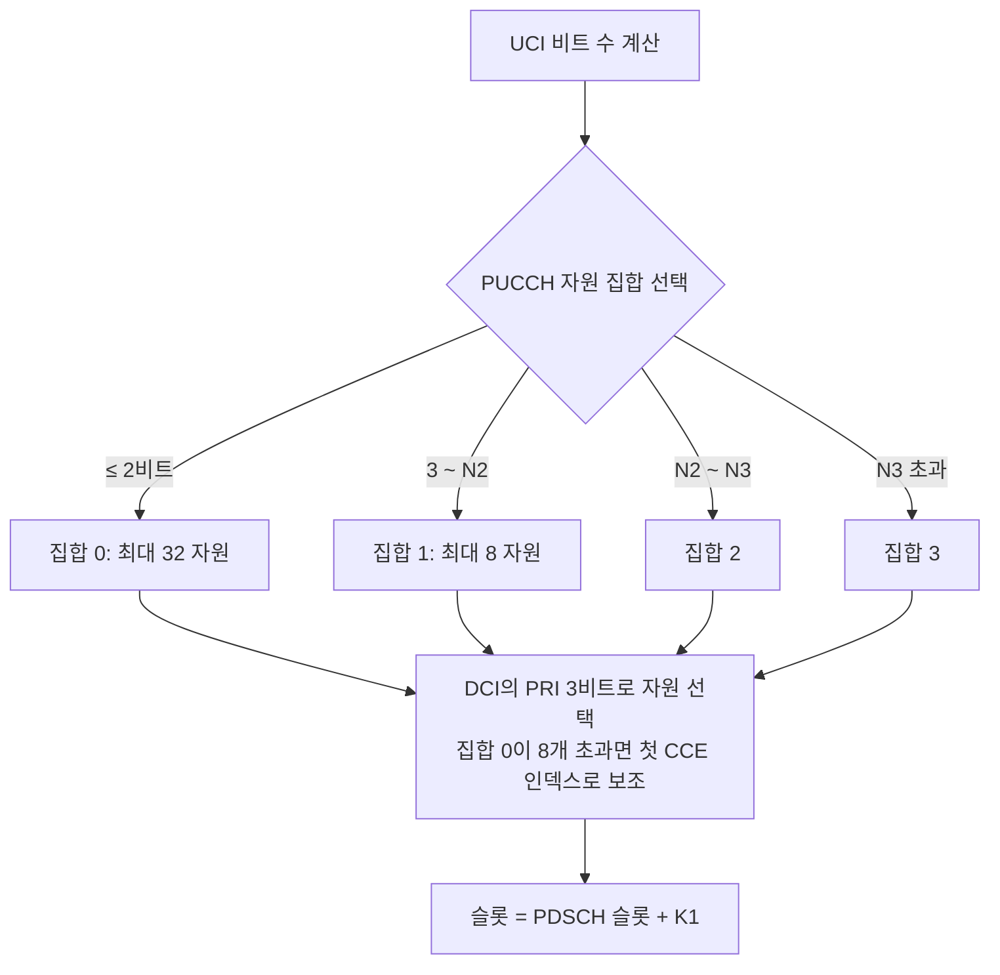

# PUCCH와 UCI

!!! spec "스펙 · 릴리즈"
    TS 38.211 §6.3.2 (PUCCH 포맷 0–4), §6.4.1.3 (PUCCH DMRS) · TS 38.212 §6.3.1 (UCI 부호화) · TS 38.213 §9 (UCI 보고: §9.1 HARQ-ACK 코드북, §9.2 PUCCH 자원, Table 9.2.1-1 공통 자원)
    Rel-15~ (Rel-16 서브슬롯 PUCCH·우선순위 2단계·interlace, Rel-17 PUCCH 반복 동적 지시·HARQ-ACK 지연, Rel-18 다중 TRP 향상)

!!! basic "한눈에 보기"
    **PUCCH**는 단말이 기지국에 **제어 정보(UCI)**를 보내는 상향 채널입니다. 내용은 LTE와 같습니다.

    - **HARQ-ACK** (하향 데이터 수신 결과)
    - **SR** (상향 자원 요청)
    - **CSI** (채널 상태 보고: CQI, PMI, RI, 빔 보고 등)

    LTE PUCCH는 항상 서브프레임 전체(14 심볼)를 썼지만, NR PUCCH는 **짧은 것(1–2 심볼)과 긴 것(4–14 심볼)**이 있고, 위치와 크기를 RRC로 자유롭게 정합니다.

    - **짧은 PUCCH**: 슬롯 끝 1–2 심볼 → 빠른 ACK (지연 짧음)
    - **긴 PUCCH**: 여러 심볼에 걸쳐 에너지를 모음 → 셀 가장자리 커버리지

## PUCCH 포맷 { .l2 }

| 포맷 | 길이 (심볼) | UCI 비트 | PRB | 방식 | 단말 다중화 |
|---|---|---|---|---|---|
| **0** | 1 – 2 | ≤ 2 | 1 | **시퀀스 선택** (순환 이동으로 정보 표현, DMRS 없음) | 순환 이동 |
| **1** | 4 – 14 | ≤ 2 | 1 | BPSK/QPSK × 시퀀스, 심볼마다 DMRS·데이터 교대, 시간 OCC | 순환 이동 × OCC |
| **2** | 1 – 2 | > 2 | 1 – 16 | CP-OFDM QPSK, DMRS가 1/3 (부반송파 1, 4, 7, 10) | 없음 |
| **3** | 4 – 14 | > 2 | 1 – 16 (\(2^a3^b5^c\)) | **DFT-s-OFDM** QPSK / π/2-BPSK | 없음 |
| **4** | 4 – 14 | > 2 | 1 | DFT-s-OFDM + DFT 전 OCC | 2 또는 4 |

UCI 부호화: 1–2비트는 시퀀스·반복, 3–11비트는 **Reed-Muller**, 12비트 이상은 **Polar**(+CRC 6/11).

## 자원 결정 { .l2 }

- **RRC 설정 전**(초기 접속 Msg4 ACK): SIB1의 `pucch-ResourceCommon`(0–15)이 TS 38.213 Table 9.2.1-1의 공통 자원 집합(포맷 0 또는 1, 시작 심볼, PRB 오프셋)을 가리킵니다.
- **SR**: 별도 자원(포맷 0 또는 1), 주기·오프셋 설정. ACK와 겹치면 함께 실음(포맷 0은 순환 이동 추가, 포맷 1은 SR 자원으로 ACK 전송).

## HARQ-ACK 코드북 { .l2 }

| 유형 | 크기 결정 | 장점 / 단점 |
|---|---|---|
| **Type-1 (semi-static)** | 가능한 모든 PDSCH 기회 (K1 집합 × TDRA × 셀) | 견고, 오버헤드 큼 |
| **Type-2 (dynamic)** | DCI의 **DAI**(counter/total)로 실제 스케줄 수 | 효율적, DCI 놓침은 DAI로 검출 |
| Type-3 (Rel-16, one-shot) | 모든 HARQ 프로세스 | NR-U에서 LBT 실패 대비 |

??? expert "전문가 노트 — 포맷 세부와 Rel-16 이후"
    **포맷 0 동작.** 길이 12 기저 시퀀스의 순환 이동 \(m_{cs}\)로 정보를 표현합니다. 1비트 ACK: {0, 6}, 2비트: {0, 3, 6, 9} (초기 이동 \(m_0\)에 더함), SR 양성이면 추가 이동. 수신기는 에너지 검출로 판정합니다. DMRS가 없어 코히어런트 검출이 필요 없습니다.

    **포맷 1 구조.** 짝수 심볼 DMRS, 홀수 심볼 데이터(또는 반대)를 번갈아 두고 슬롯 내 주파수 호핑을 할 수 있습니다. 시간 OCC 길이는 심볼 수에 따라 \(\lfloor N/2 \rfloor\) 정도로, 최대 7개 OCC × 12 CS로 다중화됩니다.

    **CSI Part 1 / Part 2.** CSI는 크기가 고정인 Part 1(RI, CQI 첫 CW, CRI 등)과 Part 1 값에 따라 크기가 변하는 Part 2(PMI, 두 번째 CW CQI)로 나눠 따로 부호화합니다. 자원이 부족하면 Part 2의 우선순위 낮은 부분부터 생략합니다(omission).

    **다중화와 충돌 처리.** 같은 슬롯에서 겹치는 PUCCH들(ACK, SR, CSI)은 하나의 PUCCH로 합치거나, 겹치는 PUSCH가 있으면 **PUSCH에 실어 보냅니다(UCI on PUSCH)**. 이때 처리 시간 조건(타임라인)을 만족해야 합니다.

    **Rel-16 URLLC 기능.**
    - **서브슬롯 PUCCH**: 슬롯을 2 또는 7 심볼 서브슬롯으로 나눠 K1을 서브슬롯 단위로 → 한 슬롯에 여러 번 ACK
    - **우선순위 2단계**: 고우선 HARQ-ACK 코드북과 저우선 코드북을 따로 운영, 충돌 시 저우선을 버림 (Rel-17에서 함께 다중화 가능)

    **Rel-17 향상.** PUCCH 반복 횟수를 DCI로 동적 지시, TDD에서 UL 슬롯이 없어 ACK를 못 보낼 때 다음 기회로 미루는 **SPS HARQ-ACK 지연**, 커버리지 향상용 DMRS 번들링.

## LTE ↔ NR 비교

| 항목 | LTE | NR |
|---|---|---|
| 길이 | 항상 1 서브프레임 | 1–2 또는 4–14 심볼 |
| 위치 | 대역 양 끝 고정 구조 | RRC로 PRB·심볼 자유 설정 |
| ACK 자원 | 첫 CCE로 암시 | DCI의 PRI (+CCE) |
| ACK 타이밍 | FDD n+4 고정 | K1 (DCI 지시) |
| 대용량 UCI | 포맷 3/4/5 | 포맷 2/3/4 (Polar) |

## 관련 페이지

- [PUSCH](pusch.md) — UCI on PUSCH
- [CSI-RS와 CSI 보고](csi-rs.md)
- [스케줄링과 HARQ](../procedures/scheduling-harq.md)
- [LTE PUCCH](../../lte/phy/pucch.md)
