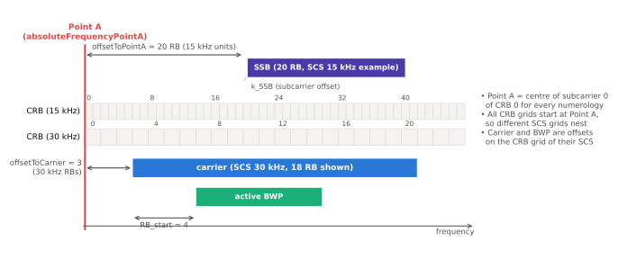

# 리소스 그리드와 Point A

!!! spec "스펙 · 릴리즈"
    TS 38.211 §4.4 (Point A, CRB, PRB, VRB), §4.4.4.2 (CRB), §7.3.1.6 (VRB→PRB 매핑) · 전송 대역 구성: TS 38.101-1 Table 5.3.2-1, 38.101-2 Table 5.3.2-1 · 자원 할당: TS 38.214 §5.1.2.2, §6.1.2.2 · RRC: `FrequencyInfoDL`, `SCS-SpecificCarrier`
    Rel-15~ (Rel-16 NR-U interlace 할당 Type 2)

!!! basic "한눈에 보기"
    LTE에서는 캐리어 **중심(DC)**이 기준점이었습니다. NR은 캐리어가 넓고(최대 400 MHz), 단말마다 쓰는 대역 부분(BWP)이 다르기 때문에 **캐리어 바깥에 공통 기준점**을 둡니다. 이것이 **Point A**입니다.

    - Point A에서부터 **공통 RB(CRB)** 번호를 0, 1, 2 … 로 매깁니다.
    - 캐리어, BWP, SSB의 위치는 모두 "Point A에서 몇 RB 떨어져 있는가"로 표현합니다.
    - NR의 RB는 **주파수로만 정의**됩니다(12 부반송파). 시간 길이는 슬롯·심볼로 따로 정합니다.

## Point A와 RB 종류 { .l2 }

<figure markdown>

<figcaption>Point A는 모든 numerology에서 CRB 0의 부반송파 0 중심입니다. 캐리어는 offsetToCarrier, BWP는 RB_start, SSB는 offsetToPointA와 k_SSB로 위치가 정해집니다.</figcaption>
</figure>

| 용어 | 정의 | 기준 |
|---|---|---|
| **Point A** | 공통 기준 주파수 | `absoluteFrequencyPointA` (NR-ARFCN) |
| **CRB** (Common RB) | Point A부터 번호 매긴 RB, SCS별 격자 | CRB 0 = Point A |
| 캐리어 | SCS별 자원 그리드의 시작·크기 | `offsetToCarrier`, `carrierBandwidth` (CRB 단위) |
| **PRB** (Physical RB) | BWP 안에서 0부터 매긴 RB | \(n_{CRB} = n_{PRB} + N_{BWP}^{start}\) |
| VRB | 할당에 쓰는 가상 RB (인터리브 매핑 가능) | PDSCH/PUSCH 자원 할당 |

## 전송 대역 구성 (FR1, TS 38.101-1) { .l2 }

| 채널 대역폭 (MHz) | 5 | 10 | 15 | 20 | 25 | 30 | 40 | 50 | 60 | 80 | 100 |
|---|---|---|---|---|---|---|---|---|---|---|---|
| 15 kHz | 25 | 52 | 79 | 106 | 133 | 160 | 216 | 270 | — | — | — |
| 30 kHz | 11 | 24 | 38 | 51 | 65 | 78 | 106 | 133 | 162 | 217 | **273** |
| 60 kHz | — | 11 | 18 | 24 | 31 | 38 | 51 | 65 | 79 | 107 | 135 |

FR2 (TS 38.101-2): 120 kHz에서 50 / 100 / 200 / **400 MHz** → 32 / 66 / 132 / **264 RB**, 60 kHz에서 50 / 100 / 200 MHz → 66 / 132 / 264 RB.

**스펙트럼 효율 비교**: LTE 20 MHz는 18 MHz(90%)만 쓰지만, NR 30 kHz 100 MHz는 273 × 12 × 30 kHz = 98.28 MHz(**98.3%**)를 씁니다.

## 주파수 자원 할당 { .l2 }

| 유형 | 방식 | DCI | 비고 |
|---|---|---|---|
| **Type 0** | RBG 비트맵 | 0_1, 1_1 | 비연속 할당 |
| **Type 1** | 시작 RB + 길이 (RIV) | 0_0, 1_0, 0_1, 1_1 | 연속 할당, 폴백 DCI는 항상 Type 1 |
| Type 2 (Rel-16) | interlace + RB 집합 | 0_0, 0_1 (NR-U) | 비면허 대역 점유 규제 |
| dynamicSwitch | DCI 1비트로 0/1 선택 | 0_1, 1_1 | |

### RBG 크기 P (TS 38.214 Table 5.1.2.2.1-1)

| BWP 크기 (RB) | Configuration 1 | Configuration 2 |
|---|---|---|
| 1 – 36 | 2 | 4 |
| 37 – 72 | 4 | 8 |
| 73 – 144 | 8 | 16 |
| 145 – 275 | 16 | 16 |

??? expert "전문가 노트 — 기준점 세부와 LTE 공존"
    **Point A 결정 경로.**
    - SA 초기 접속: 단말은 SSB를 찾은 뒤 MIB의 `ssb-SubcarrierOffset`(\(k_{SSB}\)), SIB1의 `offsetToPointA`로 Point A를 계산합니다. `offsetToPointA`는 FR1에서 15 kHz RB, FR2에서 60 kHz RB 단위입니다.
    - 연결 상태 / NSA: RRC `FrequencyInfoDL.absoluteFrequencyPointA`(NR-ARFCN)로 직접 알려 줍니다.

    **\(k_{SSB}\).** SSB의 부반송파 0과 그 SSB와 겹치는 CRB \(N_{CRB}^{SSB}\)의 부반송파 0 사이의 오프셋입니다. FR1은 0–23(15 kHz 단위, MIB 4비트 + PBCH 페이로드 1비트), FR2는 0–11. FR1에서 \(k_{SSB} \ge 24\)이면 "이 SSB에 연결된 CORESET#0/SIB1이 없음"을 뜻합니다(다른 GSCN 탐색 힌트 제공).

    **DC 위치.** NR은 DC 부반송파를 비우지 않습니다. 단말은 자기 송수신 DC 위치를 알려 주고(`txDirectCurrentLocation`, UL은 BWP별), 기지국은 그 RE의 성능 저하를 감안합니다.

    **UL 7.5 kHz 이동.** LTE와 같은 대역(DSS, UL 공유)에서 NR UL 부반송파를 LTE 격자와 맞추기 위해 `frequencyShift7p5khz`를 설정할 수 있습니다(FR1 일부 밴드).

    **VRB→PRB 인터리브 (Type 1).** 번들 크기 2 또는 4 RB 단위로 블록 인터리버를 적용해 주파수 다이버시티를 얻습니다(`vrb-ToPRB-Interleaver`). DCI 1_0으로 스케줄된 SIB1 등은 CORESET#0 대역 기준으로 해석합니다.

    **최대 275 RB 제약.** NR 규격은 SCS별 그리드를 최대 275 RB로 제한합니다. 120 kHz × 275 RB × 12 = 396 MHz → 400 MHz 채널에 264 RB가 정의된 이유(보호 대역 포함)입니다.

## LTE ↔ NR 비교

| 항목 | LTE | NR |
|---|---|---|
| 기준점 | 캐리어 중심 (EARFCN) | **Point A** (NR-ARFCN) |
| RB | 12 sc × 1 슬롯 | 12 sc (주파수만) |
| 최대 RB | 110 (실제 100) | 275 |
| 대역 점유율 | 90% | 최대 약 98% |
| DC | DL DC 비움 | 비우지 않음 |

## 관련 페이지

- [Numerology와 프레임 구조](numerology.md)
- [BWP](bwp.md)
- [SSB 구조](ssb.md)
- [NR-ARFCN과 GSCN](../spectrum/arfcn-gscn.md)
- [LTE 리소스 그리드](../../lte/phy/resource-grid.md)
