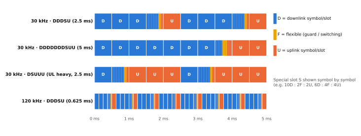
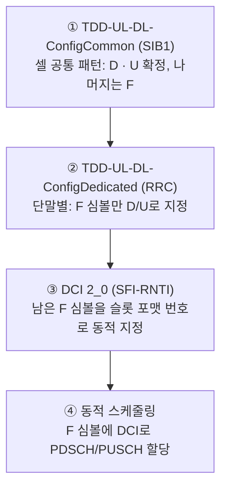

# 슬롯 포맷과 TDD 패턴

!!! spec "스펙 · 릴리즈"
    TS 38.213 §11.1 (슬롯 구성, Table 11.1.1-1 슬롯 포맷 0–55), §11.1.1 (DCI 2_0 SFI) · TS 38.331 `TDD-UL-DL-ConfigCommon`, `TDD-UL-DL-ConfigDedicated`, `SlotFormatIndicator`
    Rel-15~ (Rel-16 3 ms·4 ms 주기, CLI 측정 / Rel-18 SBFD 연구 → Rel-19 SBFD 규격)

!!! basic "한눈에 보기"
    LTE TDD는 서브프레임 단위로 정해진 **7가지 구성** 중 하나를 골랐습니다. NR은 훨씬 자유롭습니다.

    - **심볼 하나하나**를 하향(D), 상향(U), 유연(F) 중 하나로 정할 수 있습니다.
    - 반복 주기도 0.5 ms부터 10 ms까지 고를 수 있습니다.
    - **F(Flexible)** 심볼은 상황에 따라 D나 U로 쓰거나, 전환용 보호 구간으로 비워 둡니다.

    실제 망에서는 **같은 지역 모든 사업자가 같은 패턴**을 맞춰 씁니다(서로의 하향이 상향을 간섭하지 않도록). 3.5 GHz 대역에서는 30 kHz **DDDSU**(2.5 ms 주기)나 **DDDDDDDSUU**(5 ms 주기)가 흔합니다.

## 대표 TDD 패턴 { .l2 }

<figure markdown>

<figcaption>대표적인 TDD 패턴. 특수 슬롯(S)은 심볼 단위로 D–F–U가 섞인 슬롯입니다. 120 kHz에서는 같은 DDDSU 패턴이 0.625 ms마다 반복됩니다.</figcaption>
</figure>

| 패턴 (30 kHz) | 주기 | DL 비율 (대략) | 특징 |
|---|---|---|---|
| DDDSU | 2.5 ms | 약 74% | 상향 기회가 자주 → 지연 짧음 |
| DDDDDDDSUU | 5 ms | 약 77% | LTE TDD config 2와 정렬 가능, 상향 연속 2슬롯 |
| DDDSUDDSUU | 5 ms (2 패턴) | 약 64% | 상향 비중 증가 |
| DSUUU 계열 | 2.5 ms | 낮음 | 상향 중심(산업·FWA 업링크) |

DL 비율은 특수 슬롯 10D:2F:2U 가정으로 계산한 값입니다.

## 설정 계층 { .l2 }

**우선순위**: 위 단계에서 D나 U로 확정된 심볼은 아래 단계가 바꿀 수 없습니다. 아래 단계는 F만 바꿀 수 있습니다.

### `TDD-UL-DL-ConfigCommon` 구성

| 필드 | 의미 | 예 (DDDSU, 10:2:2) |
|---|---|---|
| `referenceSubcarrierSpacing` | 패턴 기준 SCS | 30 kHz |
| `dl-UL-TransmissionPeriodicity` | 주기 0.5, 0.625, 1, 1.25, 2, 2.5, 3, 4, 5, 10 ms | 2.5 ms |
| `nrofDownlinkSlots` | 주기 시작의 전 D 슬롯 수 | 3 |
| `nrofDownlinkSymbols` | 그다음 슬롯 앞부분 D 심볼 수 | 10 |
| `nrofUplinkSlots` | 주기 끝의 전 U 슬롯 수 | 1 |
| `nrofUplinkSymbols` | 그 앞 슬롯 끝부분 U 심볼 수 | 2 |
| `pattern2` | 두 번째 패턴 (전체 주기 = pattern1 + pattern2) | (선택) |

나머지(여기서는 특수 슬롯의 2 심볼)가 F입니다.

## 슬롯 포맷 표 (일부, TS 38.213 Table 11.1.1-1) { .l2 }

| 포맷 | 심볼 0–13 | | 포맷 | 심볼 0–13 |
|---|---|---|---|---|
| 0 | DDDDDDDDDDDDDD | | 28 | DDDDDDDDDDDDFU |
| 1 | UUUUUUUUUUUUUU | | 31 | DDDDDDDDDDDFUU |
| 2 | FFFFFFFFFFFFFF | | 34 | DFUUUUUUUUUUUU |
| 3 | DDDDDDDDDDDDDF | | 45 | DDDDDDFFUUUUUU |

포맷은 0–55가 정의되어 있고(56–254 예약), 255는 "반정적 설정과 스케줄링을 따르라"는 뜻입니다.

??? expert "전문가 노트 — GP 설계, 공존, SBFD"
    **보호 구간과 셀 반경.** F 심볼이 하향→상향 전환 보호 구간이 됩니다. 30 kHz 1 심볼 ≈ 35.7 µs → 왕복 약 10.7 km → **셀 반경 약 5.4 km**. 단말 TA 오프셋(`n-TimingAdvanceOffset`: FR1 25600 \(T_c\) ≈ 13 µs 또는 39936 \(T_c\) ≈ 20 µs(LTE 공존)), 기지국 전환 시간도 GP에서 차지합니다.

    **원격 간섭과 대기 덕팅.** 수백 km 떨어진 기지국의 하향 신호가 대기 덕트로 지연되어 도착하면 상향 수신 구간을 간섭합니다. Rel-16 **RIM**은 피해 기지국이 RIM-RS를 보내 가해 기지국을 찾아 대응하게 합니다.

    **LTE TDD와 같은 대역 공존.** LTE config 2(DSUDD, 5 ms) 지역에서는 NR 30 kHz DDDDDDDSUU + 프레임 오프셋 3 ms 정렬 같은 방식으로 D/U 경계를 맞춥니다. 특수 서브프레임 구성도 함께 맞춰야 합니다.

    **CLI (Rel-16).** 동적 TDD로 이웃 셀 방향이 다르면 단말↔단말 교차 링크 간섭이 생깁니다. 단말이 **SRS-RSRP**, **CLI-RSSI**를 측정·보고해 기지국이 패턴을 조정합니다.

    **SBFD (Rel-18 연구, Rel-19 규격).** TDD 캐리어의 D 심볼 일부 시간에 대역 가운데 부대역을 U로 쓰는 방식입니다. 기지국은 같은 시간에 송신과 수신을 하므로 자기 간섭 제거·부대역 격리가 필요하고, 단말은 반이중 그대로입니다. 상향 기회가 늘어 지연과 상향 커버리지가 좋아집니다.

## 관련 페이지

- [듀플렉싱 (FDD/TDD)](../../basics/duplexing.md)
- [LTE 프레임 구조](../../lte/phy/frame-structure.md) — LTE TDD 구성
- [스케줄링과 HARQ](../procedures/scheduling-harq.md)
- [Numerology와 프레임 구조](numerology.md)
