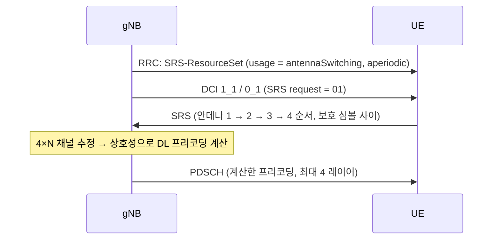

# SRS

!!! spec "스펙 · 릴리즈"
    TS 38.211 §6.4.1.4 (SRS 시퀀스·매핑, 대역폭 설정 Table 6.4.1.4.3-1) · TS 38.214 §6.2.1 (SRS 절차, 용도별 동작) · TS 38.213 §7.3 (SRS 전력) · RRC `SRS-Config`
    Rel-15~ (Rel-16 측위 SRS·comb 8, Rel-17 반복·부분 주파수 사운딩·안테나 전환 최대 8Rx, Rel-18 8포트 SRS)

!!! basic "한눈에 보기"
    **SRS (Sounding Reference Signal)**는 단말이 상향으로 보내는 "**측정용 신호**"입니다. 기지국은 SRS를 받아서 단말의 상향 채널을 직접 잽니다.

    NR에서 SRS가 특히 중요한 이유는 **TDD 상호성** 때문입니다. TDD에서는 상향과 하향이 같은 주파수라서, 기지국이 SRS로 상향 채널을 재면 **하향 채널도 알 수 있습니다**. 그러면 단말이 복잡한 PMI를 보고하지 않아도 64개 안테나 Massive MIMO 빔을 정밀하게 만들 수 있습니다.

## 용도 (`usage`) { .l2 }

| 용도 | 동작 |
|---|---|
| **codebook** | 기지국이 SRS로 측정 → PUSCH TPMI·랭크 결정 |
| **nonCodebook** | 단말이 프리코딩한 SRS 여러 개 → 기지국이 SRI로 선택 |
| **antennaSwitching** | 단말의 송신 안테나를 바꿔 가며 **모든 수신 안테나의 채널**을 기지국에 알림 (DL 상호성 빔포밍) |
| **beamManagement** | 단말 송신 빔 스윕 → 기지국이 UL 빔 선택 |
| positioning (Rel-16) | UL-TDOA, UL-AoA, 다중 RTT 측위 |

### 안테나 전환 구성

| 표기 | 의미 | 예 |
|---|---|---|
| 1T2R | 송신 1, 수신 2 | 저가 단말 |
| **1T4R** | 송신 1개로 4개 안테나를 번갈아 사운딩 | 일반 스마트폰 (FR1 TDD) |
| **2T4R** | 송신 2개로 4개 안테나 | 고급 스마트폰 |
| T=R | 모든 안테나 동시 송신 | CPE |
| xT6R, xT8R (Rel-17) | 최대 8 수신 안테나 | CPE·FWA |

## 자원 구조 { .l2 }

| 항목 | 값 |
|---|---|
| 심볼 | 1, 2, 4 연속 (Rel-15: 슬롯 마지막 6 심볼 안 / Rel-16 이후: 슬롯 어디든, 반복 확장) |
| 포트 | 1, 2, 4 (Rel-18: 8) |
| comb | **2, 4** (Rel-16 측위: 8) |
| 순환 이동 | comb 2: 8개, comb 4: 12개 |
| 대역폭 | 트리 구조 \(C_{SRS}\)(0–63) × \(B_{SRS}\)(0–3) → 4–272 RB |
| 주파수 호핑 | \(b_{hop}\)로 부분 대역을 돌며 전체 대역 사운딩 |
| 시간 동작 | 주기 (1–2560 슬롯) / 반지속 (MAC CE) / 비주기 (DCI SRS request) |

??? expert "전문가 노트 — 시퀀스, 용량, 측위"
    **시퀀스.** 길이 \(M_{sc}^{SRS} = m_{SRS,b} N_{sc}^{RB}/K_{TC}\)의 low-PAPR 시퀀스, 순환 이동 \(\alpha_i = 2\pi n_{SRS}^{cs,i}/n_{SRS}^{cs,max}\). 그룹 호핑·시퀀스 호핑을 설정할 수 있고 `sequenceId`(0–1023)로 셀과 독립적으로 정할 수 있습니다.

    **안테나 전환 보호 구간.** 안테나를 바꾸는 사이에 Y 심볼 보호 구간(FR1 μ ≤ 1이면 1 심볼, FR2 120 kHz는 2 심볼)을 둡니다.

    **SRS 용량 병목.** Massive MIMO TDD 셀에서 많은 단말이 자주 사운딩해야 하므로 SRS 자원(UL 슬롯 수 × 심볼 × comb × CS)이 부족해집니다. Rel-17은 **SRS 반복**(커버리지), **부분 주파수 사운딩**(RB 일부만, 용량), **comb 8 확장** 등으로 보완했습니다.

    **SRS 캐리어 전환.** PUSCH가 설정되지 않은 TDD 캐리어(DL CA 전용)에서도 SRS만 보내 상호성을 얻는 기능입니다(LTE Rel-14에서 시작, NR도 지원). 다른 캐리어 송신을 잠시 멈추는 중단 시간이 생깁니다.

    **측위 SRS (Rel-16).** RRC_CONNECTED뿐 아니라 Rel-17에서 INACTIVE 상태에서도 송신 가능, 여러 gNB/TRP가 수신해 도착 시간(UL-RTOA)과 각도(AoA)를 측정합니다. 경로 손실 기준을 이웃 셀 SSB/PRS로 잡을 수 있습니다. → [포지셔닝](../advanced/positioning.md)

## 관련 페이지

- [PUSCH](pusch.md)
- [빔 관리 개요](../beam/overview.md)
- [MIMO 기초](../../basics/mimo.md) — 채널 상호성
- [LTE 참조신호](../../lte/phy/reference-signals.md) — LTE SRS
