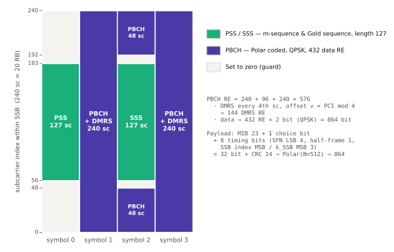
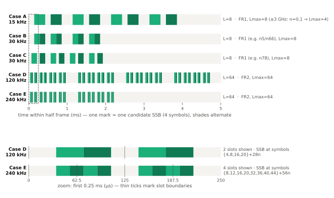

# SSB 구조

!!! spec "스펙 · 릴리즈"
    TS 38.211 §7.4.2 (PSS/SSS 시퀀스), §7.4.3 (SS/PBCH 블록 자원, Table 7.4.3.1-1), §7.3.3 (PBCH) · TS 38.212 §7.1 (BCH 부호화) · TS 38.213 §4.1 (SSB 후보 위치 Case A–G) · TS 38.331 `MIB`, `ssb-PositionsInBurst`
    Rel-15 (Case A–E) → Rel-16 NR-U 발견 버스트 → Rel-17 Case F/G (480·960 kHz), NCD-SSB

!!! basic "한눈에 보기"
    **SSB (SS/PBCH Block)**는 NR 셀이 자신을 알리는 **신호 묶음**입니다. 한 블록 안에 세 가지가 들어 있습니다.

    - **PSS** (주 동기신호): 타이밍 맞추기, 셀 ID 일부
    - **SSS** (부 동기신호): 셀 ID 나머지
    - **PBCH** (방송 채널): MIB — SFN, CORESET#0 위치 등 최소 정보

    LTE에서는 이 셋이 시간·주파수에 흩어져 있었지만, NR에서는 **4 심볼 × 240 부반송파** 한 덩어리로 묶었습니다. 그리고 이 덩어리를 **여러 번, 방향을 바꿔 가며(빔 스윕)** 보냅니다. 단말은 가장 잘 들리는 SSB를 골라 그 빔으로 접속합니다.

## SSB 내부 구조 { .l2 }

<figure markdown>

<figcaption>SSB는 4 OFDM 심볼 × 240 부반송파(20 RB). 심볼 0에 PSS, 심볼 2 가운데에 SSS, 심볼 1·3 전체와 심볼 2 양옆에 PBCH가 들어갑니다(TS 38.211 Table 7.4.3.1-1).</figcaption>
</figure>

| 심볼 | 부반송파 0–47 | 48–55 | 56–182 | 183–191 | 192–239 |
|---|---|---|---|---|---|
| 0 | 0 | 0 | **PSS** | 0 | 0 |
| 1 | PBCH | PBCH | PBCH | PBCH | PBCH |
| 2 | PBCH | 0 | **SSS** | 0 | PBCH |
| 3 | PBCH | PBCH | PBCH | PBCH | PBCH |

## 셀 ID { .l2 }

\[
N_{ID}^{cell} = 3\,N_{ID}^{(1)} + N_{ID}^{(2)}, \qquad N_{ID}^{(1)} \in \{0,\dots,335\},\ N_{ID}^{(2)} \in \{0,1,2\} \ \Rightarrow\ 1008 \text{개}
\]

| 신호 | 시퀀스 | 운반 정보 |
|---|---|---|
| PSS | BPSK **m-시퀀스** 길이 127, 순환 이동 \(43 N_{ID}^{(2)}\) | \(N_{ID}^{(2)}\), 심볼 타이밍 |
| SSS | BPSK **Gold 시퀀스** 길이 127 (두 m-시퀀스, 이동값이 \(N_{ID}^{(1)}\), \(N_{ID}^{(2)}\)에 의존) | \(N_{ID}^{(1)}\) |
| PBCH DMRS | Gold 시퀀스, SSB 인덱스·하프 프레임으로 초기화 | **SSB 인덱스** 하위 2–3비트 |

LTE의 ZC 기반 PSS는 주파수 오프셋과 타이밍 오프셋이 섞이는 문제가 있어, NR은 m-시퀀스를 택했습니다.

## SS 버스트 { .l2 }

<figure markdown>

<figcaption>하프 프레임(5 ms) 안의 SSB 후보 위치(TS 38.213 §4.1). 실제로 보낼 SSB는 ssb-PositionsInBurst 비트맵으로 정합니다. 아래는 FR2 Case D/E 처음 0.25 ms 확대.</figcaption>
</figure>

| Case | SCS | 후보 첫 심볼 (하프 프레임 기준) | 주 사용 |
|---|---|---|---|
| A | 15 kHz | {2, 8} + 14n | FR1 FDD 저대역 |
| B | 30 kHz | {4, 8, 16, 20} + 28n | FR1 일부 밴드 (n5, n66 등) |
| C | 30 kHz | {2, 8} + 14n | FR1 (n78 등 대부분) |
| D | 120 kHz | {4, 8, 16, 20} + 28n | FR2 |
| E | 240 kHz | {8, 12, 16, 20, 32, 36, 40, 44} + 56n | FR2 |
| F / G (Rel-17) | 480 / 960 kHz | {2, 9} + 14n | FR2-2 |

| 최대 SSB 수 \(L_{max}\) | 조건 |
|---|---|
| 4 | FR1 저주파 (FDD 약 3 GHz 이하, TDD는 더 낮은 기준) |
| 8 | FR1 그 외 |
| 64 | FR2 |

<figure markdown>

<figcaption>SSB 인덱스마다 다른 방향의 빔으로 보냅니다. 단말은 가장 강한 SSB를 고르고, 그 SSB에 연결된 RACH 자원으로 접속해 기지국에 빔을 알려 줍니다.</figcaption>
</figure>

## MIB 내용 { .l2 }

| 필드 | 비트 | 의미 |
|---|---|---|
| `systemFrameNumber` | 6 | SFN 상위 6비트 (하위 4비트는 PBCH 페이로드) |
| `subCarrierSpacingCommon` | 1 | SIB1·Msg2/4·페이징의 SCS (FR1: 15/30, FR2: 60/120) |
| `ssb-SubcarrierOffset` | 4 | \(k_{SSB}\) 하위 4비트 |
| `dmrs-TypeA-Position` | 1 | PDSCH/PUSCH 첫 DMRS 심볼 (2 또는 3) |
| `pdcch-ConfigSIB1` | 8 | **controlResourceSetZero(4) + searchSpaceZero(4)** → CORESET#0, SS#0 |
| `cellBarred` | 1 | 셀 금지 |
| `intraFreqReselection` | 1 | 금지 시 동일 주파수 재선택 허용 여부 |
| spare | 1 | |

PBCH 전송 블록 = MIB 24비트(선택 비트 포함) + **8비트 타이밍 정보**(SFN 하위 4, 하프 프레임 1, \(L_{max}=64\)이면 SSB 인덱스 상위 3 / 아니면 \(k_{SSB}\) 최상위 1비트 + 예약 2).

??? expert "전문가 노트 — 주기, 인덱스, 부호화"
    **주기.** `ssb-PeriodicityServingCell`: 5, 10, 20, 40, 80, 160 ms. **초기 셀 탐색에서 단말은 20 ms를 가정**합니다. SSB가 160 ms마다 오면 탐색 시간이 늘지만 기지국 에너지 절감에 유리합니다(Rel-18 망 에너지 절감과 연결).

    **SSB 인덱스 획득.** \(L_{max}\) = 4: DMRS로 2비트 / 8: DMRS로 3비트 / 64: DMRS 3비트 + PBCH 페이로드 3비트. PBCH DMRS 초기값:
    \(c_{init} = 2^{11}(\bar i_{SSB}+1)(\lfloor N_{ID}^{cell}/4 \rfloor + 1) + 2^6(\bar i_{SSB}+1) + (N_{ID}^{cell} \bmod 4)\),
    \(\bar i_{SSB}\)는 SSB 인덱스 하위 비트(\(L_{max}\)=4일 때는 하프 프레임 비트 포함). 인덱스를 알면 그 SSB의 정확한 프레임 내 타이밍을 알 수 있습니다.

    **PBCH 부호화.** 32비트 + CRC 24 → Polar(N = 512) → 레이트 매칭 864비트 → QPSK 432 RE. 페이로드 비트는 먼저 **스크램블**(SFN 2·3번째 LSB로 위상 선택)되어 80 ms TTI 안의 4개 20 ms 구간이 서로 결합 가능하도록 설계되었습니다.

    **CD-SSB와 NCD-SSB.** 셀을 정의하는 SSB(CD-SSB)는 동기 래스터(GSCN) 위에 있고 CORESET#0과 연결됩니다. 래스터 밖의 SSB(NCD-SSB)는 측정·BWP용입니다. → [NR-ARFCN과 GSCN](../spectrum/arfcn-gscn.md)

    **SSB와 데이터 다중화.** SSB가 있는 RB·심볼은 PDSCH가 레이트 매칭으로 피합니다(`ssb-PositionsInBurst` 기준). 단말이 그 정보를 모르는 SIB1 수신 시에는 SSB와 겹치는 PDSCH를 스케줄하지 않습니다.

    **NR-U (Rel-16).** LBT 실패로 SSB를 못 보내는 경우를 대비해 **발견 버스트 전송 창**(최대 5 ms) 안에서 SSB 후보 위치를 늘리고, 같은 빔의 후보끼리 QCL 관계(`ssb-PositionQCL`)를 알려 줍니다.

## LTE ↔ NR 비교

| 항목 | LTE | NR |
|---|---|---|
| 구성 | PSS·SSS·PBCH가 따로 | **SSB** 한 덩어리 (4 심볼 × 20 RB) |
| 위치 | 캐리어 중앙 | 래스터 위 어디든 (캐리어 중앙 아닐 수 있음) |
| 주기 | PSS/SSS 5 ms, PBCH 10 ms | 5–160 ms (기본 가정 20 ms) |
| 빔 | 없음 | 최대 64 빔 스윕 |
| PCI | 504 | 1008 |
| PBCH 복조 | CRS | PBCH DMRS |

## 관련 페이지

- [초기 접속](../procedures/initial-access.md)
- [CORESET과 Search Space](coreset-searchspace.md) — CORESET#0
- [빔 관리 개요](../beam/overview.md)
- [LTE PSS·SSS](../../lte/phy/pss-sss.md)
