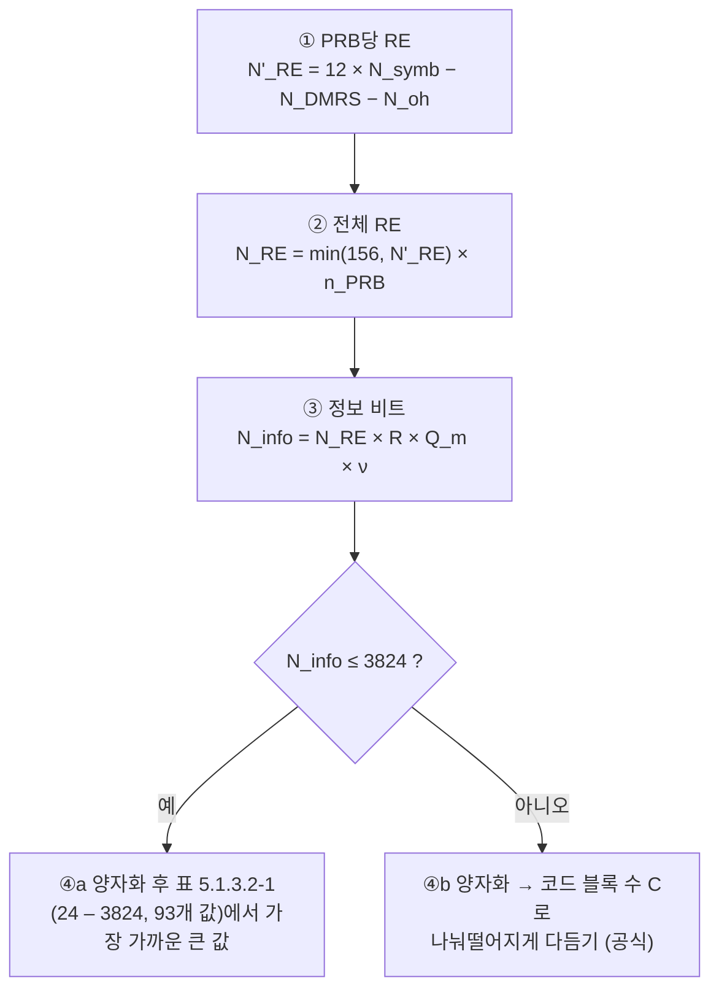

# TBS와 MCS

!!! spec "스펙 · 릴리즈"
    TS 38.214 §5.1.3.1 (MCS 표: Table 5.1.3.1-1 64QAM, -2 256QAM, -3 저효율, -4 1024QAM Rel-17), §5.1.3.2 (TBS 결정, Table 5.1.3.2-1), §6.1.4 (PUSCH MCS, transform precoding 표 6.1.4.1-1/-2)
    Rel-15~ (Rel-17 1024QAM 표, Rel-18 변경 없음)

!!! basic "한눈에 보기"
    LTE는 MCS와 RB 수로 **거대한 표**를 찾아 TBS를 정했습니다. NR은 RB 수, 심볼 수, 레이어 수가 너무 다양해서 표 대신 **계산식**을 씁니다.

    > 사용 가능한 RE 수 × 코딩률 × 변조 비트 수 × 레이어 수 → 다듬기 → TBS

    MCS 번호가 **변조 방식**과 **목표 코딩률**을 알려 주는 것은 LTE와 같습니다. 다만 NR MCS 표는 코딩률을 직접 적어 두었습니다.

## TBS 계산 절차 (TS 38.214 §5.1.3.2) { .l2 }

| 기호 | 의미 |
|---|---|
| \(N_{symb}\) | PDSCH 심볼 수 (TDRA의 L) |
| \(N_{DMRS}\) | PRB당 DMRS RE (CDM 그룹 포함, 데이터 없는 그룹도 포함) |
| \(N_{oh}\) | `xOverhead` 0, 6, 12, 18 (CSI-RS 등 대략적 오버헤드) |
| 156 | PRB당 RE 상한 (= 12 × 13) |
| \(R\), \(Q_m\) | MCS 표의 코딩률, 변조 차수 |
| \(\nu\) | 레이어 수 |

### \(N_{info} > 3824\) 일 때

\[
n = \lfloor \log_2(N_{info} - 24) \rfloor - 5, \qquad N'_{info} = \max\left(3840,\ 2^n \times \operatorname{round}\frac{N_{info}-24}{2^n}\right)
\]

- \(R \le 1/4\): \(C = \lceil (N'_{info}+24)/3816 \rceil\), \(TBS = 8C\lceil (N'_{info}+24)/(8C) \rceil - 24\)
- 그 외, \(N'_{info} > 8424\): \(C = \lceil (N'_{info}+24)/8424 \rceil\), \(TBS = 8C\lceil (N'_{info}+24)/(8C) \rceil - 24\)
- 그 외: \(TBS = 8\lceil (N'_{info}+24)/8 \rceil - 24\)

TBS가 LDPC 코드 블록(BG1 8448, BG2 3840)과 바이트에 딱 맞게 떨어지도록 설계되었습니다.

## 계산 예 { .l2 }

30 kHz, 100 MHz (273 PRB), PDSCH 12 심볼, DMRS 1 심볼(Type 1, CDM 그룹 2개 → 12 RE/PRB), xOverhead 0, 4 레이어

| 단계 | 256QAM, MCS 27 (R = 948/1024) | 64QAM, MCS 28 (R = 948/1024) |
|---|---|---|
| \(N'_{RE}\) | 12 × 12 − 12 = 132 | 132 |
| \(N_{RE}\) | 132 × 273 = 36,036 | 36,036 |
| \(N_{info}\) | 36,036 × 0.9258 × 8 × 4 ≈ 1,067,567 | ≈ 800,675 |
| \(n\), \(N'_{info}\) | 15, 1,081,344 | 14, 802,816 |
| \(C\) | 129 | 96 |
| **TBS** | **1,081,512비트/슬롯** | **803,304비트/슬롯** |
| 슬롯당 0.5 ms → | 약 **2.16 Gbps** (모든 슬롯 DL 가정) | 약 1.61 Gbps |

DDDSU TDD(DL 약 74%)라면 256QAM 4 레이어 최대 약 1.6 Gbps가 됩니다.

## MCS 표 1 (64QAM, Table 5.1.3.1-1) { .l2 }

| MCS | \(Q_m\) | R × 1024 | 효율 | | MCS | \(Q_m\) | R × 1024 | 효율 |
|---|---|---|---|---|---|---|---|---|
| 0 | 2 | 120 | 0.2344 | | 15 | 4 | 616 | 2.4063 |
| 1 | 2 | 157 | 0.3066 | | 16 | 4 | 658 | 2.5703 |
| 2 | 2 | 193 | 0.3770 | | 17 | 6 | 438 | 2.5664 |
| 3 | 2 | 251 | 0.4902 | | 18 | 6 | 466 | 2.7305 |
| 4 | 2 | 308 | 0.6016 | | 19 | 6 | 517 | 3.0293 |
| 5 | 2 | 379 | 0.7402 | | 20 | 6 | 567 | 3.3223 |
| 6 | 2 | 449 | 0.8770 | | 21 | 6 | 616 | 3.6094 |
| 7 | 2 | 526 | 1.0273 | | 22 | 6 | 666 | 3.9023 |
| 8 | 2 | 602 | 1.1758 | | 23 | 6 | 719 | 4.2129 |
| 9 | 2 | 679 | 1.3262 | | 24 | 6 | 772 | 4.5234 |
| 10 | 4 | 340 | 1.3281 | | 25 | 6 | 822 | 4.8164 |
| 11 | 4 | 378 | 1.4766 | | 26 | 6 | 873 | 5.1152 |
| 12 | 4 | 434 | 1.6953 | | 27 | 6 | 910 | 5.3320 |
| 13 | 4 | 490 | 1.9141 | | 28 | 6 | 948 | 5.5547 |
| 14 | 4 | 553 | 2.1602 | | 29–31 | 2/4/6 | 재전송용 | |

256QAM 표(Table 5.1.3.1-2)는 MCS 20–27이 256QAM(코딩률 682.5 ~ 948)이고, 저효율 표(5.1.3.1-3)는 URLLC용으로 코딩률 30/1024부터 시작합니다.

??? expert "전문가 노트 — 표 선택, 재전송, UL 특수 경우"
    **MCS 표 선택.** `mcs-Table`(qam256 / qam64LowSE / qam1024)이 설정되어도, 다음 경우는 표 1을 씁니다: DCI 1_0/0_0을 공통 탐색 공간에서 받은 경우, SI-/RA-/P-RNTI, TC-RNTI. `qam64LowSE`는 **MCS-C-RNTI**로 스크램블된 DCI에만 적용하도록 설정해 eMBB와 URLLC를 같은 단말에서 동적으로 나눌 수 있습니다.

    **재전송의 TBS.** MCS 29–31(표 2는 28–31)은 변조만 지정하고 TBS는 첫 전송 값을 유지합니다. 재전송 때 자원 양을 바꿀 수 있는 이유입니다.

    **TBS 상한과 LBRM.** 단말 최대 TBS는 별도 상한이 없지만, 레이트 매칭 시 순환 버퍼 크기 \(N_{cb}\)는 LBRM 기준(최대 레이어·변조·RB 가정, \(R_{LBRM}\) = 2/3)으로 제한될 수 있습니다.

    **UL transform precoding MCS (Table 6.1.4.1-1/-2).** π/2-BPSK 사용 시 MCS 0–1을 π/2-BPSK로 바꾼 표를 씁니다(`tp-pi2BPSK`). 코딩률이 매우 낮은 구간에서 PAPR 이득을 얻습니다.

    **SIB/페이징 TBS 스케일링.** DCI 1_0(P-RNTI, RA-RNTI)의 TB scaling 필드로 \(N_{info}\)에 1, 0.5, 0.25를 곱해 같은 RB에서 더 낮은 코딩률로 보낼 수 있습니다.

    **최대 처리량 공식 (TS 38.306 §4.1.2)** 은 TBS 계산과 별개로 단말 능력 비교용 근사식입니다. → [처리량 계산](../measurement/throughput.md)

## 관련 페이지

- [채널 코딩](../../basics/channel-coding.md) — LDPC BG 선택
- [CSI-RS와 CSI 보고](csi-rs.md) — CQI 표
- [처리량 계산](../measurement/throughput.md)
- [LTE TBS와 MCS](../../lte/phy/tbs-mcs.md)
