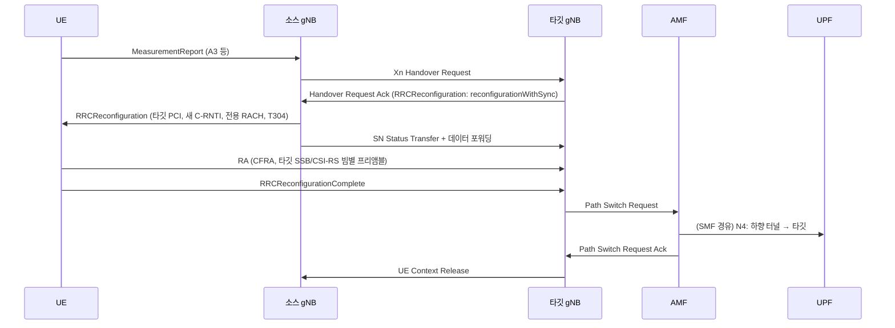
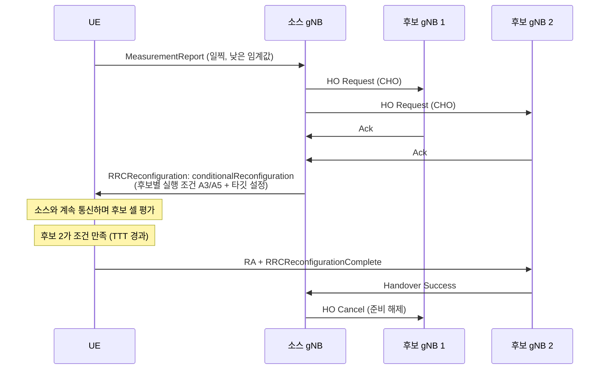

# 핸드오버 (CHO · DAPS · LTM)

!!! spec "스펙 · 릴리즈"
    NG-RAN 이동성: TS 38.300 §9.2.3 (Xn/NG HO, CHO §9.2.3.4, DAPS §9.2.3.2.x), §9.2.3.5 (LTM, Rel-18) · RRC: TS 38.331 §5.3.5.5 (`reconfigurationWithSync`), §5.3.5.13 (CHO) · 절차: TS 23.502 §4.9.1 · 요구사항: TS 38.133 §6.1
    Rel-15 기본 HO → Rel-16 **CHO·DAPS** → Rel-17 조건부 PSCell 추가/변경(CPAC) → Rel-18 **LTM**, 조건부 LTM·CHO+SCG 결합 → Rel-19 LTM 확장

!!! basic "한눈에 보기"
    NR 기본 핸드오버는 LTE와 같습니다: 측정 보고 → 기지국 간 준비 → 핸드오버 명령 → 타깃 셀 RA → 경로 변경.

    NR에서는 이 과정을 **더 빠르고 안정적으로** 만드는 기술이 릴리즈마다 추가되었습니다.

    | 기술 | 한 줄 요약 |
    |---|---|
    | **CHO** (Conditional HO, Rel-16) | 후보 셀을 미리 준비해 두고 **단말이 조건을 보고 스스로 실행** → 명령을 못 받아 끊기는 일 감소 |
    | **DAPS** (Dual Active Protocol Stack, Rel-16) | 타깃에 붙는 동안 **소스와의 데이터도 계속** → 중단 시간 거의 0 |
    | **LTM** (L1/L2 Triggered Mobility, Rel-18) | RRC 대신 **L1 측정 + MAC CE**로 셀 전환 → 수 ms 수준 |

## 기본 Xn 핸드오버 { .l2 }

**NG 핸드오버**는 Xn이 없거나 AMF 변경이 필요할 때 AMF를 경유합니다(Handover Required → Request → Command).

## CHO (Conditional Handover) { .l2 }

| 항목 | 기존 HO | CHO |
|---|---|---|
| 실행 결정 | 기지국 (명령 즉시) | **단말** (조건 만족 시) |
| 명령 수신 시점 | 신호 나빠진 뒤 → 실패 위험 | 신호 좋을 때 **미리** |
| 후보 셀 | 1 | 최대 8 |
| 대가 | — | 후보 셀 자원 예약 부담 |

## DAPS 핸드오버 { .l2 }

| 단계 | 소스 링크 | 타깃 링크 |
|---|---|---|
| HO 명령 수신 | **유지** (DL·UL) | RA 시작 |
| 타깃 RA 성공 | DL 유지, UL 전환 시작 | UL 데이터 시작 |
| 소스 해제 지시 | 해제 | 단독 |

PDCP가 소스·타깃 두 경로를 함께 다루며(키 2개), 단말은 두 셀에 동시 송수신할 RF·처리 능력이 필요합니다.

## LTM (Rel-18) { .l2 }

L3 필터링·RRC 처리 없이 L1 측정과 MAC CE로 전환하므로 결정 지연과 중단 시간이 크게 줄어듭니다. 같은 gNB-CU 안의 DU/셀 간에 특히 효과적입니다.

??? expert "전문가 노트 — 중단 시간, 빔, 실패 처리"
    **중단 시간 요구 (TS 38.133).** 일반 HO의 중단은 \(T_{interrupt} = T_{search} + T_{IU} + T_{processing} + T_{\Delta} + T_{margin}\) 형태입니다. FR2는 타깃 빔 찾기(\(T_{\Delta}\)) 때문에 더 깁니다. DAPS는 사실상 0 ms, LTM은 RACH-less + 조기 동기 시 수 ms를 목표로 합니다.

    **빔별 CFRA.** `rach-ConfigDedicated`에 타깃의 SSB 또는 CSI-RS별 전용 프리앰블을 주면, 단말은 타깃에서 가장 좋은 빔을 골라 그 빔의 전용 프리앰블을 보냅니다. 기지국은 RA만으로 타깃 빔을 압니다.

    **CHO 실패와 복구.** CHO 실행 실패나 RLF가 나면 단말은 재수립 대신 **다른 CHO 후보 셀로 바로 실행**할 수 있습니다(`attemptCondReconfig`). 재수립보다 빠릅니다.

    **조건부 PSCell 추가·변경 (CPAC, Rel-17).** DC의 SCG에도 조건부 실행을 적용합니다. Rel-18에서는 CHO와 SCG 설정을 함께 묶는(CHO with candidate SCG) 확장이 추가되었습니다.

    **MRO 확장.** CHO·DAPS 실패, 성공 HO 보고(SHR, Rel-17: 성공했지만 아슬아슬했던 HO의 측정 정보)로 파라미터 자동 최적화를 지원합니다.

## 관련 페이지

- [측정 이벤트와 갭](../measurement/events-gaps.md)
- [CU/DU 분리와 O-RAN](../architecture/cu-du-oran.md)
- [PDCP](../protocol/pdcp.md) — DAPS
- [LTE 핸드오버](../../lte/procedures/handover.md)
