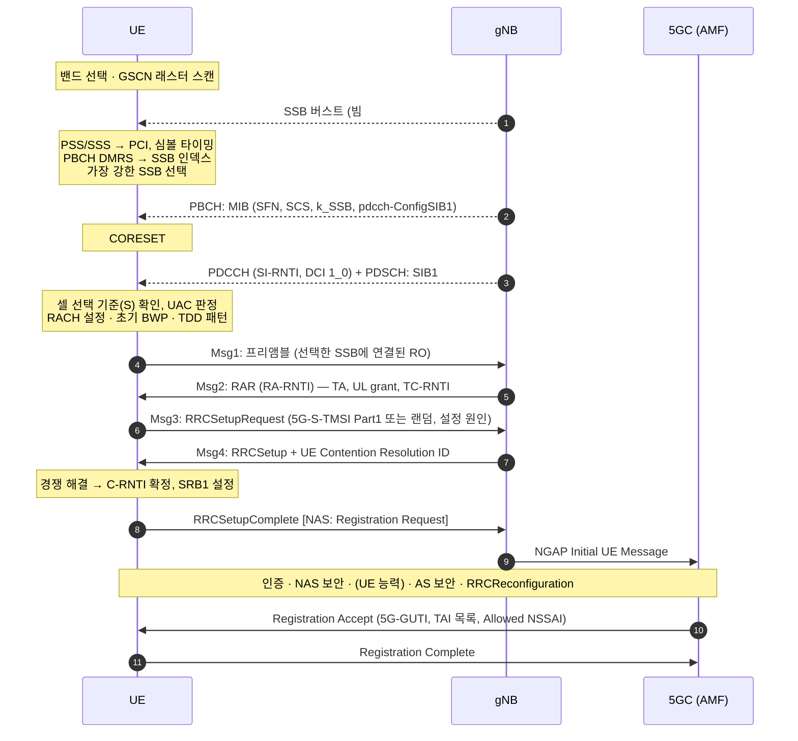
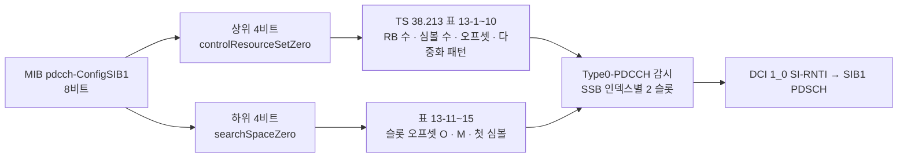

# 초기 접속

!!! spec "스펙 · 릴리즈"
    셀 탐색·동기: TS 38.213 §4.1 (SSB), §13 (Type0-PDCCH/CORESET#0) · 셀 선택: TS 38.304 §5.2 · 시스템 정보: TS 38.331 §5.2 · 랜덤 액세스: TS 38.321 §5.1, TS 38.213 §8 · RRC 연결: TS 38.331 §5.3.3 · 등록: TS 23.502 §4.2.2.2
    Rel-15~ (Rel-16 2-step RA·NR-U, Rel-17 RedCap 초기 BWP·NTN, Rel-18 망 에너지 절감 SSB-less SCell)

!!! basic "한눈에 보기"
    5G 단말이 전원을 켜고 SA 망에 붙기까지의 과정입니다. LTE와 큰 흐름은 같지만, **빔**이 처음부터 끼어 있다는 점이 다릅니다.

    1. **SSB 찾기**: 동기 래스터(GSCN) 위를 훑어 SSB를 찾고, PSS/SSS로 셀 ID와 타이밍을 얻음
    2. **가장 좋은 SSB(빔) 고르기**
    3. **MIB 읽기**: SFN, 그리고 SIB1을 어디서 찾을지(CORESET#0, SearchSpace#0)
    4. **SIB1 읽기**: 이 셀에 들어가도 되는지, RACH 설정, 초기 BWP
    5. **RACH**: 고른 SSB에 연결된 RACH 기회로 프리앰블 → 기지국이 단말의 빔을 알게 됨
    6. **RRC 연결**: RRCSetupRequest → RRCSetup → RRCSetupComplete(+ 등록 요청)
    7. **등록**: 5GC에 Registration → 인증·보안 → 완료

## 전체 흐름 { .l2 }

등록 이후 단계는 [등록 (Registration)](registration.md), RACH 세부는 [랜덤 액세스](random-access.md)에서 다룹니다.

## 단계별로 얻는 정보 { .l2 }

| 단계 | 신호 | 얻는 정보 |
|---|---|---|
| PSS | m-시퀀스 | \(N_{ID}^{(2)}\), 심볼 경계 |
| SSS | Gold 시퀀스 | \(N_{ID}^{(1)}\) → **PCI** |
| PBCH DMRS | | **SSB 인덱스**(하위 비트), 하프 프레임 |
| PBCH 페이로드 | MIB + 8비트 | **SFN**, SSB 인덱스 상위 비트(FR2), \(k_{SSB}\), SIB1 SCS, CORESET#0/SS#0, DMRS Type A 위치, 셀 금지 |
| SIB1 | PDSCH | PLMN, TAC, 셀 ID, 셀 선택 기준, UAC, **ServingCellConfigCommon**(초기 DL/UL BWP, RACH, PUCCH 공통, TDD 패턴, SSB 위치·주기), SI 스케줄 |
| RAR | PDSCH | **TA**, Msg3 grant, TC-RNTI |
| Msg4 | PDSCH | RRCSetup (SRB1, masterCellGroup), 경쟁 해결 |

## SIB1 받기: CORESET#0과 SS#0 { .l2 }

**다중화 패턴 1**(TDM, FR1에서 흔함)에서 SSB 인덱스 \(i\)의 Type0-PDCCH는 슬롯 \(n_0 = (O \cdot 2^{\mu} + \lfloor i \cdot M \rfloor) \bmod N_{slot}^{frame,\mu}\)부터 연속 2 슬롯에서 감시합니다. 즉 **SSB 빔마다 SIB1도 같은 빔으로** 보냅니다.

SIB1 주기는 160 ms이고, 그 안에서 반복 전송 주기는 기지국 구현(SSB 주기 등)에 따릅니다.

??? expert "전문가 노트 — 탐색 시간, NSA, 특수 경우"
    **동기 래스터와 탐색 시간.** NR은 SSB가 캐리어 중앙에 있지 않아도 되는 대신, SSB 중심을 **GSCN** 래스터(FR1 3 GHz 이상에서 1.44 MHz 간격) 위에만 둡니다. LTE(100 kHz 래스터)보다 후보 수가 크게 줄어 탐색이 빠릅니다. 밴드별로 쓸 수 있는 GSCN 범위·간격이 정해져 있습니다(TS 38.101-1 Table 5.4.3.3-1). → [NR-ARFCN과 GSCN](../spectrum/arfcn-gscn.md)

    **SSB 주기 가정.** 단말은 초기 탐색에서 20 ms를 가정하므로, 셀이 SSB를 40 ms 이상 주기로 보내면 탐색 시간이 길어집니다. 비 CD-SSB(\(k_{SSB} \ge 24\))를 만나면 MIB의 정보로 가까운 CD-SSB의 GSCN 힌트를 얻습니다.

    **셀 선택 기준.** \(S_{rxlev} = Q_{rxlevmeas} - (Q_{rxlevmin} + Q_{rxlevminoffset}) - P_{compensation} - Q_{offsettemp} > 0\) (LTE와 같은 형태, NR에서는 **SS-RSRP**로 측정, 셀 품질은 여러 빔 측정값에서 도출).

    **NSA(EN-DC) 초기 접속.** NR 셀의 MIB/SIB1을 읽을 필요가 없습니다. LTE RRC로 받은 `nr-Config`(SCG의 ServingCellConfigCommon, 전용 RACH)로 바로 PSCell에 **비경쟁 RA**를 합니다. 그래서 NSA 전용 NR 셀은 SIB1을 방송하지 않기도 합니다.

    **초기 접속 지연 구성.** SSB 검출(여러 SSB 주기) + MIB(최대 80 ms 결합) + SIB1(최대 160 ms 주기) + RACH 기회 대기(PRACH 주기 10–160 ms) + Msg2–4(수 ms) + 등록(수십~수백 ms). 망 설정(SSB·SIB1·PRACH 주기)이 체감 접속 시간을 좌우합니다.

    **RedCap (Rel-17).** RedCap 단말을 위해 별도의 초기 DL/UL BWP(최대 20 MHz FR1), 전용 RACH 자원(조기 식별), `cellBarredRedCap` 등을 SIB1에 추가했습니다. → [RedCap](../advanced/redcap.md)

## LTE ↔ NR 비교

| 항목 | LTE | NR SA |
|---|---|---|
| 탐색 단위 | 100 kHz 래스터, 중앙 6 RB | GSCN 래스터, SSB 20 RB |
| 빔 | 없음 | SSB 선택 → RO 연동 |
| SIB1 위치 | 서브프레임 5 고정 | CORESET#0/SS#0 (MIB가 지시) |
| 기타 SI | 항상 방송 | 방송 또는 on-demand |
| 연결 메시지 | RRCConnectionRequest/Setup/Complete | RRCSetupRequest/Setup/Complete |
| 등록 | Attach (기본 베어러 포함) | Registration (PDU 세션 분리) |

## 관련 페이지

- [SSB 구조](../phy/ssb.md)
- [CORESET과 Search Space](../phy/coreset-searchspace.md)
- [랜덤 액세스 (4-step·2-step)](random-access.md)
- [등록 (Registration)](registration.md)
- [LTE 셀 탐색과 시스템 정보](../../lte/procedures/cell-search.md)
