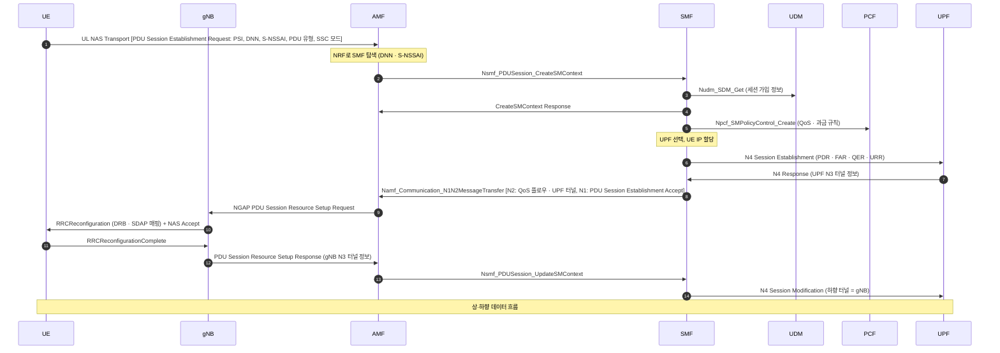

# PDU 세션

!!! spec "스펙 · 릴리즈"
    절차: TS 23.502 §4.3.2 (PDU Session Establishment), §4.3.3 (Modification), §4.3.4 (Release) · 개념: TS 23.501 §5.6 (세션 관리, SSC 모드 §5.6.9) · NAS: TS 24.501 §6.4 · N4: TS 29.244 (PFCP)
    Rel-15~ (Rel-16 이중화 PDU 세션·TSN, Rel-17 엣지 컴퓨팅, Rel-18 PDU Set QoS)

!!! basic "한눈에 보기"
    **PDU 세션**은 단말과 데이터 네트워크(인터넷, IMS, 사내망 등) 사이의 **데이터 통로**입니다. LTE의 PDN 연결에 해당합니다.

    - 등록한 뒤 필요할 때 만듭니다 (예: 인터넷용, 음성(IMS)용 각각).
    - 세션마다 **DNN**(접속할 망 이름, LTE의 APN)과 **S-NSSAI**(슬라이스)를 정합니다.
    - 세션 안에는 여러 **QoS 플로우**가 있고, 최소 하나의 기본 플로우가 만들어집니다.
    - IP뿐 아니라 **이더넷**, 구조 없는(Unstructured) 데이터 세션도 가능합니다.

## PDU 세션 생성 흐름 { .l2 }

## 세션 속성 { .l2 }

| 속성 | 값 | 의미 |
|---|---|---|
| PDU Session ID | 1–15 | 단말 내 세션 구분 |
| **DNN** | 예: `internet`, `ims` | 데이터 네트워크 이름 |
| **S-NSSAI** | SST + SD | 슬라이스 |
| PDU 유형 | IPv4, IPv6, IPv4v6, **Ethernet**, Unstructured | |
| **SSC 모드** | 1, 2, 3 | 이동 시 세션 연속성 방식 |
| Session-AMBR | | non-GBR 플로우 합 최대 속도 |
| 접속 유형 | 3GPP / 비3GPP | Wi-Fi 경유 세션 가능 |

### SSC 모드

| 모드 | 동작 | 용도 |
|---|---|---|
| **1** | 앵커 UPF(PSA) 고정 → **IP 유지** | 일반 (LTE와 같음) |
| 2 | 앵커 변경 시 **기존 세션 해제 후** 새 세션 (break-before-make) | IP 변경을 견디는 앱 |
| 3 | **새 세션을 먼저 만들고** 기존 세션 해제 (make-before-break) | 엣지 앱 이동 |

??? expert "전문가 노트 — UPF 체인, 이중화, Service Request"
    **사용자 평면 재활성화.** CM-IDLE로 가면 N3 터널(무선·gNB 구간)만 해제되고 PDU 세션 자체는 SMF·UPF에 남습니다. 다음 Service Request에서 단말이 `Uplink data status`에 재활성할 세션을 표시하면, AMF → SMF → N2 PDU Session Resource Setup으로 DRB와 N3만 복원합니다.

    **하향 데이터 도착 (CM-IDLE).** UPF가 SMF에 Data Notification → SMF → AMF(Namf_Communication_N1N2MessageTransfer) → AMF가 페이징 → Service Request. UPF 대신 SMF가 버퍼링하도록 설정할 수도 있습니다.

    **ULCL / Branching Point.** SMF가 세션 중간에 UPF를 추가해 특정 목적지(엣지 서버) 트래픽만 로컬 PSA로 빼고, 나머지는 중앙 PSA로 보냅니다. IPv6 multi-homing 세션은 단말이 여러 프리픽스를 가집니다.

    **이중화 PDU 세션 (Rel-16 URLLC).** 단말이 서로 다른 경로(다른 gNB·UPF, DC)로 **두 개의 PDU 세션**을 만들고, 응용 또는 TSN의 FRER(IEEE 802.1CB)로 중복 패킷을 처리합니다. N3/N9 구간에 이중 터널을 두는 방식도 있습니다.

    **이더넷 PDU 세션.** UPF가 MAC 주소 학습과 브리지 역할을 하며, TSN 연동 시 5GS 전체가 하나의 **TSN 브리지**로 보입니다(DS-TT/NW-TT 변환기, 시간 동기 gPTP 전달).

    **PDU 세션 해제 원인.** 5GSM cause #26(자원 부족), #27(DNN 누락/불명), #28(PDU 유형 미지원), #29(사용자 인증 실패), #33(요청 서비스 옵션 미가입), #39(재활성 요청), #46(LADN 밖), #54(PDU 세션 없음) 등.

## 관련 페이지

- [QoS 플로우](../architecture/qos-flow.md)
- [5GC와 SBA](../architecture/5gc-sba.md)
- [등록 (Registration)](registration.md)
- [NAS (5GMM·5GSM)](../protocol/nas.md)
- [LTE 베어러와 QoS](../../lte/architecture/bearer-qos.md)
