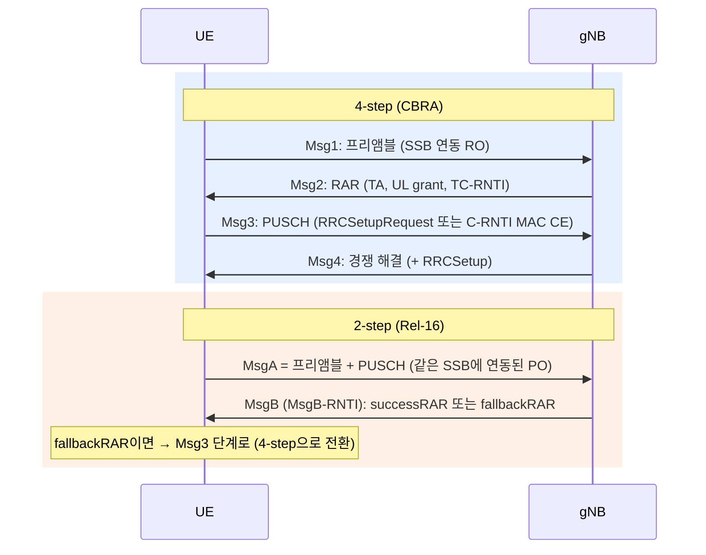

# 랜덤 액세스 (4-step · 2-step)

!!! spec "스펙 · 릴리즈"
    MAC: TS 38.321 §5.1 (§5.1.1 초기화, §5.1.2 자원 선택, §5.1.4 RAR, §5.1.5 경쟁 해결, §5.1.4a MsgB) · 물리계층: TS 38.213 §8 (RAR UL grant Table 8.2-1, MsgA §8.1A) · RRC `RACH-ConfigCommon`, `RACH-ConfigCommonTwoStepRA`
    Rel-15 4-step → Rel-16 **2-step (MsgA/MsgB)** → Rel-17 SDT·Msg3 반복·RedCap 조기 식별 → Rel-18 PRACH 반복

!!! basic "한눈에 보기"
    NR 랜덤 액세스는 LTE의 4단계(Msg1~Msg4)를 기본으로 하되, 두 가지가 추가되었습니다.

    1. **빔 선택**: 단말은 먼저 가장 좋은 SSB(빔)를 고르고, 그 SSB에 짝지어진 RACH 기회로 보냅니다.
    2. **2-step RA (Rel-16)**: Msg1과 Msg3를 합친 **MsgA**, Msg2와 Msg4를 합친 **MsgB**로 **왕복 한 번**에 끝냅니다. 지연과 시그널링이 줄고, 비면허 대역(LBT 횟수 감소)에 유리합니다.

## 4-step vs 2-step { .l2 }

| 항목 | 4-step | 2-step |
|---|---|---|
| 왕복 | 2회 | **1회** |
| 상향 첫 전송 | 프리앰블만 | 프리앰블 + **데이터(PUSCH)** |
| TA | RAR로 받은 뒤 Msg3 | MsgA PUSCH는 **TA 없이** 송신 → 작은 셀·정지 단말에 적합 |
| 선택 기준 | 기본 | RSRP ≥ `msgA-RSRP-Threshold`이면 2-step |
| 실패 시 | 재시도 | `msgA-TransMax` 후 4-step 전환 |

## RA가 시작되는 경우 { .l2 }

| 트리거 | 방식 |
|---|---|
| 초기 접속, RRC 재수립, INACTIVE 재개 | CBRA (4 / 2-step) |
| 연결 상태 DL/UL 데이터, UL 비동기 | CBRA 또는 PDCCH order(CFRA) |
| 핸드오버, SCG 추가(EN-DC) | **CFRA** (전용 프리앰블, SSB/CSI-RS별) |
| **빔 실패 복구** | CFRA (BFR 전용) → 실패 시 CBRA |
| SI 요청 (Msg1 기반) | 전용 프리앰블 |
| SR 실패, LBT 실패(NR-U), 측위 | CBRA / CFRA |
| 소량 데이터 (RA-SDT, Rel-17) | CBRA + Msg3/MsgA에 데이터 |

## RAR 내용 { .l2 }

| 필드 | 비트 | 의미 |
|---|---|---|
| RAPID | 6 | 프리앰블 ID |
| **Timing Advance** | **12** | 0–3846, 단위 \(16 \cdot 64 \cdot T_c / 2^{\mu}\) |
| UL grant | **27** | 주파수 호핑 1 · PUSCH 주파수 자원 14 · 시간 자원 4 · MCS 4 · TPC 3 · CSI 요청 1 |
| TC-RNTI | 16 | 임시 C-RNTI |
| (MAC 헤더) BI | 4 | 백오프 지시 |

RAR 창(`ra-ResponseWindow`)은 최대 10 ms(Rel-16 NR-U 40 ms, NTN은 오프셋 추가)이고, 프리앰블을 보낸 RO 이후 첫 Type1 CSS 감시 시점부터 시작합니다.

??? expert "전문가 노트 — MsgA 자원, 경쟁 해결, 커버리지 향상"
    **MsgA PUSCH 자원.** RO의 프리앰블 하나하나가 **PRU**(PUSCH Resource Unit = PUSCH occasion + DMRS 자원)에 매핑됩니다. PUSCH occasion은 RO 슬롯 이후 `msgA-PUSCH-TimeDomainOffset`에 위치하고, 주파수·시간·DMRS 순서로 할당됩니다. MCS·크기는 RRC로 고정입니다.

    **MsgB 내용.** successRAR: 경쟁 해결 ID, TA, C-RNTI, PUCCH 자원(HARQ-ACK용) / fallbackRAR: RAR과 같은 내용(Msg3 grant). 단말은 MsgB의 경쟁 해결 ID가 자기 MsgA CCCH SDU와 맞으면 성공입니다.

    **Msg3 / Msg4 경쟁 해결.** CCCH SDU(RRCSetupRequest 48비트 등)를 보낸 경우 Msg4의 **UE Contention Resolution Identity MAC CE**(48비트)가 일치해야 합니다. C-RNTI MAC CE를 보낸 경우 자기 C-RNTI PDCCH(새 UL grant 등)를 받으면 성공입니다. `ra-ContentionResolutionTimer` 8–64 서브프레임.

    **우선순위 RA (Rel-16).** 핸드오버·BFR 같은 중요한 RA에 별도 `powerRampingStepHighPriority`와 `scalingFactorBI`(백오프 축소)를 줄 수 있습니다. MPS/MCS 접근 등급도 마찬가지입니다.

    **Msg3 반복 (Rel-17 커버리지 향상).** 단말은 RSRP가 낮으면 전용 프리앰블로 Msg3 반복 필요를 알리고, 기지국은 RAR의 MCS 필드 일부로 반복 횟수(1, 2, 3, 4, 7, 8, 12, 16 중 설정값)를 지시합니다.

    **조기 식별 (Rel-17).** RedCap, SDT, 슬라이스, Msg3 반복을 **feature combination**별 전용 프리앰블/RO로 Msg1에서 알려, 기지국이 Msg2 grant를 맞춤 설정합니다.

## 관련 페이지

- [PRACH](../phy/prach.md)
- [초기 접속](initial-access.md)
- [빔 실패 복구](../beam/bfr.md)
- [RRC 상태와 INACTIVE](rrc-states.md) — SDT
- [LTE 랜덤 액세스](../../lte/procedures/random-access.md)
