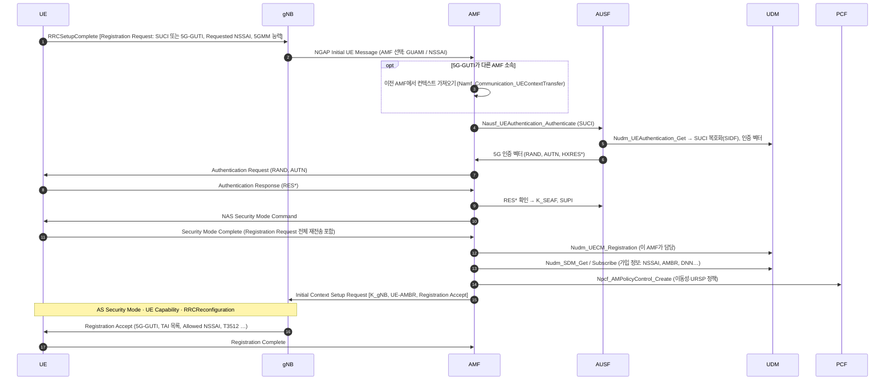

# 등록 (Registration)

!!! spec "스펙 · 릴리즈"
    절차: TS 23.502 §4.2.2.2 (General Registration), §4.2.2.3 (Deregistration) · NAS: TS 24.501 §5.5.1 · 인증: TS 33.501 §6.1 (5G-AKA, EAP-AKA') · NGAP: TS 38.413 · 서비스: TS 29.518 (Namf), 29.503 (Nudm), 29.509 (Nausf)
    Rel-15~ (Rel-16 NSSAA·NPN, Rel-17 NSAC·재난 로밍, Rel-18 위성 접속 연동)

!!! basic "한눈에 보기"
    **Registration**은 단말이 5G 핵심망(5GC)에 "나 여기 있어요, 이 서비스를 쓰고 싶어요"라고 등록하는 절차입니다. LTE의 Attach에 해당하지만 결정적인 차이가 있습니다.

    - LTE Attach: 등록 + **기본 데이터 통로(베어러)와 IP 주소까지** 한 번에
    - 5G Registration: **등록만**. 데이터 통로(PDU 세션)는 나중에 따로 만듭니다.

    등록 과정에서 망은 단말을 **인증**하고, 임시 ID(**5G-GUTI**), 위치 등록 단위(**TA 목록**), 쓸 수 있는 **슬라이스 목록(Allowed NSSAI)**을 줍니다.

## 등록 유형 { .l2 }

| 유형 | 언제 |
|---|---|
| **Initial registration** | 전원 켬, 5GS 처음 진입 |
| **Mobility registration update** | 등록된 TA 목록 밖으로 이동, 능력·NSSAI 변경, EPS에서 5GS로 이동 |
| **Periodic registration update** | T3512 만료 (기본 54분) |
| Emergency registration | 긴급 서비스 (인증 생략 가능) |
| SNPN onboarding (Rel-17) | 사설망 자격 프로비저닝 |

## Initial Registration 흐름 { .l2 }

## Registration Request / Accept 주요 내용 { .l2 }

| Request IE | Accept IE |
|---|---|
| 5GS registration type (+ follow-on request) | 5GS registration result |
| 5GS mobile identity (SUCI / 5G-GUTI) | 새 5G-GUTI |
| ngKSI (NAS 보안 키 인덱스) | TAI list |
| Requested NSSAI | **Allowed NSSAI**, Rejected NSSAI, Configured NSSAI |
| UE security capability | Equivalent PLMNs |
| 5GMM capability, UE radio capability ID | T3512 값, MICO 지시, eDRX |
| PDU session status, Uplink data status | PDU session status, PDU 세션 재활성 결과 |
| Requested DRX / eDRX | Negotiated DRX / eDRX |
| NAS message container (보안 후 전체 메시지) | 5GS network feature support (IMS VoPS, EMC 등) |

**IMS VoPS 지시**(Accept의 5GS network feature support)가 단말이 VoNR을 쓸 수 있는지를 결정합니다.

??? expert "전문가 노트 — 5G-AKA, 보안 맥락, 실패 사례"
    **5G-AKA의 핵심 차이.** LTE EPS-AKA는 MME가 XRES와 RES를 비교했지만, 5G-AKA는 **홈망(AUSF)이 최종 확인**합니다. 방문망 AMF는 HXRES*(해시)로 1차 검사만 하고, RES*를 AUSF에 보내 홈망이 인증 성공을 확인한 뒤에야 K_SEAF와 SUPI를 받습니다. 방문망이 홈망 몰래 인증을 위조하는 것을 막습니다.

    **EAP-AKA'.** 비3GPP 접속 통합과 기업망 연동을 위해 EAP 프레임워크로 같은 AKA를 수행할 수도 있습니다(AUSF가 EAP 서버).

    **NAS 메시지 보호.** 첫 Registration Request는 보안 컨텍스트가 없으면 **평문 IE(cleartext IE)**만 담고, Security Mode Complete 안에 전체 Registration Request를 다시 넣어 보호된 상태로 보냅니다(NAS message container). 민감한 정보 노출을 줄입니다.

    **AMF 재할당.** Requested NSSAI를 초기 AMF가 처리할 수 없으면 NSSF로 대상 AMF 집합을 찾고, 직접 넘기거나 RAN을 통해 재라우팅합니다(Registration with AMF re-allocation).

    **자주 보는 실패.**
    - Registration Reject #62 (No network slices available): Requested NSSAI가 모두 거부됨
    - #27 (N1 mode not allowed): 5GS 가입 없음 → 단말은 EPS로
    - Authentication Failure #21 (Synch failure): SQN 재동기(AUTS)
    - #15 / #13: 해당 TA에서 접근 불가

    **EPS → 5GS 이동 시.** 단말이 4G GUTI에서 매핑한 5G-GUTI로 mobility registration을 하면, AMF는 N26으로 MME에서 컨텍스트를 받아 PDU 세션을 유지합니다(IP 유지).

## 관련 페이지

- [NAS (5GMM·5GSM)](../protocol/nas.md)
- [PDU 세션](pdu-session.md)
- [초기 접속](initial-access.md)
- [네트워크 슬라이싱](../architecture/network-slicing.md)
- [LTE Attach](../../lte/procedures/attach.md)
