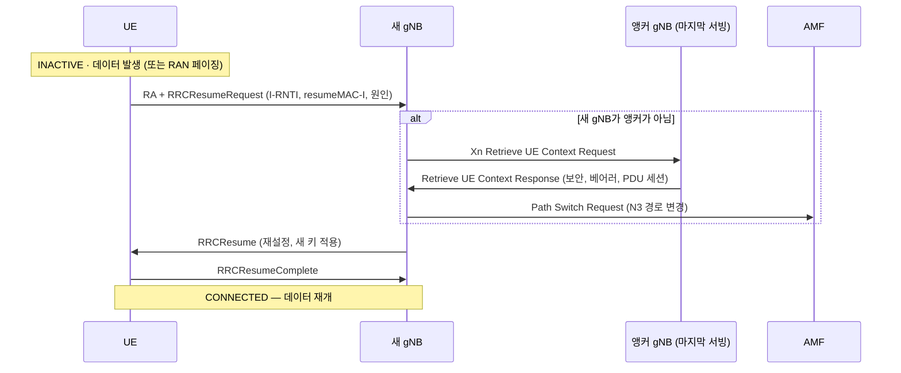

# RRC 상태와 INACTIVE

!!! spec "스펙 · 릴리즈"
    상태 정의: TS 38.300 §7.3 (RRC_INACTIVE), TS 38.331 §4.2.1 · Resume: TS 38.331 §5.3.13 · RNA 갱신·RAN 페이징: TS 38.300 §9.2.2 · Xn 컨텍스트 이전: TS 38.423 (Retrieve UE Context) · SDT: TS 38.331 §5.3.13, TS 38.321 §5.27 (Rel-17)
    Rel-15 INACTIVE → Rel-16 Idle/Inactive 조기 측정 → Rel-17 **SDT** (INACTIVE 상태 소량 데이터) → Rel-18 INACTIVE 멀티캐스트 수신·SDT 확장

!!! basic "한눈에 보기"
    스마트폰 앱은 몇 초~몇 분마다 작은 데이터를 주고받습니다. LTE에서는 그때마다 Idle ↔ Connected를 오가며 **10여 개의 메시지**를 주고받아야 했습니다.

    NR은 중간 상태 **RRC_INACTIVE**를 추가했습니다.

    - 단말과 기지국이 **연결 설정(보안 키, 베어러 설정)을 저장해 둔 채** 잠듭니다.
    - 핵심망 입장에서는 계속 "연결됨"이라 다시 연결할 때 핵심망 절차가 필요 없습니다.
    - 깨어날 때는 **Resume 3개 메시지**로 끝 → 빠르고 배터리 절약

    Rel-17부터는 INACTIVE 상태 그대로 **작은 데이터를 보낼 수도(SDT)** 있습니다.

## 세 가지 상태 비교 { .l2 }

| 항목 | RRC_IDLE | RRC_INACTIVE | RRC_CONNECTED |
|---|---|---|---|
| AS 컨텍스트 | 없음 | **단말·앵커 gNB에 저장** | 있음 |
| 핵심망 연결 (CM) | CM-IDLE | **CM-CONNECTED** (N2·N3 유지) | CM-CONNECTED |
| 이동성 | 셀 재선택 | 셀 재선택 + **RNA 갱신** | 핸드오버 |
| 위치 단위 | TA (AMF가 앎) | **RNA** (앵커 gNB가 앎) | 셀 |
| 페이징 | CN 페이징 (AMF 시작) | **RAN 페이징** (gNB 시작) | — |
| 단말 ID | 5G-S-TMSI | **I-RNTI** | C-RNTI |
| 데이터 | 불가 | 불가 (Rel-17 **SDT** 가능) | 가능 |
| 전력 소모 | 최소 | IDLE 수준 | 큼 |
| 데이터 재개 지연 | 큼 (연결 설정 + 핵심망) | **작음** (Resume) | — |

## Resume 절차 { .l2 }

RRCSetup(IDLE에서 연결)과 비교하면 **보안 모드 명령, 단말 능력 조회, 베어러 설정(RRCReconfiguration), NGAP Initial Context Setup**이 생략됩니다.

## RNA와 RAN 페이징 { .l2 }

| 항목 | 내용 |
|---|---|
| **RNA** (RAN-based Notification Area) | 셀 목록 또는 RAN Area Code 목록. RRCRelease의 `suspendConfig`로 지정 |
| RNA 갱신 (RNAU) | RNA 밖으로 이동하거나 **T380**(주기) 만료 시 RRCResumeRequest(원인 rna-Update) → 보통 RRCRelease로 다시 INACTIVE |
| RAN 페이징 | 하향 데이터가 오면 앵커 gNB가 RNA의 gNB들에 Xn RAN Paging → I-RNTI로 페이징 |
| 실패 시 | RAN 페이징에 응답 없으면 앵커 gNB가 AMF에 알리고 CN 페이징으로 전환 |

??? expert "전문가 노트 — 보안, SDT, 실무 설계"
    **Resume 보안.** `resumeMAC-I`는 이전 \(K_{RRCint}\)로 계산한 짧은 MAC으로, 새 셀이 앵커에 컨텍스트를 요청할 때 단말 진위를 확인합니다. RRCResume은 **새 키**(NCC로 유도한 \(K_{gNB}^*\))로 보호됩니다. RRCRelease의 `nextHopChainingCount`가 다음 키를 결정합니다.

    **RRCResumeRequest vs RRCResumeRequest1.** Short I-RNTI(24비트, 48비트 CCCH 메시지)와 Full I-RNTI(40비트, 64비트 CCCH1 메시지). SIB1의 `useFullResumeID`로 선택합니다.

    **SDT (Small Data Transmission, Rel-17).**
    - **RA-SDT**: 4-step의 Msg3 또는 2-step의 MsgA에 RRCResumeRequest와 **사용자 데이터를 함께** 실음
    - **CG-SDT**: RRCRelease 때 받은 Configured Grant 자원으로 바로 전송(TA가 유효할 때)
    - 이후 서브시퀀트 전송을 이어 갈 수 있고, 끝나면 RRCRelease로 INACTIVE 유지
    - 조건: 데이터량이 `sdt-DataVolumeThreshold` 이하, RSRP ≥ `sdt-RSRP-Threshold`, SDT 허용 DRB만

    **INACTIVE 지속 시간 설계.** 앵커 gNB는 컨텍스트를 메모리에 보관하므로, 단말 수가 많으면 저장 시간(사실상 T380과 RAN 페이징 주기)을 조절합니다. 스마트폰은 INACTIVE와 C-DRX 조합으로 체감 반응성과 배터리를 함께 최적화합니다.

    **LTE와의 관계.** LTE Rel-13 Suspend/Resume, Rel-15 "eLTE INACTIVE"(5GC 연결 ng-eNB)와 같은 개념이며, NR에서 표준 상태로 정식화되었습니다.

## 관련 페이지

- [RRC](../protocol/rrc.md)
- [Paging](paging.md)
- [랜덤 액세스 (4-step·2-step)](random-access.md)
- [UE 전력 절약](../advanced/power-saving.md)
- [LTE RRC 연결 관리](../../lte/procedures/rrc-connection.md)
