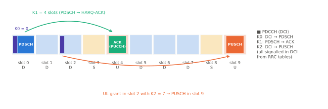

# 스케줄링과 HARQ

!!! spec "스펙 · 릴리즈"
    시간 관계: TS 38.214 §5.1.2.1 (K0), §6.1.2.1 (K2), TS 38.213 §9.2.3 (K1) · 처리 시간: TS 38.214 §5.3 (N1), §6.4 (N2) · HARQ: TS 38.321 §5.3.2, §5.4.2, TS 38.213 §9.1 (HARQ-ACK 코드북) · CG/SPS: TS 38.321 §5.8, TS 38.214 §5.3–6.1.2.3
    Rel-15~ (Rel-16 URLLC: 서브슬롯 PUCCH·다중 CG/SPS·우선순위, Rel-17 HARQ 32 프로세스·HARQ 비활성화(NTN)·SPS ACK 지연)

!!! basic "한눈에 보기"
    LTE FDD에서는 "데이터를 받고 정확히 4 ms 뒤에 ACK"처럼 타이밍이 **고정**이었습니다. NR은 **DCI가 매번 타이밍을 알려 줍니다**.

    | 값 | 의미 |
    |---|---|
    | **K0** | PDCCH가 온 슬롯 → PDSCH 슬롯 |
    | **K1** | PDSCH 슬롯 → HARQ-ACK(PUCCH) 슬롯 |
    | **K2** | UL grant(PDCCH) 슬롯 → PUSCH 슬롯 |

    TDD 패턴이 무엇이든, 단말 처리 속도가 어떻든 기지국이 맞춰 스케줄할 수 있습니다. HARQ도 상·하향 모두 **비동기**라서 재전송 시점이 자유롭습니다.

## 타이밍 예 { .l2 }

<figure markdown>

<figcaption>DDDSU 패턴(30 kHz) 예. 슬롯 0의 PDSCH(K0 = 0)에 대한 ACK는 첫 UL 슬롯인 슬롯 4로(K1 = 4). 슬롯 2의 UL grant는 K2 = 7로 슬롯 9의 PUSCH를 지시합니다.</figcaption>
</figure>

| 값 | 범위 | 지시 방법 |
|---|---|---|
| K0 | 0 – 32 슬롯 | TDRA 표 행 (DCI TDRA 필드) |
| K1 | 0 – 15 (Rel-16: 0 – 31) | DCI `PDSCH-to-HARQ_feedback timing` → `dl-DataToUL-ACK` 목록 |
| K2 | 0 – 32 슬롯 | TDRA 표 행 |

## HARQ { .l2 }

| 항목 | 값 |
|---|---|
| 프로세스 수 | DL·UL 각각 최대 **16** (Rel-17: 최대 32) |
| 방식 | 비동기 · 적응형 (DL·UL 모두) |
| 새 데이터 판단 | DCI의 NDI 토글 |
| 재전송 단위 | TB 또는 **CBG** (최대 8 그룹) |
| UL ACK | 별도 채널 없음 — 재전송 DCI가 곧 NACK, 새 데이터 DCI가 ACK |
| DL ACK 코드북 | Type-1 (반정적) / Type-2 (동적, DAI) / Type-3 (Rel-16) |

## 단말 처리 능력 { .l2 }

| 처리 시간 | 의미 | Capability 1 (μ = 0 / 1 / 2 / 3) | Capability 2 (μ = 0 / 1 / 2) |
|---|---|---|---|
| \(N_1\) | PDSCH 끝 → HARQ-ACK 시작 | 8 / 10 / 17 / 20 심볼 | 3 / 4.5 / 9 심볼 |
| \(N_2\) | UL grant 끝 → PUSCH 시작 | 10 / 12 / 23 / 36 심볼 | 5 / 5.5 / 11 심볼 |

(DMRS 추가 위치 없는 기본 값) Capability 2는 URLLC용 빠른 처리입니다. 예: 30 kHz Capability 2에서 \(N_1\) = 4.5 심볼 ≈ 0.16 ms.

## 스케줄링 유형 { .l2 }

| 유형 | DL | UL | 특징 |
|---|---|---|---|
| 동적 | DCI 1_x | DCI 0_x | 기본 |
| 반지속 / 무승인 | **SPS** (DCI 활성화) | **Configured Grant** Type 1 (RRC만) / Type 2 (DCI 활성화) | 주기 트래픽, 저지연 (URLLC, VoNR) |
| 다중 슬롯 | 슬롯 집성, multi-PDSCH (Rel-17) | 반복 Type A/B, TBoMS | 커버리지·짧은 슬롯 |
| 교차 캐리어 | CIF 3비트 | CIF | CA |

??? expert "전문가 노트 — 지연 예산과 URLLC 기법"
    **사용자 평면 지연 분해 (URLLC 예, 30 kHz, FDD).** 패킷 도착 → (CG 기회 대기) → PUSCH 2–7 심볼 미니슬롯 → gNB 디코딩 → … 무선 구간 단방향 1 ms 이하를 목표로 합니다. 기법: 미니슬롯(Type B), CG(SR·grant 생략), 짧은 \(N_1/N_2\), 서브슬롯 PUCCH, 높은 SCS(60 kHz).

    **선점과 취소.** URLLC DL이 이미 eMBB에 준 자원을 쓰면 **DCI 2_1**(선점 지시), URLLC UL을 보호하려 eMBB UL을 멈추게 할 때 **DCI 2_4**(UL 취소 지시)를 씁니다. 단말 내 고/저우선 충돌은 Rel-16 우선순위 지시(DCI의 priority indicator)로 정합니다.

    **HARQ 프로세스 수와 TDD.** 처리 시간 + TDD 대기 때문에 RTT가 길어지면 16개로 부족할 수 있습니다(FR2-2 짧은 슬롯, NTN). Rel-17이 32개로 늘린 이유입니다.

    **링크 적응.** LTE와 마찬가지로 CQI + OLLA(목표 BLER 10%, URLLC는 10⁻⁵ 수준 → 저효율 MCS 표·CQI 표)를 씁니다. CBG는 큰 TB에서 재전송 효율을, PDCCH 반복·PDSCH 반복은 신뢰성을 높입니다.

    **NTN HARQ (Rel-17).** 위성 RTT(수십~500 ms)에서는 HARQ를 프로세스별로 끄고(`HARQ feedback disabled`), 블라인드 반복이나 RLC ARQ에 맡깁니다. K1, K2, RAR 창 등에 `K_offset`을 더합니다.

## 관련 페이지

- [MAC](../protocol/mac.md)
- [PDCCH와 DCI](../phy/pdcch-dci.md)
- [PUCCH와 UCI](../phy/pucch.md) — HARQ-ACK 코드북
- [URLLC](../advanced/urllc.md)
- [HARQ 기초](../../basics/harq.md)
