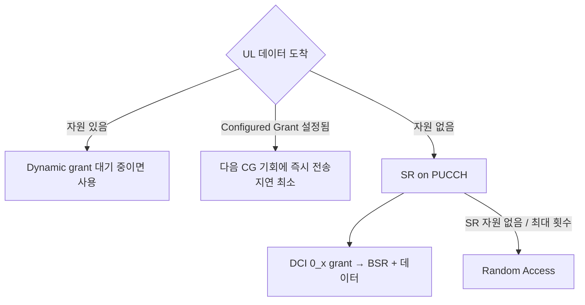

# MAC

!!! spec "스펙 · 릴리즈"
    TS 38.321 (NR MAC) — §5.1 RA, §5.2 TA, §5.3–5.4 DL/UL-SCH·HARQ, §5.4.3 LCP, §5.4.4 SR, §5.4.5 BSR, §5.4.6 PHR, §5.7 DRX, §5.8 configured grant·SPS, §5.15 BWP, §5.17 빔 실패 복구, §6 PDU 형식(LCID 표 Table 6.2.1-1/-2)
    Rel-15~ (Rel-16 2-step RA·LBT 실패·eLCID, Rel-17 NTN·HARQ 비활성화, Rel-18 LTM 셀 전환 MAC CE)

!!! basic "한눈에 보기"
    NR MAC은 LTE MAC이 하던 일(스케줄링, 다중화, HARQ, BSR/SR/PHR, RA, DRX)에 **5G에서 생긴 일**이 더해졌습니다.

    - **BWP 전환**: 단말이 쓰는 대역 부분을 바꾸기
    - **빔 관리 지원**: 빔 실패 감지·복구, TCI(빔) 활성화 MAC CE
    - **Configured Grant**: 기지국 지시 없이 미리 정한 자원으로 바로 상향 전송 (URLLC, IoT)
    - **여러 numerology 처리**: 논리 채널마다 쓸 수 있는 부반송파 간격·PUSCH 길이를 제한

## MAC PDU 구조 { .l2 }

LTE는 서브헤더를 맨 앞에 모았지만, NR은 **각 MAC SDU/CE 바로 앞에** 서브헤더가 붙습니다.

```
DL:  [subhdr|MAC CE] [subhdr|MAC CE] … [subhdr|MAC SDU] [subhdr|MAC SDU] … [padding]
UL:  [subhdr|MAC SDU] [subhdr|MAC SDU] … [subhdr|MAC CE] [subhdr|MAC CE] … [padding]
```

| 서브헤더 | 형식 | 필드 |
|---|---|---|
| 고정 길이 CE / 패딩 | R/LCID (1바이트) | LCID 6비트 |
| 가변 길이 | R/F/LCID/L (2–3바이트) | F=0이면 L 8비트, F=1이면 16비트 |
| Rel-16 eLCID | LCID=33/34 + eLCID 1–2바이트 | 논리 채널·CE 수 확장 |

UL에서 MAC CE를 **뒤에** 두는 이유: BSR·PHR 같은 CE는 마지막 순간에 계산해야 정확하기 때문입니다.

## 주요 LCID (TS 38.321 Table 6.2.1-1, -2) { .l2 }

| DL-SCH LCID | 내용 | | UL-SCH LCID | 내용 |
|---|---|---|---|---|
| 0 | CCCH | | 0 | CCCH (64비트, CCCH1) |
| 1–32 | 논리 채널 | | 1–32 | 논리 채널 |
| 52 | TCI State Indication for UE-specific PDCCH | | 52 | CCCH (48비트) |
| 53 | TCI States Act/Deact for UE-specific PDSCH | | 55 | Configured Grant Confirmation |
| 56 | Duplication Act/Deact | | 57 | Single Entry PHR |
| 57 / 58 | SCell Act/Deact (4 / 1 octet) | | 58 | **C-RNTI** |
| 59 / 60 | Long DRX Command / DRX Command | | 59 / 60 | Short / Long Truncated BSR |
| 61 | **Timing Advance Command** | | 61 / 62 | **Short / Long BSR** |
| 62 | **UE Contention Resolution Identity** | | 63 | 패딩 |
| 63 | 패딩 | | | |

## LTE와 달라진 MAC 기능 { .l2 }

| 기능 | LTE | NR |
|---|---|---|
| LCG 수 | 4 | **8** |
| SR 설정 | 1개 | **여러 개** (논리 채널별로 다른 SR 자원 연결 가능) |
| LCP 제한 | 없음 | `allowedSCS-List`, `maxPUSCH-Duration`, `configuredGrantType1Allowed`, `allowedServingCells` |
| 상향 무승인 전송 | SPS (활성화 필요) | **Configured Grant Type 1** (RRC만으로 활성) / **Type 2** (DCI 활성화) |
| BWP | 없음 | DCI·타이머·RA로 전환 (`bwp-InactivityTimer`) |
| 빔 실패 복구 | 없음 | BFD 카운터·타이머 → BFR (RA 또는 MAC CE) |
| UL HARQ | 동기 + PHICH | **비동기**, DCI로 재전송 |

## 상향 전송 방식 { .l2 }



??? expert "전문가 노트 — BSR, PHR, CG, BFR 세부"
    **BSR.** Short BSR: LCG ID 3비트 + 버퍼 크기 5비트(32단계). Long BSR: LCG 비트맵 8비트 + LCG별 8비트(256단계, 최대 81 MB 이상). Regular BSR이 트리거되었는데 UL 자원이 없으면 SR을 트리거하고, `logicalChannelSR-DelayTimer`로 SR을 늦출 수도 있습니다.

    **PHR.** Single Entry(서빙 셀 하나) / Multiple Entry(CA·DC, 셀별 PH와 \(P_{CMAX,f,c}\)). Type 1(PUSCH), Type 2(PUCCH+PUSCH, EN-DC LTE 측), Type 3(SRS). 실제 전송 기반(actual) 또는 참조 포맷 기반(virtual) PH가 구분됩니다.

    **Configured Grant.**
    - Type 1: RRC `configuredGrantConfig`에 시간·주파수·MCS·주기까지 모두 → 즉시 사용
    - Type 2: RRC로 주기 등만 → DCI(CS-RNTI)로 활성/비활성
    - 주기는 최소 2 심볼까지 가능(URLLC), 반복(K repetitions, RV 패턴) 설정 가능
    - Rel-16: 셀당 최대 12개 CG 설정, CG 재전송 타이머(NR-U)

    **빔 실패 검출.** PHY가 빔 실패 지시(BFD-RS의 가상 PDCCH BLER > Qout)를 올릴 때마다 `BFI_COUNTER` 증가, `beamFailureDetectionTimer` 만료 시 리셋. 카운터가 `beamFailureInstanceMaxCount`에 도달하면 BFR 시작 → PCell은 RA(비경쟁 BFR 프리앰블), SCell은 **BFR MAC CE**(Rel-16) → [빔 실패 복구](../beam/bfr.md)

    **LBT 실패 (Rel-16 NR-U).** UL LBT 실패가 `lbt-FailureInstanceMaxCount`에 도달하면 consistent LBT failure를 선언하고 다른 BWP로 전환하거나 MAC CE로 보고합니다.

    **HARQ 비활성화 (Rel-17 NTN).** HARQ 프로세스별로 피드백을 끄고(`downlinkHARQ-FeedbackDisabled`), 프로세스를 32개까지 늘릴 수 있습니다.

## 관련 페이지

- [스케줄링과 HARQ](../procedures/scheduling-harq.md)
- [랜덤 액세스](../procedures/random-access.md)
- [BWP](../phy/bwp.md)
- [LTE MAC](../../lte/protocol/mac.md)
