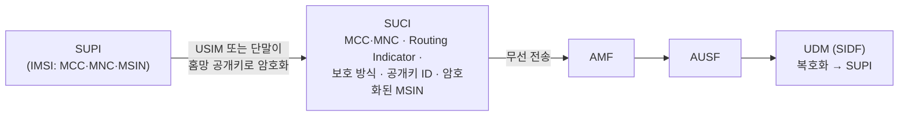

# NAS (5GMM · 5GSM)

!!! spec "스펙 · 릴리즈"
    TS 24.501 (5GS NAS) — §5 5GMM, §6 5GSM, §8–9 메시지, §10 타이머 · 절차: TS 23.502 §4.2–4.3 · SUCI: TS 33.501 §6.12, Annex C · URSP: TS 24.526
    Rel-15~ (Rel-16 NSSAA·NPN, Rel-17 NSAC·재난 로밍·NTN, Rel-18 위성 접속 향상)

!!! basic "한눈에 보기"
    5G NAS는 단말과 5G 핵심망 사이의 대화이고, LTE NAS처럼 두 부분입니다.

    - **5GMM** (Mobility Management, 단말 ↔ **AMF**): 등록(Registration), 인증, 서비스 요청, 등록 해제
    - **5GSM** (Session Management, 단말 ↔ **SMF**): PDU 세션 생성·수정·해제

    LTE와의 가장 큰 차이는 **등록과 세션이 분리**된 점입니다. 5G 단말은 등록만 하고 데이터 세션은 필요할 때 따로 만듭니다. 또 하나의 NAS 연결로 **Wi-Fi 같은 비3GPP 접속**도 관리할 수 있습니다.

## 상태 { .l2 }

| 구분 | 상태 | 의미 |
|---|---|---|
| **RM** (등록 관리) | RM-DEREGISTERED | 등록 안 됨 |
| | RM-REGISTERED | 등록됨 |
| **CM** (연결 관리) | CM-IDLE | N1 시그널링 연결 없음 |
| | CM-CONNECTED | N1 연결 있음 (RRC_CONNECTED 또는 **RRC_INACTIVE**) |

RRC_INACTIVE 단말은 핵심망 입장에서 **CM-CONNECTED**입니다. AMF는 단말이 깨어 있다고 보고, 하향 데이터가 오면 gNB가 RAN 페이징으로 찾습니다.

## 5GMM 절차 { .l2 }

| 절차 | 시작 | 메시지 |
|---|---|---|
| **Registration** | UE | Registration Request → (인증·보안) → Registration Accept → Registration Complete |
| Registration 유형 | | initial / **mobility updating** / **periodic updating** / emergency / SNPN onboarding (Rel-17) |
| **Service Request** | UE | Service Request → Service Accept (또는 보안 모드로 암시적 수락) |
| Deregistration | UE / 망 | Deregistration Request → Accept |
| Authentication | 망 | Authentication Request (5G-AKA: RAND·AUTN / EAP-AKA') → Response |
| Security Mode Control | 망 | Security Mode Command → Complete |
| Identity | 망 | Identity Request → Response (SUCI 등) |
| **Generic UE Configuration Update** | 망 | Configuration Update Command (새 5G-GUTI, TAI 목록, Allowed NSSAI, 망 이름 등) |
| **NAS Transport** | 양방향 | UL/DL NAS Transport — **5GSM 메시지, SMS, LPP, SOR, UE 정책(URSP)** 운반 |

## 5GSM 절차 { .l2 }

| 절차 | 메시지 |
|---|---|
| PDU Session Establishment | Request (PDU 세션 ID, 유형 IPv4/IPv6/IPv4v6/Ethernet/Unstructured, SSC 모드, S-NSSAI, DNN) → Accept |
| PDU Session Modification | Request (UE) / Command (망) → Complete |
| PDU Session Release | Request / Command → Complete |
| PDU Session Authentication (Rel-16) | DN 측 2차 인증 (EAP) |

5GSM 메시지는 항상 5GMM의 **UL/DL NAS Transport** 안에 실려 AMF를 지나 SMF로 갑니다.

## SUCI — 가입자 ID 보호 { .l2 }

| 보호 방식 | 알고리즘 |
|---|---|
| Null scheme | 암호화 없음 (테스트, 긴급) |
| Profile A | ECIES, Curve25519 (X25519) |
| Profile B | ECIES, secp256r1 |

MCC·MNC와 Routing Indicator는 평문이므로 홈망 라우팅이 가능하지만 MSIN은 숨겨집니다. LTE에서 IMSI가 무선에 노출되던 문제를 해결했습니다.

??? expert "전문가 노트 — 타이머, 거절 원인, 절전·정책"
    **주요 UE 타이머 (TS 24.501 §10.2)**

    | 타이머 | 기본값 | 용도 |
    |---|---|---|
    | T3510 | 15 s | Registration Request 응답 대기 |
    | T3511 | 10 s | 등록 실패 후 재시도 |
    | T3502 | 12 min | 5회 실패 후 대기 |
    | **T3512** | 54 min | **주기적 등록 갱신** |
    | T3517 | 5 s (15 s 특정 경우) | Service Request 응답 대기 |
    | T3580 | 16 s | PDU Session Establishment 응답 대기 |
    | T3346 | 망 설정 | 혼잡 백오프 |

    **자주 보는 5GMM 원인 값**

    | 값 | 의미 |
    |---|---|
    | #3 / #6 | Illegal UE / Illegal ME |
    | #7 | 5GS services not allowed |
    | #11 | PLMN not allowed |
    | #12 / #13 / #15 | TA not allowed / Roaming not allowed in TA / No suitable cells in TA |
    | #22 | Congestion |
    | #27 | N1 mode not allowed |
    | #62 | No network slices available |
    | #72 | Non-3GPP access to 5GCN not allowed |

    **MICO 모드 (Mobile Initiated Connection Only).** 등록 시 협상하면 단말은 페이징을 받지 않고(도달 불가) 자기가 보낼 때만 연결합니다. IoT 절전용으로 LTE PSM과 비슷합니다. eDRX, 확장 T3512와 함께 쓰입니다.

    **URSP.** PCF → AMF → 단말(Generic UE Configuration Update/Manage UE Policy)로 전달되는 규칙: **트래픽 설명자**(앱 ID, DNN, IP 3-tuple, FQDN) → **경로 선택 설명자**(S-NSSAI, DNN, SSC 모드, PDU 유형, 접속 유형 우선순위). 단말 OS가 이 규칙으로 앱 트래픽을 슬라이스·세션에 연결합니다.

    **EPS 연동과 N26.** 5GS와 EPS를 오가는 단말은 5G-GUTI ↔ 4G GUTI 매핑(서로 변환 가능한 구조)으로 컨텍스트를 이어 갑니다. N26이 있으면 IP 주소를 유지한 채 이동(interworking with N26)하고, 없으면 단말이 재등록·PDN 재연결을 합니다.

## 관련 페이지

- [등록 (Registration)](../procedures/registration.md)
- [PDU 세션](../procedures/pdu-session.md)
- [네트워크 슬라이싱](../architecture/network-slicing.md)
- [LTE NAS](../../lte/protocol/nas.md)
