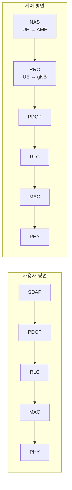

# 프로토콜 스택 개요와 SDAP

!!! spec "스펙 · 릴리즈"
    무선 프로토콜 구조: TS 38.300 §4.4, §6 · 채널 매핑: TS 38.300 §5.3, §6.2 · SDAP: TS 37.324 · L2 데이터 흐름: TS 38.300 §6.6
    Rel-15~ (Rel-16 이더넷 헤더 압축·PDCP 다중 복제, Rel-17 MBS 채널, SRB4)

!!! basic "한눈에 보기"
    NR의 프로토콜 계층은 LTE와 거의 같지만 **맨 위에 SDAP가 하나 추가**되었습니다.

    | 계층 | NR에서의 역할 |
    |---|---|
    | NAS | 단말 ↔ AMF/SMF (등록, PDU 세션) |
    | RRC | 단말 ↔ gNB 무선 연결 제어 (3가지 상태) |
    | **SDAP** | **QoS 플로우를 DRB에 매핑** (5G 신규) |
    | PDCP | 암호화·무결성, 헤더 압축, 순서 정렬, 복제 |
    | RLC | 분할, 재전송 (LTE보다 단순해짐) |
    | MAC | 스케줄링, 다중화, HARQ, 빔·BWP 관련 제어 |
    | PHY | LDPC/Polar, 변조, OFDM, 빔포밍 |

## 사용자 평면 / 제어 평면 { .l2 }

- 사용자 평면: SDAP·PDCP는 gNB-CU(-UP), RLC·MAC·PHY는 gNB-DU에서 종단
- 제어 평면: RRC·PDCP는 gNB-CU(-CP), NAS는 AMF에서 종단

## 채널 매핑 { .l2 }

| 논리 채널 | 전송 채널 | 물리 채널 | 내용 |
|---|---|---|---|
| BCCH | BCH | PBCH | MIB |
| BCCH | DL-SCH | PDSCH | SIB1, 기타 SI |
| PCCH | PCH | PDSCH | 페이징 |
| CCCH / DCCH / DTCH | DL-SCH | PDSCH | RRC, 사용자 데이터 |
| CCCH / DCCH / DTCH | UL-SCH | PUSCH | RRC, 사용자 데이터 |
| — | RACH | PRACH | 프리앰블 |
| MCCH / MTCH (Rel-17) | DL-SCH | PDSCH | MBS 방송·멀티캐스트 |
| — | — | PDCCH / PUCCH | DCI / UCI |

LTE의 PCFICH, PHICH, PMCH는 NR에 **없습니다**.

## 시그널링 무선 베어러 { .l2 }

| SRB | 논리 채널 | 용도 |
|---|---|---|
| SRB0 | CCCH | RRCSetupRequest, RRCSetup, RRCResumeRequest, RRCReestablishmentRequest |
| SRB1 | DCCH | 대부분의 RRC 메시지, 초기 NAS |
| SRB2 | DCCH | NAS 메시지 (보안 활성화 후) |
| SRB3 | DCCH | EN-DC / NR-DC에서 **SN과 단말 간 직접** RRC |
| SRB4 (Rel-17) | DCCH | 응용 계층 측정(QoE) 보고 |

## SDAP { .l2 }

| 기능 | 내용 |
|---|---|
| QoS 플로우 → DRB 매핑 | gNB가 정한 규칙(RRC `sdap-Config` 또는 reflective) |
| QFI 표시 | DL/UL 패킷 헤더에 QFI |
| Reflective 매핑 | DL 헤더의 RDI=1이면 단말이 같은 QFI의 UL을 그 DRB로 보냄 |
| 엔터티 단위 | **PDU 세션당 SDAP 엔터티 1개** |

??? expert "전문가 노트 — LTE L2와 달라진 설계 원칙"
    **사전 처리(pre-processing) 가능한 L2.** NR은 RLC 연결(concatenation)을 없애고 MAC 서브헤더를 각 MAC SDU 바로 앞에 두었습니다. 그래서 UL grant를 받기 전에 PDCP·RLC PDU와 MAC 서브헤더까지 미리 만들어 두고, grant 크기에 맞게 붙이기만 하면 됩니다. 처리 시간이 짧은 NR 타임라인(단말 처리 능력 N1/N2)의 기반입니다.

    **순서 정렬 위치 이동.** LTE에서는 RLC가 순서 정렬을 했지만, NR에서는 RLC가 순서 없이 PDCP에 넘기고 **PDCP가 정렬**합니다(DC split 베어러 경로가 섞이는 것을 한 곳에서 처리).

    **DRB 무결성 보호.** LTE DRB는 암호화만 했지만 NR은 DRB에도 무결성 보호를 걸 수 있습니다(`integrityProtection`). 단말은 무결성 보호 가능한 최대 데이터율을 capability로 보고합니다(예: 64 kbps 또는 full rate).

    **PDCP 복제.** 같은 PDCP PDU를 두 개(Rel-16: 최대 4개) RLC 엔터티로 복제해 서로 다른 캐리어/셀 그룹으로 보내 신뢰성을 높입니다(URLLC). MAC CE로 동적으로 켜고 끕니다.

    **헤더 압축 확장.** ROHC에 더해 Rel-16에서 **EHC**(이더넷 헤더 압축)가 추가되어 이더넷 PDU 세션(TSN, 산업망)을 지원합니다.

## 관련 페이지

- [MAC](mac.md) · [RLC](rlc.md) · [PDCP](pdcp.md) · [RRC](rrc.md) · [NAS](nas.md)
- [QoS 플로우](../architecture/qos-flow.md)
- [LTE 프로토콜 스택](../../lte/protocol/overview.md)
