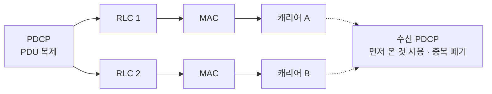
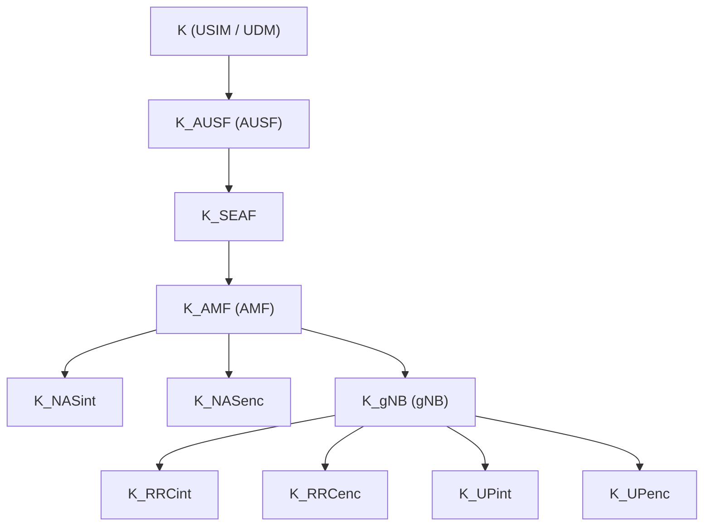

# PDCP

!!! spec "스펙 · 릴리즈"
    TS 38.323 (NR PDCP) — §5.2 재수립·복구, §5.7 헤더 압축, §5.8–5.9 암호화·무결성, §5.11 복제, §6 PDU 형식 · 보안: TS 33.501 §6 (키 계층)
    Rel-15~ (Rel-16 EHC·최대 4중 복제·DAPS, Rel-17 UDC·MBS PDCP)

!!! basic "한눈에 보기"
    NR PDCP는 LTE PDCP의 기능(암호화, 헤더 압축, 핸드오버 처리)에 세 가지가 더해졌습니다.

    1. **순서 정렬**: RLC가 순서 없이 넘긴 패킷을 PDCP가 정렬합니다.
    2. **DRB 무결성 보호**: 사용자 데이터도 위조 방지 가능
    3. **패킷 복제(duplication)**: 같은 패킷을 서로 다른 캐리어로 동시에 보내, 하나가 실패해도 도착하게 합니다(URLLC).

## 기능 { .l2 }

| 기능 | SRB | DRB |
|---|---|---|
| 암호화 (NEA1/2/3) | ✔ | ✔ |
| 무결성 (NIA1/2/3) | ✔ (필수) | ✔ (선택, `integrityProtection`) |
| 헤더 압축 | — | ROHC, **EHC** (Rel-16), UDC (Rel-17) |
| 순서 정렬·중복 제거 | ✔ | ✔ (`t-Reordering`) |
| 타이머 기반 폐기 | — | ✔ (`discardTimer`) |
| 복제 | ✔ (SRB1/2, CA·DC) | ✔ |
| Split 베어러 라우팅 | — | ✔ (`primaryPath`, `ul-DataSplitThreshold`) |
| 상태 보고 | — | ✔ (AM) |

## PDU 형식 { .l2 }

| PDU | SN | 헤더 | 꼬리 |
|---|---|---|---|
| SRB 데이터 | 12비트 | 2바이트 | MAC-I 4바이트 |
| DRB 데이터 | 12비트 | 2바이트 | MAC-I 4바이트 (무결성 사용 시) |
| DRB 데이터 | 18비트 | 3바이트 | 〃 |
| 제어 PDU | — | — | 상태 보고, ROHC/EHC 피드백 |

**COUNT (32비트) = HFN + SN**. 암호화·무결성 입력으로 쓰이며, 같은 키로 COUNT가 재사용되면 안 됩니다.

## 패킷 복제 { .l2 }

| 유형 | 경로 | 비고 |
|---|---|---|
| CA 복제 | 같은 MAC, 서로 다른 캐리어 | LCP 제한으로 RLC별 캐리어 고정 |
| DC 복제 | MCG + SCG | 서로 다른 기지국 |
| Rel-16 | 최대 **4개 RLC** (CA + DC 조합) | MAC CE로 동적 선택 |

## 보안 키 계층 (5G) { .l2 }

| 번호 | 암호화 | 무결성 | 기반 |
|---|---|---|---|
| 0 | NEA0 (없음) | NIA0 (긴급 호만) | |
| 1 | 128-NEA1 | 128-NIA1 | SNOW 3G |
| 2 | 128-NEA2 | 128-NIA2 | AES |
| 3 | 128-NEA3 | 128-NIA3 | ZUC |

??? expert "전문가 노트 — 정렬, 핸드오버, 압축"
    **수신 정렬 변수.** RX_NEXT(다음 기대 COUNT), RX_DELIV(아직 전달 안 된 첫 COUNT), RX_REORD(타이머 시작 기준). 공백이 생기면 `t-Reordering`을 시작하고, 만료 시 공백을 건너뛰어 상위로 전달합니다. `outOfOrderDelivery`가 설정되면 정렬 없이 바로 전달합니다(응용이 직접 정렬하는 경우).

    **PDCP 재수립과 데이터 복구.** 핸드오버(키 변경)에는 재수립, 키 변경 없는 경로 변경(예: intra-CU, SCG 해제)에는 **data recovery**(상태 보고 + 미확인 PDU 재전송)를 씁니다. Rel-16 **DAPS** 핸드오버에서는 소스·타깃 키를 함께 쓰는 이중 PDCP 처리(소스/타깃 별도 암호화, 공통 정렬)를 합니다.

    **UL split 라우팅.** `ul-DataSplitThreshold` 이하 데이터는 `primaryPath`로만, 이상이면 두 경로 모두로 보냅니다. EN-DC에서 NR 상향이 약할 때 LTE 경로를 주 경로로 쓰는 튜닝이 흔합니다.

    **EHC (Rel-16).** 이더넷 헤더(MAC 주소, VLAN, EtherType)를 컨텍스트 ID로 압축합니다. 산업용 TSN 브리지 시나리오에서 2–5바이트 수준으로 줄입니다.

    **무결성 실패.** SRB에서 MAC-I 검증 실패 시 단말은 RRC 재수립을 시작합니다. DRB 무결성 실패 시 해당 PDU를 버리고 RRC에 알립니다(망 정책에 따라 처리).

## 관련 페이지

- [RLC](rlc.md)
- [URLLC](../advanced/urllc.md) — 복제
- [핸드오버 (CHO·DAPS·LTM)](../procedures/handover.md)
- [LTE PDCP](../../lte/protocol/pdcp.md)
