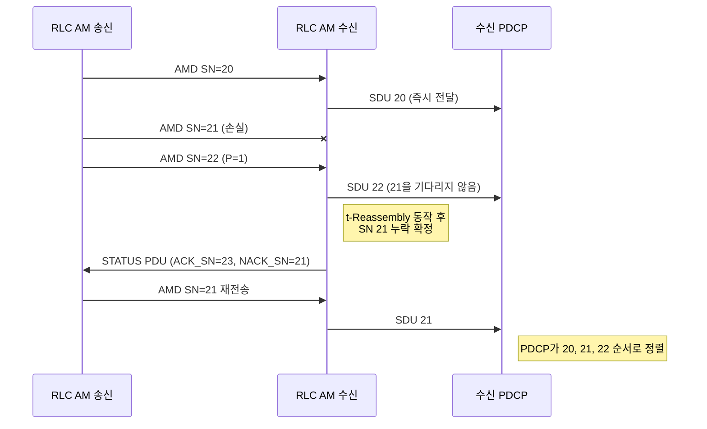

# RLC

!!! spec "스펙 · 릴리즈"
    TS 38.322 (NR RLC) — §4.2 모드, §5.2 데이터 전송, §5.3 ARQ, §6 PDU 형식, §7 타이머
    Rel-15~ (Rel-16 IAB·NR-U 운용, Rel-17 NTN 타이머 확장)

!!! basic "한눈에 보기"
    NR RLC는 LTE RLC에서 **두 가지 기능을 덜어냈습니다**.

    1. **연결(concatenation) 없음**: 여러 패킷을 하나의 RLC PDU로 묶지 않습니다. 묶는 일은 MAC이 합니다.
    2. **순서 정렬 없음**: 받은 순서대로 위(PDCP)로 넘기고, 정렬은 PDCP가 합니다.

    덕분에 RLC PDU를 **미리 만들어 둘 수 있어서** 처리 지연이 줄었습니다. 모드(TM, UM, AM)와 재전송(ARQ) 기능은 LTE와 같습니다.

## 기능 비교 { .l2 }

| 기능 | LTE RLC | NR RLC |
|---|---|---|
| 분할 | ✔ (FI 필드) | ✔ (**SI** 필드 + **SO** 오프셋) |
| 연결 | ✔ | **✕** (MAC 다중화로 대체) |
| 순서 정렬 / 순차 전달 | ✔ | **✕** (PDCP가 담당) |
| 재조립 | ✔ | ✔ |
| ARQ (AM) | ✔ | ✔ |
| 재정렬 타이머 | t-Reordering | **t-Reassembly** (분할 조각 대기만) |
| SN 길이 | UM 5/10, AM 10/16 | **UM 6/12, AM 12/18** |
| 완전한 SDU의 UM 헤더 | SN 포함 | **SN 없음** (1바이트 헤더) |

## PDU 헤더 { .l2 }

| PDU | 헤더 | 크기 |
|---|---|---|
| UMD (완전한 SDU) | SI(2) + R(6) | **1바이트** |
| UMD (분할, 6비트 SN) | SI + SN | 1바이트 (+ SO 2바이트, 첫 조각 제외) |
| UMD (분할, 12비트 SN) | SI + R + SN | 2바이트 (+ SO) |
| AMD (12비트 SN) | D/C + P + SI + SN | 2바이트 (+ SO) |
| AMD (18비트 SN) | D/C + P + SI + R + SN | 3바이트 (+ SO) |

**SI (Segmentation Info)**: 00 완전한 SDU, 01 첫 조각, 10 마지막 조각, 11 중간 조각.

## AM 동작 { .l2 }

??? expert "전문가 노트 — 타이머와 성능 설계"
    **주요 파라미터 (`RLC-Config`)**

    | 이름 | 범위 | 비고 |
    |---|---|---|
    | `t-PollRetransmit` | 5 – 4000 ms | NTN에서 범위 확장 (Rel-17) |
    | `pollPDU` / `pollByte` | 4 – 65536 PDU / 1 kB – 40 MB, infinity | 고속에서는 크게 |
    | `maxRetxThreshold` | 1 – 32 | 도달 시 RLF (SCG면 SCG 실패) |
    | `t-Reassembly` | 0 – 200 ms | HARQ 재전송 시간 고려 |
    | `t-StatusProhibit` | 0 – 2400 ms | |

    **18비트 SN이 필요한 경우.** AM 윈도 = \(2^{SN-1}\). 12비트면 2048 PDU입니다. 예: 4 Gbps, 1500바이트 PDU, RTT 20 ms → 약 6,700 PDU가 in-flight → 12비트로는 송신이 멈춥니다. 고속 FR2·CA에서는 18비트(윈도 131,072)를 씁니다.

    **STATUS PDU 확장.** NACK_SN에 SO 범위(분할 조각 단위 NACK)와 NACK range(연속 누락 개수)를 담아 큰 손실 구간을 짧게 보고합니다.

    **RLC와 IAB.** IAB에서는 홉마다 RLC가 있습니다(hop-by-hop ARQ). 종단 간 손실 복구는 PDCP와 BAP 계층의 재라우팅이 보완합니다.

    **RLC UM과 URLLC.** URLLC 서비스는 RLC 재전송 지연을 허용하지 않아 UM + PDCP 복제 + HARQ 반복 조합을 많이 씁니다.

## 관련 페이지

- [PDCP](pdcp.md)
- [MAC](mac.md)
- [LTE RLC](../../lte/protocol/rlc.md)
