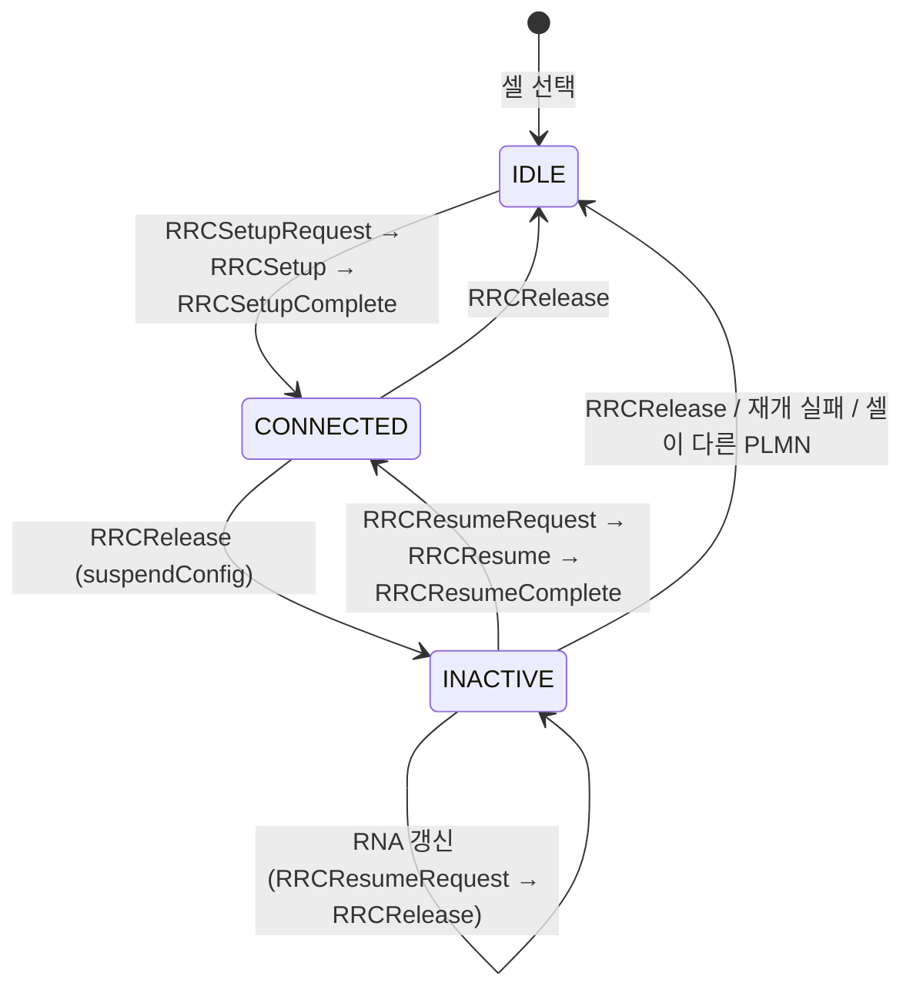

# RRC

!!! spec "스펙 · 릴리즈"
    TS 38.331 (NR RRC) — §4.2 상태, §5.2 시스템 정보, §5.3 연결 제어, §5.5 측정, §6 ASN.1, §7 타이머 · Idle/Inactive 절차: TS 38.304 · 접근 제어(UAC): TS 38.331 §5.3.14, TS 22.261
    Rel-15~ (Rel-16 조건부 핸드오버·Idle 조기 측정, Rel-17 SDT·NTN, Rel-18 LTM·NCR)

!!! basic "한눈에 보기"
    NR RRC는 LTE RRC와 같은 역할(연결 관리, 설정, 측정, 이동성, 시스템 정보)을 하면서 두 가지가 크게 바뀌었습니다.

    1. **상태가 3개**: IDLE, CONNECTED에 더해 **INACTIVE**가 생겼습니다. 연결 정보를 저장해 둔 채 잠들었다가 빠르게 깨어납니다.
    2. **시스템 정보를 필요할 때만**: 꼭 필요한 정보(MIB, SIB1)만 항상 방송하고, 나머지 SIB는 **요청이 있을 때(on-demand)** 보낼 수 있습니다. 에너지와 자원을 아낍니다.

## RRC 상태 { .l2 }

자세한 비교는 [RRC 상태와 INACTIVE](../procedures/rrc-states.md)를 참고하세요.

## 주요 메시지 { .l2 }

| 메시지 | 방향 | SRB | 용도 |
|---|---|---|---|
| MIB | ↓ | BCCH/BCH | SFN, SCS, CORESET#0·SearchSpace#0, 셀 금지 |
| SIB1 | ↓ | BCCH/DL-SCH | 셀 접근, PLMN, TAC, 공통 설정(BWP, RACH), SI 스케줄 |
| SystemInformation | ↓ | BCCH/DL-SCH | SIB2 이후 |
| Paging | ↓ | PCCH | CN 페이징 (5G-S-TMSI) / RAN 페이징 (I-RNTI) |
| **RRCSetupRequest** | ↑ | SRB0 | 연결 요청 (ng-5G-S-TMSI-Part1 또는 랜덤 39비트, 설정 원인) |
| **RRCSetup** | ↓ | SRB0 | SRB1 설정 (masterCellGroup) |
| **RRCSetupComplete** | ↑ | SRB1 | 선택 PLMN, 등록 AMF, S-NSSAI 목록, **NAS** |
| **RRCResumeRequest / RRCResumeRequest1** | ↑ | SRB0 | INACTIVE 재개 (short / full I-RNTI, resumeMAC-I) |
| RRCResume / RRCResumeComplete | ↓ / ↑ | SRB1 | 재개 |
| SecurityModeCommand / Complete | ↓ / ↑ | SRB1 | AS 보안 |
| UECapabilityEnquiry / Information | ↓ / ↑ | SRB1 | 단말 능력 (밴드 조합, 특징) |
| **RRCReconfiguration** / Complete | ↓ / ↑ | SRB1/3 | 셀 그룹 설정, 베어러, 측정, 핸드오버(reconfigurationWithSync) |
| MeasurementReport | ↑ | SRB1/3 | 측정 결과 |
| RRCReestablishmentRequest / RRCReestablishment | ↑ / ↓ | SRB0 / SRB1 | RLF 후 복구 |
| **RRCRelease** | ↓ | SRB1 | 해제 (suspendConfig 있으면 INACTIVE) |
| UEAssistanceInformation | ↑ | SRB1 | 과열, 전력 선호, 선호 DRX·BWP·레이어 |
| SCGFailureInformation | ↑ | SRB1 | SCG 실패 |
| ULInformationTransfer / DLInformationTransfer | ↑ / ↓ | SRB2 | NAS 운반 |

## 시스템 정보 { .l2 }

| 구분 | 내용 | 전송 |
|---|---|---|
| **Minimum SI** | MIB + SIB1 | 항상 주기적 방송 |
| **Other SI** | SIB2 이후 | 주기적 방송 **또는 요청 시** (`si-BroadcastStatus` = notBroadcasting) |

| SIB | 내용 |
|---|---|
| SIB2 | 셀 재선택 공통 (서빙, 동일 주파수) |
| SIB3 / SIB4 | 동일 / 다른 주파수 이웃 재선택 |
| SIB5 | E-UTRA 재선택 |
| SIB6 / 7 / 8 | ETWS 1차·2차 / CMAS |
| SIB9 | 시각 정보 (UTC, GPS, 지역 시간) |
| SIB10 (Rel-16) | NPN (사설망) 이름 |
| SIB11 (Rel-16) | Idle/Inactive 조기 측정 설정 |
| SIB12–14 | NR / LTE 사이드링크 |
| SIB15 (Rel-17) | 재난 로밍 |
| SIB16 (Rel-17) | 슬라이스 기반 재선택 |
| SIB17 (Rel-17) | Idle/Inactive 단말용 TRS |
| SIB19 (Rel-17) | **NTN** (위성 궤도·타이밍 정보) |
| SIB20 / 21 (Rel-17) | MBS 방송 (MCCH, 주파수) |

On-demand 요청은 **Msg1 기반**(SIB별 전용 프리앰블) 또는 **Msg3 기반**(`RRCSystemInfoRequest`)이고, 연결 상태 단말은 `DedicatedSIBRequest`(Rel-16)나 전용 RRC로 받습니다.

??? expert "전문가 노트 — CellGroupConfig, 타이머, UAC"
    **RRCReconfiguration 구조.** `radioBearerConfig`(SRB/DRB·PDCP·SDAP) + `masterCellGroup` / `secondaryCellGroup`(**CellGroupConfig**: RLC 베어러, MAC 설정, PCell/SpCell 설정, SCell 목록) + `measConfig` + `dedicatedNAS-MessageList`. 핸드오버는 SpCellConfig의 **reconfigurationWithSync**(타깃 PCI, T304, 새 C-RNTI, RACH 전용 자원)로 표현합니다. LTE의 mobilityControlInfo에 해당합니다.

    **주요 타이머.**

    | 타이머 | 의미 |
    |---|---|
    | T300 | RRCSetupRequest 응답 대기 |
    | T301 | Reestablishment 응답 대기 |
    | T304 | 동기 재구성(HO, SCG 변경) 완료 제한 |
    | T310 / N310 / N311 | RLF 판정 |
    | T311 | RLF 후 셀 선택 |
    | T316 (Rel-16) | Fast MCG recovery |
    | T319 | RRCResumeRequest 응답 대기 |
    | T380 | **주기적 RNA 갱신** |
    | T390 | UAC 접근 금지 대기 |

    **UAC (Unified Access Control).** LTE의 ACB/SSAC/ACDC를 하나로 합친 구조입니다. 단말은 **Access Identity**(0: 일반, 1: MPS, 2: MCS, 11–15: 특수 등급)와 **Access Category**(0: MT 응답, 1: 지연 허용, 2: 긴급, 3: MO 시그널링, 4: MMTel 음성, 5: MMTel 영상, 6: SMS, 7: MO 데이터, 8: RNA 갱신, 9: MO IMS 등록, 32–63 사업자 정의)를 정해, SIB1의 `uac-BarringInfo`(카테고리별 확률·시간)로 접근을 판정합니다.

    **Release 후 리디렉션과 우선순위.** RRCRelease의 `redirectedCarrierInfo`, `cellReselectionPriorities`(T320), INACTIVE의 `suspendConfig`(fullI-RNTI, shortI-RNTI, ran-PagingCycle, ran-NotificationAreaInfo, t380, nextHopChainingCount).

    **ASN.1 버전 표기.** NR도 `-r16`, `-v1610` 같은 확장 접미사를 쓰지만, LTE보다 확장 마커(`...`)와 `[[ ]]` 확장 그룹을 많이 써서 메시지 내부에 직접 확장 필드가 붙는 경우가 많습니다.

## 관련 페이지

- [RRC 상태와 INACTIVE](../procedures/rrc-states.md)
- [초기 접속](../procedures/initial-access.md)
- [측정 이벤트와 갭](../measurement/events-gaps.md)
- [LTE RRC](../../lte/protocol/rrc.md)
