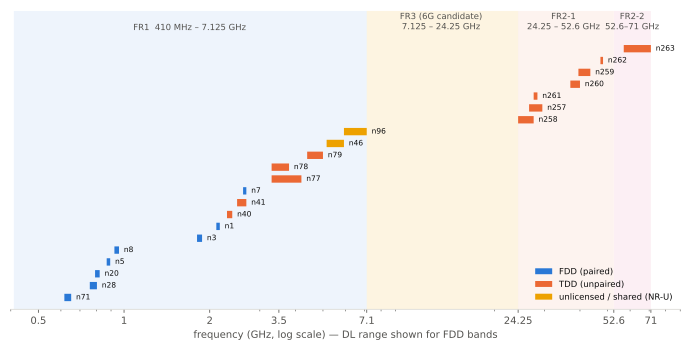

# FR1 · FR2와 밴드

!!! spec "스펙 · 릴리즈"
    주파수 범위 정의: TS 38.101-1 §5.1 (FR1), TS 38.101-2 §5.1 (FR2-1, FR2-2) · 밴드 표: TS 38.101-1 Table 5.2-1, 38.101-2 Table 5.2-1 · 밴드별 SCS·대역폭: Table 5.3.5-1 · CA/DC 조합: TS 38.101-1 §5.2A, TS 38.101-3
    Rel-15 초기 FR1 450 MHz–6 GHz, FR2 24.25–52.6 GHz → 이후 개정에서 FR1 410 MHz–7.125 GHz로 확장 → Rel-17 **FR2-2** (52.6–71 GHz) → Rel-18 신규 밴드(n104 등) → 6G 후보 FR3(7–24 GHz) 연구

!!! basic "한눈에 보기"
    NR은 주파수 범위를 두 덩어리로 나눕니다.

    | 범위 | 주파수 | 특징 |
    |---|---|---|
    | **FR1** ("Sub-6") | 410 MHz – 7.125 GHz | 넓은 커버리지, 건물 투과. 대부분의 5G 서비스 |
    | **FR2** ("mmWave") | 24.25 – 71 GHz | 매우 넓은 대역(수백 MHz), 빔포밍 필수, 짧은 거리 |

    밴드 이름은 **n + 숫자**입니다. LTE에서 쓰던 밴드를 NR로 바꿔 쓰면 같은 번호(예: LTE B3 → NR n3)를 쓰고, NR에서 새로 만든 밴드는 n77, n78, n257처럼 새 번호를 씁니다.

## 주요 밴드 지도 { .l2 }

<figure markdown>

<figcaption>주요 NR 밴드(로그 스케일). FR1 저대역 FDD는 커버리지, 3.5 GHz 대역(n77/n78) TDD는 용량, FR2 mmWave는 초고속 핫스팟 역할을 합니다. 노란 영역 FR3는 6G 후보 대역입니다.</figcaption>
</figure>

## 대표 밴드 표 { .l2 }

| 밴드 | 듀플렉스 | 하향 (MHz) | 대표 SCS (kHz) | 최대 대역폭 | 비고 |
|---|---|---|---|---|---|
| n28 | FDD | 758 – 803 | 15 / 30 | 30 MHz | 700 MHz, 커버리지 |
| n71 | FDD | 617 – 652 | 15 | 20 MHz | 600 MHz (북미) |
| n5 / n8 | FDD | 869–894 / 925–960 | 15 | 20 MHz 이상 | 850 / 900 MHz |
| n1 / n3 | FDD | 2110–2170 / 1805–1880 | 15 / 30 | 50 / 50 MHz | LTE 재배치, DSS |
| n7 | FDD | 2620 – 2690 | 15 / 30 | 50 MHz | 2.6 GHz |
| n40 | TDD | 2300 – 2400 | 15 / 30 | 100 MHz | |
| n41 | TDD | 2496 – 2690 | 15 / 30 | 100 MHz | 2.5 GHz (미국·중국) |
| **n77** | TDD | 3300 – 4200 | 30 | 100 MHz | C-band |
| **n78** | TDD | 3300 – 3800 | 30 | 100 MHz | **가장 널리 쓰이는 5G 대역** |
| n79 | TDD | 4400 – 5000 | 30 | 100 MHz | 일본·중국 |
| n46 | TDD (비면허) | 5150 – 5925 | 30 | 80 MHz | NR-U 5 GHz |
| n96 / n102 | TDD (비면허) | 5925 – 7125 / 5925 – 6425 | 30 | 80 MHz | NR-U 6 GHz |
| n104 (Rel-18) | TDD | 6425 – 7125 | 30 | 100 MHz | 상위 6 GHz 면허 |
| **n257** | TDD | 26500 – 29500 | 120 | 400 MHz | 28 GHz |
| n258 | TDD | 24250 – 27500 | 120 | 400 MHz | 26 GHz (유럽·아시아) |
| n260 / n261 | TDD | 37000–40000 / 27500–28350 | 120 | 400 MHz | 39 GHz / 미국 28 GHz |
| n262 | TDD | 47200 – 48200 | 120 | 400 MHz | 47 GHz |
| **n263** (Rel-17) | TDD | 57000 – 71000 | 120 / 480 / 960 | 400 MHz – 2 GHz | **FR2-2**, 60 GHz |

SUL(상향 전용) n80–n86, n89 등, SDL(하향 전용) n75·n76 등도 있습니다. 밴드별 최대 채널 대역폭은 개정마다 늘어나므로 최신 TS 38.101-1/-2 Table 5.3.5-1로 확인하세요.

## 대역별 역할 { .l2 }

| 층 | 대역 | 셀 반경 (대략) | 역할 |
|---|---|---|---|
| 커버리지 층 | 600–900 MHz | 수 km – 수십 km | 넓은 지역, 실내 투과, IoT |
| 중대역 | 1.8–2.6 GHz | 1–3 km | 커버리지 + 용량 |
| **용량 층** | **3.3–5 GHz (C-band)** | 수백 m – 1 km 이상 | 5G 주력 (100 MHz 캐리어, Massive MIMO) |
| 초고속 층 | 24–71 GHz | 100–300 m | 핫스팟, FWA, 경기장 |

??? expert "전문가 노트 — 표기법, RF 이슈, 미래 대역"
    **CA/DC 조합 표기.** `CA_n78C`: n78 연속 2 CC / `CA_n3A-n78A`: n3 + n78 / `DC_3A_n78A`: LTE B3 + NR n78 EN-DC / `CA_n77(2A)`: 같은 밴드 비연속 2 CC. 대역폭 클래스 A(1 CC), B·C(연속 2 CC), D(3), E(4) 등은 FR1·FR2마다 집성 대역폭 기준이 다릅니다.

    **밴드 정의 진화.** FR1은 처음에 450–6000 MHz였다가, 6 GHz 비면허·면허 대역과 저대역을 위해 **410–7125 MHz**로 확장되었습니다(TS 38.101-1). FR2는 Rel-17에서 52.6–71 GHz를 **FR2-2**로 추가하며 기존 범위를 FR2-1로 불렀습니다.

    **n77/n78 실무 이슈.** 위성 지구국(C-band) 간섭, 국가별 블록 경계 정렬, 인접 사업자 동기화(같은 TDD 패턴), 항공 전파고도계(미국 3.7–3.98 GHz와 4.2–4.4 GHz 보호) 등.

    **SUL.** 3.5 GHz TDD 셀의 상향 커버리지가 부족할 때, 같은 셀에 저대역 상향 전용 캐리어(n80–n84)를 붙여 RACH·PUSCH를 그쪽으로 보냅니다. 단말은 SIB1의 `supplementaryUplink`와 RSRP 임계값(`rsrp-ThresholdSSB-SUL`)으로 UL 캐리어를 고릅니다.

    **FR3 (7.125–24.25 GHz).** 6G의 핵심 후보 대역으로, 넓은 대역(수백 MHz)과 FR2보다 나은 커버리지의 절충입니다. Rel-19에서 7–24 GHz 채널 모델·공존 연구(TR 38.820 계열 갱신)가 진행되었고, Rel-20 6G 연구의 주요 대역입니다. → [6G 후보 기술](../../sixg/key-technologies.md)

## 관련 페이지

- [NR-ARFCN과 GSCN](arfcn-gscn.md)
- [Numerology와 프레임 구조](../phy/numerology.md)
- [CA와 DC](../advanced/ca-dc.md)
- [NR-U](../advanced/nr-u.md)
