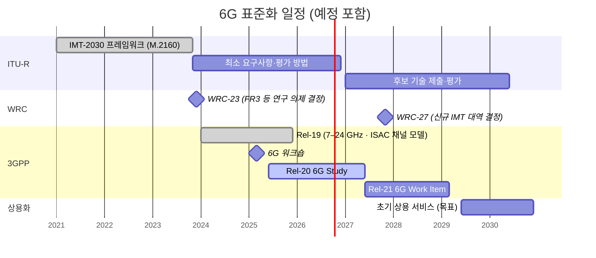

# 3GPP 6G 일정

!!! spec "참고 문서"
    3GPP 6G 워크숍 (2025-03) · RAN#108 (2025-06) 6G Study Item 승인 · SA1 TR 22.870 (Rel-20) · ITU-R IMT-2030 일정 · WRC-27 의제 1.7 (IMT 신규 대역)

!!! basic "한눈에 보기"
    6G 표준은 대략 다음 순서로 만들어집니다.

    1. **2025년**: 3GPP 6G 연구 시작 (Rel-20)
    2. **2027년 무렵**: 연구를 마치고 실제 규격 작업 시작 (Rel-21)
    3. **2028년 말 ~ 2029년**: 첫 6G 규격 완성
    4. **2030년 전후**: 상용 서비스 시작

    5G가 2016년 연구 → 2018년 첫 규격 → 2019년 상용화였던 것과 비슷한 리듬입니다.

## 전체 일정 { .l2 }

| 시점 | 이벤트 | 의미 |
|---|---|---|
| 2023-11 | ITU-R M.2160 승인 | 6G 비전·사용 시나리오 확정 |
| 2023-12 | WRC-23 | WRC-27에서 검토할 IMT 후보 대역 의제 결정 |
| 2025-03 | 3GPP 6G 워크숍 | 각 회사·지역의 6G 비전 발표 |
| 2025-06 | Rel-20 6G Study 승인 | 무선·구조 연구 시작 |
| 2027 (예정) | Rel-21 6G Work Item 시작 | 실제 규격 작성 |
| 2027-11 (예정) | WRC-27 | **4.4–4.8 GHz, 7.125–8.4 GHz, 14.8–15.35 GHz** 등 IMT 대역 검토 (의제 1.7) |
| 2028 말 – 2029 (예정) | Rel-21 동결 (ASN.1) | 첫 6G 규격 |
| 2030 전후 (목표) | 상용화, IMT-2030 승인 | |

??? expert "전문가 노트 — 일정 리스크와 5G와의 차이"
    **5G의 교훈.** 5G는 NSA early drop(2017-12)으로 일정을 앞당겼지만, 그 결과 NSA/SA 이원화와 Rel-15 late drop 같은 복잡성이 생겼습니다. 6G 논의에서는 **SA만으로 시작**하고 5G 핵심망과의 연동을 처음부터 설계하는 방향이 강조됩니다.

    **5G–6G 공존.** 6G 초기에는 5G와 **같은 대역을 공유**할 수 있어야 한다는 요구가 큽니다(MRSS: Multi-RAT Spectrum Sharing — LTE–NR DSS의 6G 버전). 사업자가 새 대역 없이도 6G를 도입할 수 있게 하려는 것입니다.

    **주파수 일정이 관건.** FR3(7–24 GHz) 일부 대역은 위성·군·전파천문 등 기존 사용자와의 공존이 필요해, WRC-27 결과가 대역 계획과 장비 생태계를 좌우합니다.

    **일정 변동 가능성.** 3GPP 일정은 회의 진척에 따라 분기 단위로 조정될 수 있습니다. 위 표의 2027년 이후 날짜는 2026년 시점의 예정입니다.

## 관련 페이지

- [IMT-2030 비전](imt-2030.md)
- [후보 기술](key-technologies.md)
- [Rel-20 (5G-A)](../advanced5g/rel20.md)
- [3GPP와 릴리즈 타임라인](../getting-started/3gpp-releases.md)
