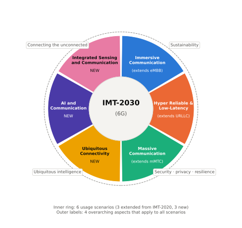

# IMT-2030 비전

!!! spec "참고 문서"
    ITU-R M.2160 (IMT-2030 프레임워크와 목표, 2023-11) · ITU-R M.2516 (미래 기술 동향) · IMT-2030 최소 요구사항 보고서 (ITU-R WP 5D, 작업 중) · 3GPP TR 22.870 (6G 사용 사례)

!!! basic "한눈에 보기"
    ITU-R은 각 세대의 "목표와 사용 시나리오"를 정하고, 3GPP 같은 표준 단체는 그 목표를 만족하는 기술을 제출합니다. 6G의 목표 문서가 **ITU-R M.2160 "IMT-2030 프레임워크"**입니다.

    5G(IMT-2020)는 사용 시나리오가 **3개**(eMBB, URLLC, mMTC)였습니다. IMT-2030은 이 3개를 확장하고 **새로운 3개**를 더해 **6개**가 되었습니다.

<figure markdown>

<figcaption>IMT-2030의 6개 사용 시나리오(안쪽 고리)와 모든 시나리오에 적용되는 4개 공통 원칙(바깥). ITU-R M.2160의 구성을 바탕으로 다시 그린 그림입니다.</figcaption>
</figure>

## 6개 사용 시나리오 { .l2 }

| 시나리오 | 5G에서 온 것 | 예 |
|---|---|---|
| **몰입형 통신** (Immersive Communication) | eMBB 확장 | XR, 홀로그램 통화, 원격 존재감, 혼잡 지역 고속 데이터 |
| **초고신뢰·저지연 통신** (HRLLC) | URLLC 확장 | 산업 자동화, 원격 수술, 자율 주행 협력, 드론 군집 |
| **대규모 통신** (Massive Communication) | mMTC 확장 | 스마트 시티, 농업, 물류의 초대규모 센서망 |
| **유비쿼터스 연결** (Ubiquitous Connectivity) | 신규 | 농어촌·해상·항공·오지 연결, 위성 통합 |
| **AI와 통신** (AI and Communication) | 신규 | 분산 AI 학습·추론, 망이 제공하는 AI 컴퓨팅, 지능형 운용 |
| **통신·센싱 통합** (ISAC) | 신규 | 사람·차량·드론 감지, 동작 인식, 환경 지도, 정밀 측위 |

## 4가지 공통 원칙 { .l2 }

| 원칙 | 의미 |
|---|---|
| 지속 가능성 (Sustainability) | 에너지·자원 효율, 탄소 감축 |
| 연결되지 않은 곳 연결 (Connecting the unconnected) | 디지털 격차 해소 |
| 유비쿼터스 지능 (Ubiquitous intelligence) | 모든 곳에 AI 능력 |
| 보안·프라이버시·회복력 (Security, privacy, resilience) | 신뢰할 수 있는 인프라 |

## 성능 지표 (Capabilities) { .l2 }

M.2160은 15개 지표를 제시합니다. **9개는 IMT-2020 지표의 강화**, **6개는 새 지표**입니다. 수치는 연구 목표 범위의 예입니다(최종 최소 요구사항은 별도 보고서로 정해짐).

| 지표 | IMT-2020 (5G) | IMT-2030 (연구 범위 예) |
|---|---|---|
| 최고 전송 속도 | 20 Gbps | 50, 100, 200 Gbps |
| 사용자 체감 속도 | 100 Mbps | 300, 500 Mbps |
| 최고 스펙트럼 효율 | 30 bit/s/Hz | IMT-2020의 1.5 – 3배 |
| 영역 트래픽 용량 | 10 Mbps/m² | 30, 50 Mbps/m² |
| 연결 밀도 | 10⁶ /km² | 10⁶ – 10⁸ /km² |
| 이동성 | 500 km/h | 500 – 1000 km/h |
| 지연 (사용자 평면) | 1 ms | 0.1 – 1 ms |
| 신뢰성 | 1 − 10⁻⁵ | 1 − 10⁻⁵ ~ 1 − 10⁻⁷ |
| 보안·프라이버시·회복력 | — | 강화 |
| **커버리지** (신규) | | 지상·비지상 통합 |
| **측위** (신규) | | 1 – 10 cm |
| **센싱 관련 능력** (신규) | | 거리·속도·각도 추정 정확도, 검출 확률, 해상도 |
| **AI 관련 능력** (신규) | | 분산 학습·추론, 데이터 처리 |
| **지속 가능성** (신규) | | 에너지 효율 |
| **상호운용성** (신규) | | 다양한 시스템과의 연동 |

??? expert "전문가 노트 — ITU 절차와 3GPP의 관계"
    **ITU-R 절차.** WP 5D가 (1) 비전·프레임워크(M.2160, 2023 완료) → (2) 최소 기술 요구사항·평가 방법·제출 양식(2026 무렵) → (3) 후보 기술 제출(2027–2029 무렵) → (4) 평가와 승인(2030 무렵) 순서로 진행합니다. 3GPP는 Rel-21 규격을 기반으로 IMT-2030 후보를 제출할 것으로 예상됩니다.

    **수치의 성격.** M.2160의 값은 "연구 목표의 예시 범위"이고, 실제 인증 기준이 되는 것은 이후 정해지는 **최소 요구사항**입니다. 5G 때도 비전의 20 Gbps가 최소 요구사항(하향 최고 20 Gbps, 특정 조건)으로 확정되는 과정을 거쳤습니다.

    **센싱 지표의 새로움.** 통신 시스템에 센싱 성능(검출 확률, 오경보율, 거리 해상도 등)을 공식 지표로 넣은 것은 처음입니다. 3GPP Rel-19의 ISAC 채널 모델 연구가 이를 평가할 기반입니다.

## 관련 페이지

- [3GPP 6G 일정](3gpp-6g-timeline.md)
- [후보 기술](key-technologies.md)
- [이동통신 세대의 진화](../getting-started/generations.md)
