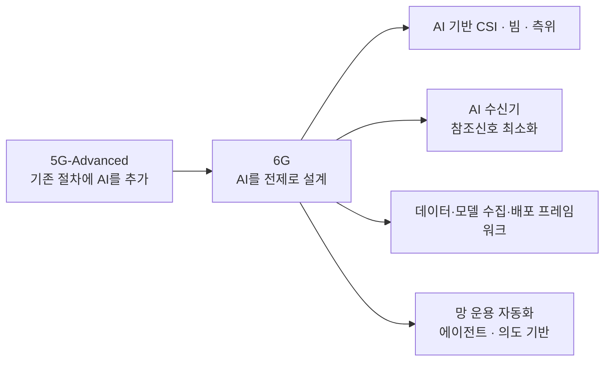

# 6G 후보 기술

!!! spec "참고 문서"
    ITU-R M.2516 (IMT-2030 기술 동향) · 3GPP Rel-20 6G Study (RAN 기술 연구 항목) · Rel-19 연구: 7–24 GHz 채널 모델, ISAC 채널 모델 (TR 38.901 확장) · 5G-Advanced 관련 규격 (AI/ML, NES, NTN)

!!! basic "한눈에 보기"
    6G 기술은 아직 확정되지 않았지만, 연구가 집중되는 방향은 꽤 분명합니다.

    | 기술 | 한 줄 설명 |
    |---|---|
    | **FR3 + 초대형 MIMO** | 7–24 GHz 대역에 수백~수천 개 안테나 소자 → 5G 3.5 GHz 수준 커버리지로 훨씬 넓은 대역 |
    | **AI-native** | 처음부터 AI를 전제로 무선 인터페이스·망 운용을 설계 |
    | **ISAC** | 통신 신호로 레이더처럼 주변을 감지 |
    | **지상·위성 통합** | 위성을 별도 시스템이 아닌 망의 일부로 |
    | **에너지 효율** | 필요할 때만 켜지는 신호, 저전력 설계 |
    | **새 파형·코딩·프레임** | OFDM 계열 진화, 채널 코딩 개선 |
    | **sub-THz** | 100–300 GHz (장기 과제) |

## FR3와 giga-MIMO { .l2 }

| 항목 | 3.5 GHz (5G 주력) | FR3 (예: 7–8 GHz, 13–15 GHz) | mmWave 28 GHz |
|---|---|---|---|
| 가용 대역폭 | 100 MHz 내외/사업자 | 수백 MHz 기대 | 400 MHz 이상 |
| 같은 면적의 안테나 소자 | 192 (64T64R 기준) | 수백 ~ 1000 이상 | 수백 |
| 커버리지 | 기준 | 대형 배열 이득으로 **3.5 GHz와 비슷한 사이트 그리드 목표** | 짧음 |
| 과제 | — | 기존 사용자(위성·고정) 공존, 전력·비용 | 차단, 커버리지 |

주파수가 2배가 되면 경로 손실은 6 dB 늘지만, 같은 면적에 안테나를 4배 넣을 수 있어 배열 이득으로 상당 부분 보상할 수 있다는 것이 핵심 논리입니다.

## AI-native 무선 인터페이스 { .l2 }

5G-Advanced의 AI/ML은 "기존 기능의 대체·보조"였다면, 6G는 참조신호 밀도, 보고 구조, 프로토콜 자체를 AI 모델이 있다는 전제에서 다시 설계할 수 있습니다. → [무선 인터페이스 AI/ML](../advanced5g/ai-ml.md)

## ISAC (통신·센싱 통합) { .l2 }

| 센싱 방식 | 송신 | 수신 | 예 |
|---|---|---|---|
| 기지국 단일 정적 (monostatic) | gNB | 같은 gNB (반사파) | 드론·차량 감지 (전이중 필요) |
| 기지국 간 양정적 (bistatic) | gNB A | gNB B | 넓은 지역 감시 |
| 기지국 → 단말 | gNB | UE | 실내 동작 인식 |
| 단말 단일 정적 | UE | 같은 UE | 차량 레이더 대체·보조 |

필요한 요소: 센싱용 참조신호 또는 통신 신호 재사용, 센싱 결과를 다루는 핵심망 기능(센싱 서비스 노출), 프라이버시 보호. Rel-19 ISAC 채널 모델이 평가의 기반입니다.

## 기타 방향 { .l2 }

| 영역 | 내용 |
|---|---|
| **지상·비지상 통합** | 위성 셀을 같은 무선 인터페이스로, 지상 셀과 끊김 없는 이동 → [NTN](../nr/advanced/ntn.md) |
| **에너지 효율 설계** | 항상 켜진 신호 최소화(SSB·SIB on-demand), 앵커/부스터 셀, 단말 저전력 수신(LP-WUS) → [망 에너지 절감](../advanced5g/network-energy-saving.md) |
| 파형 | CP-OFDM / DFT-s-OFDM 기반 유지가 유력, 저 PAPR·고속 이동 개선 |
| 채널 코딩 | LDPC·Polar 개선 (복잡도·지연·전력) |
| 전이중 | SBFD에서 단말 전이중까지 단계적 확장 |
| **5G–6G 스펙트럼 공유 (MRSS)** | 같은 캐리어에서 NR과 6G 공존 |
| 6G 핵심망 | 단순화된 구조, AI 에이전트, 컴퓨팅·데이터 서비스 통합 |
| 보안 | **양자 내성 암호(PQC)**, 256비트 알고리즘 |
| sub-THz / RIS | 장기 연구 (초고속 근거리, 지능형 반사면) |

??? expert "전문가 노트 — 무엇이 정말 바뀔까"
    **설계 원칙 수준의 변화.** 기술 목록보다 중요한 것은 5G의 교훈에서 나온 원칙들입니다: (1) **SA만으로 시작**, (2) 기능 옵션 수 최소화(단말·장비 구현 복잡도), (3) 하위 호환을 위한 "미래 대비" 설계(예약 자원, 확장 가능한 신호), (4) 에너지 효율을 처음부터 지표로.

    **FR3의 현실.** 7.125–8.4 GHz, 14.8–15.35 GHz 같은 대역은 위성·고정·군 시스템이 쓰고 있어, 사업자별 확보 가능 대역폭과 시기가 국가마다 크게 다를 수 있습니다. 그래서 FR1 기존 대역(3.5 GHz 등)에서 6G를 먼저 도입하고 FR3를 용량 층으로 추가하는 시나리오도 함께 연구됩니다.

    **ISAC의 걸림돌.** 기지국 단일 정적 센싱은 송수신 동시 동작(자기 간섭 제거)이 필요하고, 센싱 데이터의 프라이버시·규제 문제가 있습니다. 첫 6G 규격은 비교적 쉬운 시나리오(양정적, 드론 감지 등)부터 다룰 가능성이 있습니다.

    **AI-native의 범위 논쟁.** 무선 인터페이스를 얼마나 AI 모델에 의존하게 할지(상호운용성, 시험 가능성, 단말 비용)가 핵심 논쟁입니다. 5G-Advanced의 LCM·데이터 수집 경험이 6G 설계의 출발점입니다.

## 관련 페이지

- [IMT-2030 비전](imt-2030.md)
- [3GPP 6G 일정](3gpp-6g-timeline.md)
- [무선 인터페이스 AI/ML](../advanced5g/ai-ml.md)
- [FR1·FR2와 밴드](../nr/spectrum/bands.md) — FR3
- [빔포밍](../basics/beamforming.md)
